<div class="sre-hero" markdown>
<h1>Azure SRE Agent Workshop</h1>
<p>Hit a real public API, watch its VM and application charts move, trigger two safe incidents, and verify how Azure SRE Agent responds to the resulting alerts.</p>
</div>

## What you deploy

The workshop creates one disposable Ubuntu 24.04 VM:

* A public .NET 8 Orders API and browser GUI on HTTP port 8080.
* A hardened, non-root `orders-api` systemd service.
* SQLite on a separate 8 GiB managed data disk mounted at
  `/var/lib/orders`.
* A VNet, NSG, static public IP, and stable Azure DNS name.
* Azure Monitor Agent, a Data Collection Rule, Log Analytics, and
  workspace-based Application Insights.
* CPU, data-disk free-space, and HTTP 5xx alerts.
* A read-only Azure SRE Agent with an enabled Sev1/Sev2 response plan in
  Review mode.

There is no public SSH access and no public fault-injection endpoint.
Administrative checks and bounded CPU or disk faults use authenticated Azure VM
Run Command.

The workshop uses two separate browser surfaces. The public Orders GUI is the
customer view served by the VM on port 8080. This documentation site is the
operator view; after Microsoft Entra sign-in, its incident launchers use Azure
RBAC and Run Command. Administrative controls never appear in the Orders GUI.

## What you learn

* Use the Orders GUI to establish a healthy customer baseline and observe
  degradation and recovery.
* Prove that the application runs under systemd and persists SQLite data across
  a VM restart.
* Confirm that healthy endpoint activity reaches VM Metrics and Application
  Insights before investigating incidents.
* Follow Azure Monitor alerts into an SRE Agent response-plan investigation.
* Verify agent findings instead of accepting plausible prose.
* Distinguish customer impact from a leading capacity warning.
* Preserve visual evidence and turn response gaps into owned improvements.

## Learning path

The six modules follow one operator journey. The Orders GUI supplies the
customer view, and each module ties API or VM activity to repeatable terminal
evidence and an Azure portal checkpoint.

```mermaid
flowchart LR
    M1[01 Deploy, validate, and confirm telemetry]
    M1 --> M2[02 Operate response plan]
    M2 --> M3[03 Respond to high CPU]
    M3 --> M4[04 Respond to data-disk pressure]
    M4 --> M5[05 Review and improve]
    M5 --> M6[06 Preserve evidence and clean up]

    classDef setup fill:#dbeafe,stroke:#1d4ed8,color:#1e3a8a
    classDef incident fill:#fee2e2,stroke:#b91c1c,color:#7f1d1d
    classDef learn fill:#dcfce7,stroke:#15803d,color:#14532d

    class M1,M2 setup
    class M3,M4 incident
    class M5,M6 learn
```



| Module | Outcome | Visual evidence |
| --- | --- | --- |
| 01 | Deploy, use the GUI, prove persistence, and confirm telemetry | Healthy GUI status, VM CPU, and API operations |
| 02 | Rehearse the Sev1/Sev2 Review response plan | Healthy GUI requests, response plan, alert rules, and agent assessment |
| 03 | Detect, investigate, and recover from CPU saturation | GUI degradation and recovery, VM CPU, request duration, alert, and investigation |
| 04 | Detect and safely remove managed-disk pressure | GUI capacity and recovery, disk free space, alert, and investigation |
| 05 | Produce an evidence-backed incident review | Customer-view observations plus incident, recovery, and alert timelines |
| 06 | Preserve evidence and delete the environment | Final healthy GUI, CPU, API, alert, and investigation views |

Allow approximately three and a half hours for the full path, including Azure
ingestion and alert evaluation waits.

## Operating model

The same loop is repeated for both incidents:

```text
healthy signal -> authenticated fault -> portal chart -> Azure Monitor alert
         -> SRE Agent investigation -> human verification
         -> human mitigation -> visual recovery -> learning
```

The SRE Agent reads resources and telemetry and proposes a response. It does not
receive permission to mutate the VM. The attendee remains responsible for
verifying claims and running the documented mitigation.

## Workshop limitations

This is a disposable learning environment, not a production reference
architecture:

* The public API is unauthenticated HTTP.
* The VM and database are single-instance and have no high availability.
* SQLite has no workshop backup workflow.
* The availability probe runs inside the VM rather than from an external region.
* Only synthetic data belongs in the API.
* Azure resources incur charges until Module 06 deletes them.

Azure Policy must permit the public VM endpoint and outbound package and
monitoring access. The deployment creates no policy exemptions.

## Get started

[Start Module 01 :material-arrow-right:](sre/01-deploy-and-validate/index.md){ .md-button .md-button--primary }
[Review cost considerations](sre/30-appendix/03-cost-management.md){ .md-button }

!!! warning "Delete the environment when finished"
    Closing the terminal does not stop VM, disk, public-IP, monitoring, alert, or
    SRE Agent charges. Complete [Module 06](sre/06-cleanup/index.md).
