<div class="sre-hero" markdown>
<h1>Azure SRE Agent Workshop</h1>
<p>Hit a real public API, watch its VM and application charts move, trigger two safe incidents, and verify how Azure SRE Agent responds to the resulting alerts.</p>
</div>

## What you deploy

The workshop creates one disposable Ubuntu 24.04 VM:

* A public .NET 8 Orders API on HTTP port 8080.
* A hardened, non-root `orders-api` systemd service.
* SQLite on a separate 8 GiB managed data disk mounted at
  `/var/lib/orders`.
* A VNet, NSG, static public IP, and stable Azure DNS name.
* Azure Monitor Agent, a Data Collection Rule, Log Analytics, and
  workspace-based Application Insights.
* CPU, data-disk free-space, and HTTP 5xx alerts.
* A read-only Azure SRE Agent with an enabled Sev1/Sev2 response plan in
  Review mode.

There is no public SSH access and no public fault-injection endpoint.
Administrative checks and bounded CPU or disk faults use authenticated Azure VM
Run Command.

## What you learn

* Prove that the application runs under systemd and persists SQLite data across
  a VM restart.
* Generate endpoint traffic and view the result in the VM Metrics blade,
  Application Insights, and Log Analytics.
* Follow Azure Monitor alerts into an SRE Agent response-plan investigation.
* Verify agent findings instead of accepting plausible prose.
* Distinguish customer impact from a leading capacity warning.
* Preserve visual evidence and turn response gaps into owned improvements.

## Learning path

The seven modules follow one operator journey. Every module includes a portal
checkpoint that ties an action against the API or VM to a visual telemetry view.

```mermaid
flowchart LR
    M1[01 Deploy and validate] --> M2[02 Observe healthy baseline]
    M2 --> M3[03 Operate response plan]
    M3 --> M4[04 Respond to high CPU]
    M4 --> M5[05 Respond to data-disk pressure]
    M5 --> M6[06 Review and improve]
    M6 --> M7[07 Preserve evidence and clean up]

    classDef setup fill:#dbeafe,stroke:#1d4ed8,color:#1e3a8a
    classDef incident fill:#fee2e2,stroke:#b91c1c,color:#7f1d1d
    classDef learn fill:#dcfce7,stroke:#15803d,color:#14532d

    class M1,M2,M3 setup
    class M4,M5 incident
    class M6,M7 learn
```



| Module | Outcome | Portal evidence |
| --- | --- | --- |
| 01 | Deploy and prove service, disk, API, and restart recovery | VM Percentage CPU baseline |
| 02 | Establish healthy resource and application behavior | VM Metrics, Live Metrics, Performance, and Log Analytics charts |
| 03 | Verify the Sev1/Sev2 Review response plan | Response plan, alert rules, VM CPU, and API operations |
| 04 | Detect, investigate, and recover from CPU saturation | VM CPU spike, API duration, alert, and agent investigation |
| 05 | Detect and safely remove managed-disk pressure | Data-disk free-space chart, VM CPU comparison, alert, and agent investigation |
| 06 | Produce an evidence-backed incident review | Baseline, incident, recovery, and alert timelines |
| 07 | Preserve evidence and delete the environment | Final healthy CPU, API, alert, and investigation views |

Allow approximately four hours for the full path, including Azure ingestion and
alert evaluation waits.

## Operating model

The same loop is repeated for both incidents:

```text
baseline -> authenticated fault -> portal chart -> Azure Monitor alert
         -> SRE Agent investigation -> human verification
         -> human mitigation -> visual recovery -> learning
```

The SRE Agent reads resources and telemetry and proposes a response. It does not
receive permission to mutate the VM. The attendee remains responsible for
verifying claims and running the documented mitigation.

## Workshop limitations

This is a disposable learning environment, not a production reference
architecture:

* The public API is unauthenticated HTTP.
* The VM and database are single-instance and have no high availability.
* SQLite has no workshop backup workflow.
* The availability probe runs inside the VM rather than from an external region.
* Only synthetic data belongs in the API.
* Azure resources incur charges until Module 07 deletes them.

Azure Policy must permit the public VM endpoint and outbound package and
monitoring access. The deployment creates no policy exemptions.

## Get started

[Start Module 01 :material-arrow-right:](sre/01-deploy-and-validate/index.md){ .md-button .md-button--primary }
[Review cost considerations](sre/30-appendix/03-cost-management.md){ .md-button }

!!! warning "Delete the environment when finished"
    Closing the terminal does not stop VM, disk, public-IP, monitoring, alert, or
    SRE Agent charges. Complete [Module 07](sre/07-cleanup/index.md).
