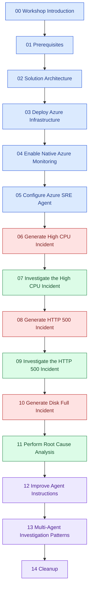

<h1>Azure SRE Agent Workshop</h1>

Break a real application on purpose. Watch Azure Monitor light up. Then let Azure SRE Agent tell you what happened, why it happened, and what to do about it.

## What you build

You deploy a small but realistic order-processing solution to Azure Container Apps, wire it to native Azure monitoring, and connect Azure SRE Agent to the resource group. Then you deliberately break it three different ways and work each incident end to end.

By the end you will have run a full incident lifecycle: detection, triage, investigation, root cause analysis, and mitigation, with an AI agent doing the tedious parts and you doing the thinking.

* :material-rocket-launch: **Deploy once, break repeatedly**

    One Bicep deployment gives you a Container Apps environment, Azure SQL Database, Log Analytics, Application Insights, and a full alerting stack.

* :material-fire: **Three realistic incidents**

    Runaway CPU, a cascading HTTP 500 failure, and a database that runs out of storage. All triggered on demand from fault-injection endpoints.

* :material-robot-outline: **Agent-led investigation**

    Ask Azure SRE Agent to correlate metrics, logs, traces, and deployment history, then review the diagnosis it produces.

* :material-tune: **Tune the agent**

    Write custom agent instructions and runbooks, then re-run an incident to measure whether the diagnosis actually improved.

## Objectives and outcomes

After completing this workshop, you should:

* Understand what Azure SRE Agent does, what it can access, and where a human stays in the loop.
* Deploy a multi-service Azure workload with reproducible infrastructure as code.
* Configure native Azure monitoring so that incidents are detectable without third-party tooling.
* Trigger controlled failures that mirror common production outages.
* Drive an Azure SRE Agent investigation from alert to diagnosis to mitigation proposal.
* Read and critique an AI-generated root cause analysis instead of accepting it blindly.
* Improve agent accuracy by supplying architectural context, runbooks, and custom instructions.
* Design multi-agent investigation patterns for workloads owned by more than one team.

## Learning path

The workshop is sequential. Each module assumes the resources and knowledge from the previous one.

## Time and cost

| Segment                            | Modules | Estimated duration |
|------------------------------------|---------|--------------------|
| Setup and deployment               | 00 - 05 | 90 minutes         |
| Incident generation and triage     | 06 - 10 | 100 minutes        |
| Root cause analysis and tuning     | 11 - 13 | 90 minutes         |
| Cleanup                            | 14      | 10 minutes         |

Total hands-on time is roughly five hours. Running the deployed environment costs a few US dollars per day; see [Cost Management](sre/30-appendix/03-cost-management.md) for the breakdown and for guidance on scaling to zero between sessions.

!!! warning "Delete your resources when you finish"
    The workshop deliberately provisions an Azure SQL Database and an always-on Container Apps replica. Leaving them running after the workshop costs money for no benefit. [Module 14](sre/14-cleanup/index.md) removes everything in a single command.

## Who this is for

This workshop targets platform engineers, SREs, DevOps engineers, and application developers who carry a pager. You should be comfortable with the Azure portal and a terminal. Deep Kubernetes or .NET knowledge is not required, because every command you need is copy-paste ready.

## Get started

[Start the workshop :material-arrow-right:](sre/00-workshop-intro/index.md){ .md-button .md-button--primary }
[Review prerequisites](sre/01-prerequisites/index.md){ .md-button }

!!! tip "Related workshop"
    This workshop is a sister project to the [Azure Container Apps .NET Workshop](https://azure.github.io/aca-dotnet-workshop/). That workshop teaches you how to build the platform. This one teaches you what to do when the platform misbehaves at 3 a.m.
