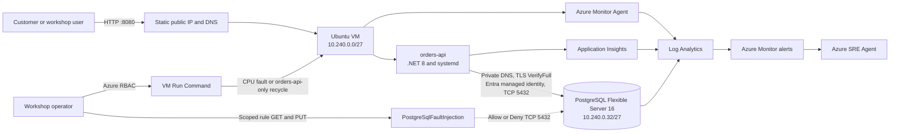
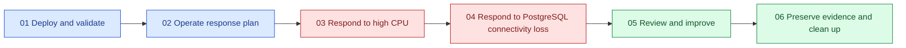

<div class="sre-hero" markdown>
<h1>Azure SRE Agent Workshop</h1>
<p>Exercise a public API, observe its private managed database dependency, trigger two controlled incidents, and verify how Azure SRE Agent responds.</p>
</div>

## What you deploy

The workshop creates one same-region application and database environment:

* One Ubuntu 24.04 VM running the .NET 8 Orders API and browser GUI as a
  hardened, non-root `orders-api` service.
* A private Azure Database for PostgreSQL Flexible Server 16 using
  `Standard_B1ms`, 32 GiB auto-grow storage, no high availability, and
  seven-day locally redundant backups.
* An Orders subnet at `10.240.0.0/27` and a delegated PostgreSQL subnet at
  `10.240.0.32/27`.
* Private DNS through `private.postgres.database.azure.com`, with database
  public access disabled.
* A public static IP and DNS name for the Orders API on HTTP port 8080.
* Azure Monitor Agent, Log Analytics, workspace-based Application Insights,
  and CPU, PostgreSQL dependency, and HTTP 5xx alerts.
* A read-only Azure SRE Agent with a Sev1/Sev2 response plan in Review mode.

There is no public SSH or fault endpoint. CPU pressure uses authenticated Azure
VM Run Command. The PostgreSQL incident changes one scoped outbound NSG child
rule from `Allow` to `Deny`, then recycles only `orders-api` so stateful pooled
connections cannot hide the outage.

The Orders GUI on the VM is the customer view. This documentation site is the
operator view. After Microsoft Entra sign-in, its incident launchers use the
participant's delegated Azure token and RBAC. The Orders GUI never receives
Azure tokens or administrative controls.

## Architecture


```mermaid
flowchart LR
    User[Customer or workshop user] -->|HTTP :8080| IP[Static public IP and DNS]
    IP --> VM[Ubuntu VM<br/>10.240.0.0/27]
    VM --> API[orders-api<br/>.NET 8 and systemd]
    API -->|Private DNS, TLS VerifyFull<br/>Entra managed identity, TCP 5432| PG[(PostgreSQL Flexible Server 16<br/>10.240.0.32/27)]

    API --> AI[Application Insights]
    VM --> AMA[Azure Monitor Agent]
    AMA --> LAW[Log Analytics]
    AI --> LAW
    PG --> LAW
    LAW --> Alerts[Azure Monitor alerts]
    Alerts --> Agent[Azure SRE Agent]

    Operator[Workshop operator] -->|Azure RBAC| RC[VM Run Command]
    RC -->|CPU fault or orders-api-only recycle| VM
    Operator -->|Scoped rule GET and PUT| Rule[PostgreSqlFaultInjection]
    Rule -.Allow or Deny TCP 5432.-> PG
```

The VM's system-assigned managed identity is both the PostgreSQL Entra
administrator and the runtime database identity. This keeps a disposable lab
credential-free and repeatable, but it is more privileged than a production
application should be. Production should separate schema administration from
runtime access.

A database on the same VM would be cheaper but would share lifecycle and
failure with the API and would not provide a meaningful network dependency
incident. A public managed database would retain managed lifecycle but add a
public endpoint. Private Flexible Server provides independent lifecycle,
private name resolution, and a realistic dependency boundary. The single API
VM and no-HA database remain deliberate cost and failure-domain compromises.

## What you learn

* Establish a healthy customer, application, dependency, and infrastructure
  baseline.
* Prove that data survives an application VM restart because PostgreSQL has a
  separate lifecycle.
* Follow Azure Monitor alerts into an SRE Agent response-plan investigation.
* Correlate failures with a specific authenticated control-plane change.
* Verify agent claims with portal charts, Kusto queries, API responses, and
  Activity Log.
* Restore a narrowly scoped network rule without modifying database data.
* Preserve evidence and turn response gaps into owned improvements.

## Learning path


```mermaid
flowchart LR
    M1[01 Deploy and validate]
    M1 --> M2[02 Operate response plan]
    M2 --> M3[03 Respond to high CPU]
    M3 --> M4[04 Respond to PostgreSQL connectivity loss]
    M4 --> M5[05 Review and improve]
    M5 --> M6[06 Preserve evidence and clean up]

    classDef setup fill:#dbeafe,stroke:#1d4ed8,color:#1e3a8a
    classDef incident fill:#fee2e2,stroke:#b91c1c,color:#7f1d1d
    classDef learn fill:#dcfce7,stroke:#15803d,color:#14532d

    class M1,M2 setup
    class M3,M4 incident
    class M5,M6 learn
```

| Module | Outcome | Evidence |
| --- | --- | --- |
| 01 | Deploy, exercise the GUI, prove VM-independent persistence, and confirm telemetry | Healthy GUI, private database inspection, VM CPU, API and dependency telemetry |
| 02 | Rehearse the Sev1/Sev2 Review response plan | Resource roles, response plan, alert rules, and healthy agent assessment |
| 03 | Detect, investigate, and recover from CPU saturation | VM CPU, request duration, alert, Activity Log, and investigation |
| 04 | Diagnose and restore PostgreSQL connectivity | NSG rule state, HTTP 503 readiness, failed dependencies, alert, and investigation |
| 05 | Produce an evidence-backed incident review | Customer, dependency, resource, alert, change, and recovery timelines |
| 06 | Preserve evidence and delete every workshop resource | Final healthy state, saved notes, resource inventory, and deletion proof |

Allow about three and a half hours, including telemetry ingestion and alert
evaluation waits.

## Incident operating model

```text
healthy signal -> authenticated bounded change -> customer and telemetry impact
         -> Azure Monitor alert -> SRE Agent investigation
         -> human verification -> human reset -> measured recovery -> learning
```

The SRE Agent reads resources and telemetry and proposes a response. It has no
permission to mutate the VM or NSG. You verify its claims and run an approved
reset through your own authenticated session.

The PostgreSQL fault changes only `PostgreSqlFaultInjection`:

```text
Outbound TCP 5432
10.240.0.0/27 -> 10.240.0.32/27
priority 100
Allow (healthy) -> Deny (incident) -> Allow (reset)
```

It does not change data, stop PostgreSQL, enable public access, or cause a broad
network outage. `azd up` also reconciles the rule to `Allow`.

## Workshop limitations

This is not a production reference architecture:

* The public API is unauthenticated HTTP.
* The application and database are each single-instance.
* PostgreSQL has no HA and its seven-day backups are locally redundant.
* The application availability probe originates on the VM.
* The VM runtime identity also holds database administrator privilege.
* Only synthetic data belongs in the API.
* Azure resources continue to incur charges until deletion.

Azure Policy must permit the public VM endpoint, private PostgreSQL resources,
and required outbound access. The deployment creates no policy exemptions.

## Get started

[Start Module 01 :material-arrow-right:](sre/01-deploy-and-validate/index.md){ .md-button .md-button--primary }
[Review cost considerations](sre/30-appendix/03-cost-management.md){ .md-button }

!!! warning "Reset and delete the environment"
    Resetting an incident does not stop billing. Before final evidence and
    cleanup, run `python scripts/workshop.py fault reset`. Complete
    [Module 06](sre/06-cleanup/index.md) with
    `azd down --purge --force`.
