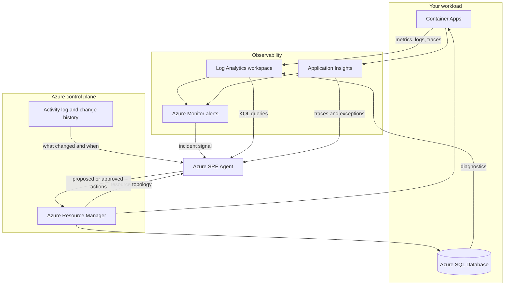

<ul class="sre-meta">
<li class="duration">Estimated time: 15 minutes</li>
<li>Module 00</li>
<li>Reading</li>
</ul>

## Overview

Azure SRE Agent is an AI agent that operates on your Azure resources during and after an incident. It reads telemetry, correlates signals, explains what it found, and proposes or performs mitigations within boundaries you define.

Understanding the capability model before you deploy anything saves confusion later. Several tasks in this workshop only make sense once you know what the agent can see and what it is permitted to do.

## Learning objectives

* Describe the four capability areas of Azure SRE Agent.
* Explain the permission model and why least privilege matters for an agent.
* Distinguish between read-only, approval-required, and autonomous operating modes.
* Recognize the limits of agent-generated conclusions.

## Architecture context

The agent sits alongside your workload rather than inside it. It reads from the Azure control plane and from your observability stack, and it writes back through the same governed APIs a human operator would use.

The important detail is the arrow direction at the bottom. The agent does not have a private back channel into your containers. Anything it changes flows through Azure Resource Manager and is subject to the same role assignments, policies, and audit logging as a human-initiated change.

## Capability areas

### Observation

The agent enumerates resources in scope, reads platform metrics, runs KQL queries against Log Analytics, and pulls request, dependency, and exception telemetry from Application Insights. This is the foundation for everything else and is the only capability the workshop strictly requires.

### Correlation

Raw signals become useful when aligned. The agent lines up a CPU spike, a burst of dependency failures, and a container restart on a single timeline, then looks for a change in the Activity log that precedes them. In the manual world this is the step that consumes most of the investigation.

### Diagnosis

The agent produces a natural language explanation with supporting evidence: which resource degraded, which signals confirm it, which signals rule out alternatives, and what most likely caused it. In [Module 11](../11-root-cause-analysis/index.md) you evaluate one of these diagnoses critically.

### Action

Depending on configuration, the agent can propose a mitigation, request approval, or execute a bounded action such as scaling a Container App or restarting a replica. This workshop keeps the agent in an approval-required posture so that you see every proposed change before it happens.

## Operating modes

| Mode              | Agent behavior                                             | When to use it                                       |
|-------------------|------------------------------------------------------------|------------------------------------------------------|
| Read-only         | Observes, correlates, and diagnoses; never changes anything | First rollout, regulated environments, this workshop |
| Approval required | Proposes a specific action and waits for a human decision   | Production once the team trusts the diagnoses        |
| Autonomous        | Executes pre-approved actions within a defined scope        | Well-understood, reversible, low-risk remediations    |

!!! important "Start read-only"
    Trust in an agent is earned against your own workload, not against a vendor benchmark. Run it read-only until the diagnoses it produces match what your on-call engineers would have concluded, then widen the scope one action type at a time.

## Permission model

The agent uses a managed identity with Azure role-based access control assignments. The scope of those assignments defines exactly what it can see and do.

| Purpose                        | Typical role                          | Scope                    |
|--------------------------------|---------------------------------------|--------------------------|
| Enumerate and read resources   | Reader                                | Workshop resource group  |
| Query workspace telemetry      | Log Analytics Reader                   | Log Analytics workspace  |
| Read metrics and alerts        | Monitoring Reader                      | Workshop resource group  |
| Perform bounded mitigations    | Not granted in this workshop           | None                     |

Two rules keep this safe. Grant the agent no more than you would grant a new on-call engineer on their first week. Scope assignments to the resource group under investigation rather than the subscription, so a misconfigured prompt cannot reach production from a lab.

Deployment grants these read-only runtime permissions automatically. The
attendee receives agent-scoped `SRE Agent Administrator` for configuration,
not additional runtime authority. Full Azure Monitor alert lifecycle operations
require subscription `Monitoring Contributor`, which this workshop does not
grant; automated investigation does not promise alert acknowledgement or closure.

!!! warning "Do not grant subscription-wide Contributor"
    It is tempting, it works immediately, and it is the single most common mistake teams make when piloting agentic tooling. Scope to the resource group. This workshop does exactly that in [Module 05](../05-configure-sre-agent/index.md).

## Where the agent falls short

Being honest about limits is what separates a useful tool from a demo.

* The agent reasons over the telemetry you collected. Signals you never instrumented do not exist as far as it is concerned.
* It infers intent from resource configuration and naming. Undocumented architectural constraints, such as a downstream partner that rate limits you on Fridays, are invisible unless you tell it. That is precisely what [Module 12](../12-agent-instructions/index.md) addresses.
* Correlation is not causation. When two things change together the agent may pick the wrong one as the cause, especially early in an incident when signals are sparse.
* It cannot reason about business impact unless you supply the mapping between services and customer journeys.

## Validation

* [x] You can list the four capability areas.
* [x] You can explain why read-only is the correct starting posture.
* [x] You can name at least two situations where agent conclusions need human verification.

## Expected results

You should now understand that Azure SRE Agent is a scoped, permissioned, auditable participant in your incident process rather than a black box that reboots servers.

## Knowledge check

??? question "Why does the agent act through Azure Resource Manager rather than connecting directly to workload resources?"
    Routing every action through Resource Manager means agent activity inherits the existing governance stack: role assignments, Azure Policy, resource locks, and Activity log auditing. You can answer "what did the agent change and when" with the same tooling you already use for humans.

??? question "An agent reports that a deployment caused an outage, but the deployment happened 90 minutes before the first alert. What should you do?"
    Treat the conclusion as a hypothesis and test it. Look for a delayed trigger such as a cache expiring, a scheduled job, a connection pool slowly exhausting, or a rollout that only reached the affected replica later. Correlation across a long gap is exactly the case where an agent is most likely to be confidently wrong.

??? question "What is the practical consequence of instrumenting only infrastructure metrics and skipping application telemetry?"
    The agent can tell you a container is saturated but not which code path saturated it. You lose the ability to distinguish a legitimate traffic increase from a pathological request, which is the difference between scaling out and shipping a fix.

## Next steps

[Next: Incident Response Concepts :material-arrow-right:](2-incident-response-concepts.md){ .md-button .md-button--primary }

[:material-arrow-left: Workshop Introduction](index.md)
[Incident Response Concepts :material-arrow-right:](2-incident-response-concepts.md)

