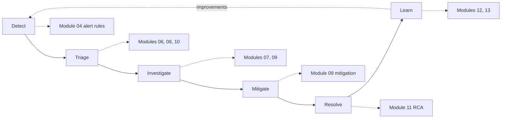

<ul class="sre-meta">
<li class="duration">Estimated time: 15 minutes</li>
<li>Module 00</li>
<li>Reading</li>
</ul>

## Overview

Every later module uses a shared vocabulary: detection, triage, mitigation, contributing factor, golden signal. If those terms mean slightly different things to you than they do to the workshop, the investigation modules become harder than they need to be.

This page defines the model. If you run incidents for a living, skim it and move on.

## Learning objectives

* Walk through the incident lifecycle and identify which phase each workshop module exercises.
* Apply the four golden signals to a service you are investigating.
* Distinguish mitigation from remediation and root cause from contributing factor.
* Explain which time-to-resolution metrics an agent actually improves.

## Architecture context

The workshop maps directly onto the incident lifecycle. Modules 06, 08, and 10 create the failure. Modules 07, 09, and 11 walk the response.

## The incident lifecycle

### Detect

Something crosses a threshold and a signal is raised. Detection quality is measured by how quickly a real problem produces an alert and how rarely a non-problem does. Both failure modes are expensive: slow detection extends the outage, noisy detection trains humans to ignore alerts.

### Triage

Establish scope and severity. Which service is affected, how many users, is it getting worse. Triage answers "how bad is this" so the response can be sized appropriately.

### Investigate

Determine what is happening and why. This is where correlation across metrics, logs, traces, and change history occurs, and it is the phase where Azure SRE Agent contributes the most.

### Mitigate

Restore service. Mitigation is not a fix. Restarting a replica, scaling out, rolling back a deployment, or shedding load all count as mitigation because they stop customer pain without necessarily addressing the underlying defect.

### Resolve

Confirm the service is healthy and stable, close the incident, and capture the timeline while it is still fresh.

### Learn

Produce a blameless post-incident review with concrete action items. Modules 12 and 13 turn what you learned into agent instructions so the next investigation starts further ahead.

!!! tip "Mitigate first, understand later"
    Under pressure, engineers frequently keep investigating when they should already be mitigating. If you have a safe action that restores service, take it. The telemetry that explains the cause is already recorded and is not going anywhere.

## The four golden signals

Every service in this workshop is evaluated against the same four signals.

| Signal      | Question it answers                  | Where you find it in this workshop                        |
|-------------|--------------------------------------|-----------------------------------------------------------|
| Latency     | How long do requests take            | Application Insights `requests` duration percentiles      |
| Traffic     | How much demand is arriving          | Container Apps request count, Application Insights volume  |
| Errors      | What fraction of requests fail       | HTTP 5xx rate, Application Insights `exceptions`          |
| Saturation  | How close to a limit are we          | CPU and memory metrics, Azure SQL Database storage percent |

The three incidents you generate are each anchored on a different signal, which is deliberate.

| Module | Incident              | Primary signal | Secondary effect                          |
|--------|-----------------------|----------------|--------------------------------------------|
| 06     | Runaway CPU           | Saturation     | Latency rises as requests queue             |
| 08     | Dependency failure    | Errors         | Latency rises from retries and timeouts     |
| 10     | Storage exhaustion    | Saturation     | Errors appear once writes start failing     |

Notice that saturation and errors are not independent. A saturation problem left alone becomes an error problem, which is why triage order matters.

## Root cause versus contributing factor

Most incidents do not have a single cause. They have one trigger and several conditions that allowed the trigger to matter.

Consider the HTTP 500 incident you generate in Module 08:

* Trigger: `catalog-api` starts returning errors.
* Contributing factor: `orders-api` has no circuit breaker, so it keeps calling a failing dependency.
* Contributing factor: the retry policy has no jitter, so retries synchronize and amplify load.
* Contributing factor: the health probe checks process liveness, not dependency health, so the platform never removed the unhealthy replica.

Fixing only the trigger leaves the same outage available to the next dependency that fails. A good root cause analysis identifies all four and prioritizes the ones with the best ratio of risk reduction to effort.

!!! note "Five whys, applied carefully"
    Asking "why" repeatedly is useful until it turns into a search for a person to blame. Stop when you reach a systemic condition you can change, such as a missing circuit breaker, rather than continuing to "why did the engineer not add one".

## Metrics that matter

| Metric | Meaning                                    | Does an agent improve it                                       |
|--------|--------------------------------------------|-----------------------------------------------------------------|
| MTTD   | Mean time to detect                        | Marginally; detection is mostly your alert rules                |
| MTTA   | Mean time to acknowledge                   | Yes, the agent can begin investigating before a human logs on   |
| MTTI   | Mean time to investigate and identify cause| Substantially, this is the agent's core contribution            |
| MTTR   | Mean time to resolve                       | Indirectly, through a faster MTTI                               |

An honest expectation: Azure SRE Agent compresses the investigation phase. If your outages are dominated by slow detection or by a change approval process that takes an hour, the agent will not save you. Fix the bottleneck you actually have.

## Severity classification

The workshop uses a simple three-level scheme. Substitute your own if you have one.

| Severity | Definition                                        | Workshop example                              |
|----------|---------------------------------------------------|-----------------------------------------------|
| Sev 1    | Complete loss of a customer-facing capability      | All order submissions fail (Module 10)        |
| Sev 2    | Significant degradation, workarounds exist         | Elevated errors and latency (Module 08)       |
| Sev 3    | Degradation with limited customer impact           | CPU saturation with headroom remaining (Module 06) |

## Validation

* [x] You can name the six phases of the incident lifecycle.
* [x] You can classify each of the three workshop incidents by primary golden signal.
* [x] You can explain why mitigation and remediation are tracked separately.

## Expected results

You now share a vocabulary with the rest of the workshop. When Module 09 asks you to "mitigate before you remediate", you know that means restoring service first and shipping the real fix afterwards.

## Knowledge check

??? question "A service is returning correct responses but the 99th percentile latency has tripled. Which golden signal is degraded, and what should you check next?"
    Latency is degraded, and saturation is the most likely explanation. Check CPU, memory, connection pool utilization, and downstream dependency duration. Latency problems without error problems usually mean something is queueing rather than failing.

??? question "Your team resolved an outage by restarting the affected replicas. Is the incident resolved?"
    Service is mitigated, not remediated. The incident can be closed once stability is confirmed, but a follow-up item must exist for the underlying defect. If the only recorded outcome is "restarted the pods", the same outage recurs.

??? question "Why does a faster MTTI not always produce a faster MTTR?"
    Resolution includes everything after identification: authoring a fix, review, deployment, and verification. If those steps dominate, shortening investigation moves the bottleneck rather than removing it. Measure each phase before optimizing.

## Next steps

[Next: How This Workshop Works :material-arrow-right:](3-how-this-workshop-works.md){ .md-button .md-button--primary }

[:material-arrow-left: What Is Azure SRE Agent](1-what-is-sre-agent.md)
[How This Workshop Works :material-arrow-right:](3-how-this-workshop-works.md)

