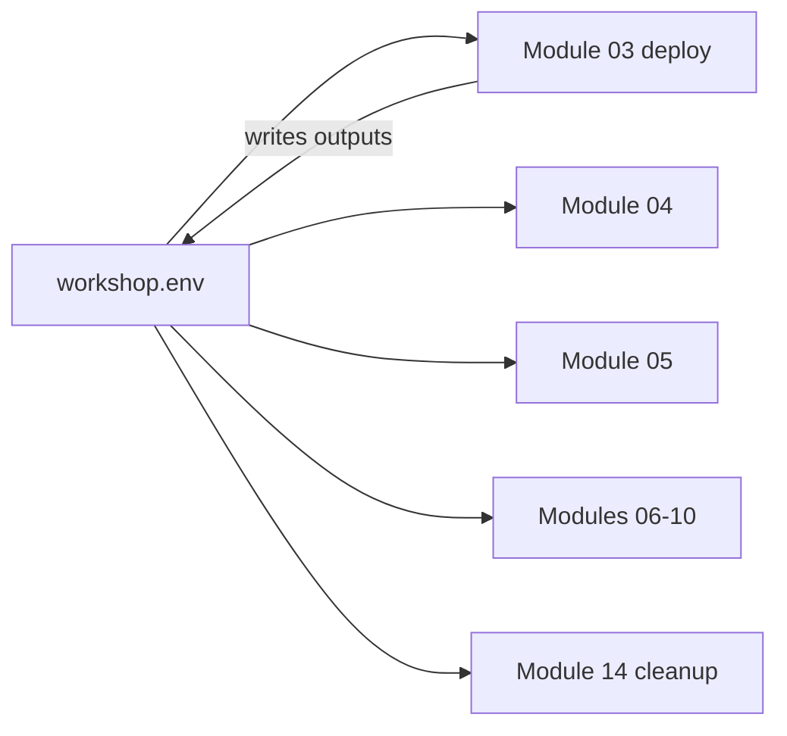

<ul class="sre-meta">
<li class="duration">Estimated time: 10 minutes</li>
<li>Module 00</li>
<li>Reading</li>
</ul>

## Overview

The remaining modules assume a specific working setup: a single terminal session, a consistent set of environment variables, and a naming convention that keeps every resource findable. Establishing those conventions now prevents the most common workshop failure, which is a command that fails because a variable silently went missing three modules ago.

## Learning objectives

* Set up a durable shell environment for the whole workshop.
* Apply the resource naming convention used by the Bicep templates.
* Choose a pacing plan that fits the time you have.
* Know where to look when a command does not behave as documented.

## Architecture context

Every module reads and writes the same variables file. Treat it as workshop state.



## Tasks

### Task 1: Create your workshop variables file

Pick a unique suffix. Several Azure resources in this workshop require globally unique names, and a shared classroom subscription will collide otherwise.

```bash
# Choose a short, lowercase, alphanumeric suffix, for example your initials plus a number
export WORKSHOP_SUFFIX="sre$RANDOM"
export LOCATION="eastus"
export RESOURCE_GROUP="rg-sre-agent-workshop-${WORKSHOP_SUFFIX}"

mkdir -p .workshop
cat > .workshop/workshop.env <<EOF
export WORKSHOP_SUFFIX="${WORKSHOP_SUFFIX}"
export LOCATION="${LOCATION}"
export RESOURCE_GROUP="${RESOURCE_GROUP}"
EOF

echo "Workshop suffix: ${WORKSHOP_SUFFIX}"
```

### Task 2: Re-source the variables in any new terminal

Whenever you open a new shell, restore state before running module commands.

```bash
source .workshop/workshop.env
env | grep -E '^(WORKSHOP_SUFFIX|LOCATION|RESOURCE_GROUP)=' | sort
```

!!! tip "Append, do not overwrite"
    Later modules append deployment outputs such as `ORDERS_API_FQDN` to the same file. Use `>>` when a module tells you to add a value, and reserve `>` for the initial creation above.

### Task 3: Review the naming convention

The Bicep templates derive every resource name from `WORKSHOP_SUFFIX`, so you never need to invent names.

| Resource                | Pattern                         | Example                     |
|-------------------------|----------------------------------|-----------------------------|
| Resource group          | `rg-sre-agent-workshop-<suffix>` | `rg-sre-agent-workshop-sre42` |
| Container Apps environment | `cae-<suffix>`                | `cae-sre42`                 |
| Container registry      | `acr<suffix>`                    | `acrsre42`                  |
| Log Analytics workspace | `law-<suffix>`                   | `law-sre42`                 |
| Application Insights    | `appi-<suffix>`                  | `appi-sre42`                |
| SQL logical server      | `sql-<suffix>`                   | `sql-sre42`                 |
| SQL database            | `sqldb-orders`                   | `sqldb-orders`              |
| Action group            | `ag-sre-workshop`                | `ag-sre-workshop`           |

Container registry names cannot contain hyphens, which is why that one row looks different. Azure, not the workshop, made that decision.

### Task 4: Choose a pacing plan

=== "Single session"

    Roughly five hours with short breaks. Run Modules 00 through 14 in order without deleting anything. This is the best experience because incident telemetry from earlier modules stays available for later comparison.

=== "Two sessions"

    Session one covers Modules 00 through 07 and ends after the first investigation. Leave the infrastructure running but scale `orders-api` to zero minimum replicas to reduce cost. Session two resumes at Module 08.

=== "Instructor-led"

    Allocate 90 minutes for Modules 00 through 05 as a guided walkthrough, then let attendees work Modules 06 through 11 independently. Reserve the final 45 minutes for Modules 12 and 13, which generate the most discussion.

!!! warning "Do not skip Module 04"
    Module 04 creates the alert rules that make the incidents detectable. Skipping it produces an environment where you can break the application but neither you nor the agent gets a signal, which turns the investigation modules into guesswork.

## Validation

Confirm your working environment is ready.

```bash
source .workshop/workshop.env
test -n "${WORKSHOP_SUFFIX}" && echo "OK: suffix is set to ${WORKSHOP_SUFFIX}" || echo "FAIL: run Task 1 again"
test -n "${RESOURCE_GROUP}" && echo "OK: resource group is ${RESOURCE_GROUP}" || echo "FAIL: run Task 1 again"
```

## Expected results

Two `OK` lines. The `.workshop/workshop.env` file exists and is excluded from source control by the repository `.gitignore`, which matters because later modules append connection details to it.

## Knowledge check

??? question "Why does the workshop use a random suffix instead of fixed resource names?"
    Container registry names and SQL logical server names are part of globally unique DNS namespaces. Fixed names would fail for the second person to run the workshop, and would let two attendees in a shared subscription overwrite each other's resources.

??? question "You open a new terminal and `az containerapp show` reports that the resource group does not exist. What happened?"
    The shell variables were not re-sourced, so `RESOURCE_GROUP` expanded to an empty string. Run `source .workshop/workshop.env` and confirm with the validation snippet above.

??? question "Why is `.workshop/` in `.gitignore`?"
    The file accumulates deployment outputs including the SQL administrator password and the fault-injection shared secret. Committing it would publish credentials to your repository history.

## Next steps

You have the concepts and the conventions. Time to check that your machine and subscription can actually run this.

[Next: Module 01 - Prerequisites :material-arrow-right:](../01-prerequisites/index.md){ .md-button .md-button--primary }

<div class="sre-nav" markdown>
[:material-arrow-left: Incident Response Concepts](2-incident-response-concepts.md)
[Module 01 - Prerequisites :material-arrow-right:](../01-prerequisites/index.md)
</div>
