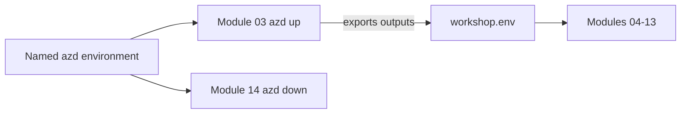

<ul class="sre-meta">
<li class="duration">Estimated time: 10 minutes</li>
<li>Module 00</li>
<li>Reading</li>
</ul>

## Overview

The remaining modules use a named Azure Developer CLI (`azd`) environment as deployment state. Each participant gets an isolated Azure resource group, while `azd` keeps the selected subscription, region, resource names, and deployment outputs together across terminal sessions.

## Learning objectives

* Create a durable `azd` environment for the whole workshop.
* Apply the resource naming convention used by the Bicep templates.
* Choose a pacing plan that fits the time you have.
* Know where to look when a command does not behave as documented.

## Architecture context

`azd` owns the environment. After deployment, it also creates the shell variables file used by the incident exercises.



## Tasks

### Task 1: Create your workshop environment

Choose a short, unique environment name, such as your alias followed by `workshop`. Environment names must be unique when participants share a subscription because each name maps to one resource group.

Run these commands from the cloned repository after completing the tooling and
both-login prerequisites in [Module 01](../01-prerequisites/index.md). If you have
not installed the tools yet, treat this task as a preview and return afterward.

```bash
azd env new "<your-alias>-workshop"
azd env set AZURE_LOCATION eastus2
```

`azd` stores this state under `.azure/<environment-name>/`, which is excluded from source control. The deployment derives a collision-resistant resource suffix from the subscription ID and environment name.

### Task 2: Restore the environment in a new terminal

Select your environment before running deployment or cleanup commands. After Module 03, source the generated compatibility file before running an incident exercise.

```bash
azd env select "<your-alias>-workshop"
azd env get-values

# Available after azd up in Module 03
source .workshop/workshop.env
```

In PowerShell, load `. ./.workshop/workshop.ps1` instead. Both exports contain
allowlisted non-secret identifiers and endpoints. The common Python hooks need
Python 3.10 or later and PyYAML; no local Docker or .NET SDK is needed for deployment.

!!! important "One environment per participant"
    An `azd` environment is a deployment target, not a shell or virtual machine. Participants can run `azd` from a local terminal, a dev container, GitHub Codespaces, or Azure Cloud Shell. Each fresh deployment uses an isolated resource group with a VNet-integrated Consumption workload-profile Container Apps environment, apps and jobs, private SQL/vault endpoints, and the remaining workshop resources. Local fault helpers use ARM and Log Analytics, so your terminal does not need VPN access to the private vault.

### Task 3: Review the naming convention

The Bicep templates choose the resource names. Environment-derived suffixes keep
names distinct where needed; apps and jobs can use fixed names within each
participant's resource group.

| Resource                   | Pattern                                  | Example                               |
|----------------------------|------------------------------------------|---------------------------------------|
| Resource group             | `rg-sre-agent-workshop-<environment>`    | `rg-sre-agent-workshop-ck-workshop`   |
| Container Apps environment | `cae-private-<generated-suffix>`         | `cae-private-ckworabc1234`            |
| Virtual network            | `vnet-<generated-suffix>`                | `vnet-ckworabc1234`                   |
| Container registry         | `acr<generated-suffix>`                  | `acrckworabc1234`                     |
| Log Analytics workspace    | `law-<generated-suffix>`                 | `law-ckworabc1234`                    |
| Application Insights       | `appi-<generated-suffix>`                | `appi-ckworabc1234`                   |
| SQL logical server         | `sql-<generated-suffix>`                 | `sql-ckworabc1234`                    |
| SQL database               | `sqldb-orders`                           | `sqldb-orders`                        |
| Key Vault                  | `kv-<generated-suffix>`                  | `kv-ckworabc1234`                     |
| SQL private endpoint       | `pe-sql-<generated-suffix>`              | `pe-sql-ckworabc1234`                 |
| Key Vault private endpoint | `pe-vault-<generated-suffix>`            | `pe-vault-ckworabc1234`               |
| SQL bootstrap job          | `orders-db-bootstrap`                    | `orders-db-bootstrap`                 |
| Token-initializer job      | `workshop-token-init`                    | `workshop-token-init`                 |
| Fault-client job           | `workshop-fault-client`                  | `workshop-fault-client`               |
| Token-initializer identity | `id-token-<generated-suffix>`            | `id-token-ckworabc1234`               |
| Fault-client identity      | `id-fault-<generated-suffix>`            | `id-fault-ckworabc1234`               |
| Action group               | `ag-sre-workshop`                        | `ag-sre-workshop`                     |

Container registry names cannot contain hyphens, which is why that one row looks different. Azure, not the workshop, made that decision.

The `cae-private-` name identifies the VNet-integrated environment, not private
application ingress. Orders HTTPS, ACR, and Azure Monitor ingestion/query remain
public; SQL and Key Vault public access is disabled. If you have an older
`cae-*` deployment, read the
[migration guidance](../03-deploy-infrastructure/index.md#updating-an-earlier-deployment)
before rerunning deployment.

### Task 4: Choose a pacing plan

=== "Single session"

    Roughly five hours with short breaks. Run Modules 00 through 14 in order without deleting anything. This is the best experience because incident telemetry from earlier modules stays available for later comparison.

=== "Two sessions"

    Session one covers Modules 00 through 07 and ends after the first investigation. Leave the infrastructure running but scale `orders-api` to zero minimum replicas to reduce cost. Session two resumes at Module 08.

=== "Instructor-led"

    Allocate 90 minutes for Modules 00 through 05 as a guided walkthrough, then let attendees work Modules 06 through 11 independently. Reserve the final 45 minutes for Modules 12 and 13, which generate the most discussion.

!!! warning "Do not skip Module 04"
    Module 03 deploys the monitoring and agent configuration through `azd up`. Module 04 verifies telemetry and establishes a baseline; skipping verification can leave you investigating without useful data.

## Validation

Confirm the environment is selected and has a deployment region.

```bash
azd env get-value AZURE_ENV_NAME
azd env get-value AZURE_LOCATION
```

## Expected results

The commands return your unique environment name and chosen Azure region.

## Knowledge check

??? question "Why does the workshop derive a suffix instead of using the environment name directly?"
    Container registry names cannot contain hyphens and several resource names use globally unique DNS namespaces. A deterministic hash of the subscription and environment name keeps names valid, stable across redeployments, and unlikely to collide.

??? question "You open a new terminal and `azd` targets the wrong deployment. What happened?"
    A different `azd` environment is selected. Run `azd env list`, then select yours with `azd env select <name>`.

??? question "Why is `.workshop/` in `.gitignore`?"
    It contains participant-specific deployment identifiers and investigation notes, not shared source. Generated exports contain no secrets; fault helpers start a private job and retrieve only its non-secret result from Log Analytics. Credentials are read inside the VNet, never on the attendee laptop. Keeping the directory ignored also prevents accidental publication of future local artifacts.

## Next steps

You have the concepts and the conventions. Time to check that your machine and subscription can actually run this.

[Next: Module 01 - Prerequisites :material-arrow-right:](../01-prerequisites/index.md){ .md-button .md-button--primary }

<div class="sre-nav" markdown>
[:material-arrow-left: Incident Response Concepts](2-incident-response-concepts.md)
[Module 01 - Prerequisites :material-arrow-right:](../01-prerequisites/index.md)
</div>
