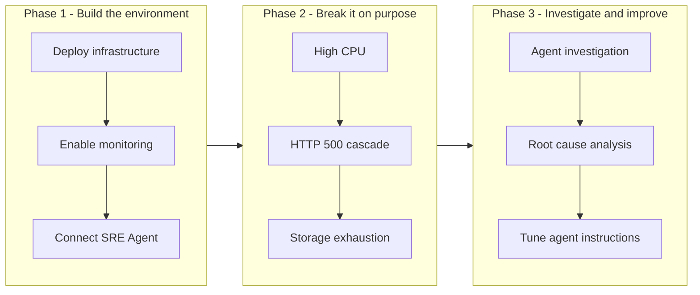

<ul class="sre-meta">
<li class="duration">Estimated time: 15 minutes</li>
<li>Module 00</li>
<li>Reading</li>
</ul>

## Overview

Modern Azure workloads emit an overwhelming amount of telemetry. When something breaks, the hard part is rarely finding data. The hard part is correlating a metric spike with a log pattern, a distributed trace, and a deployment that shipped forty minutes earlier, while a director asks for an ETA every five minutes.

Azure SRE Agent is designed for exactly that moment. It reads your Azure resources, metrics, logs, traces, and change history, then produces a reasoned diagnosis instead of another dashboard.

This module explains the scenario you deploy, what you learn, and how the workshop is structured, so that the remaining modules feel like a guided incident response rotation rather than a pile of disconnected labs.

## Learning objectives

* Describe the workshop scenario and the failure modes you reproduce.
* Explain the role Azure SRE Agent plays in an incident response workflow.
* Identify which modules build infrastructure and which modules exercise it.
* Decide whether to run the workshop end to end in one session or across several.

## Architecture context

The workshop has three phases. Everything before Module 06 exists to make the incidents in Modules 06 through 10 realistic and observable.

You spend roughly a third of the workshop building, a third breaking, and a third investigating. That ratio is intentional. An investigation is only as good as the telemetry underneath it, so the setup modules are not filler.

## The scenario

You operate **Contoso Order Services**, a fictional retailer's order-processing platform. It is small enough to reason about and large enough to fail in interesting ways.

| Component        | Azure service          | Responsibility                                            |
|------------------|------------------------|-----------------------------------------------------------|
| `orders-api`     | Azure Container Apps   | Public HTTP API that accepts and queries customer orders   |
| `catalog-api`    | Azure Container Apps   | Internal service that resolves product and pricing data    |
| Orders database  | Azure SQL Database     | Durable storage for orders and order line items            |
| Telemetry store  | Log Analytics workspace| Central store for platform logs, metrics, and traces       |
| APM              | Application Insights   | Request, dependency, and exception telemetry               |
| Detection        | Azure Monitor alerts   | Metric and log alert rules that fire the incidents         |

`orders-api` exposes a small set of deliberately unsafe fault-injection endpoints. They are protected by a shared secret and disabled by default outside the workshop, which is the only reason it is acceptable to ship them at all.

## What Azure SRE Agent contributes

An SRE with enough time and enough coffee can solve every incident in this workshop manually. The point is not that the agent solves problems humans cannot. The point is the time compression and the consistency.

| Investigation step               | Manual approach                                     | With Azure SRE Agent                            |
|----------------------------------|-----------------------------------------------------|--------------------------------------------------|
| Identify affected resources      | Click through the portal resource by resource        | Agent enumerates the resource graph              |
| Correlate metrics with logs      | Write KQL, switch blades, compare timestamps         | Agent queries and aligns time series for you     |
| Find the triggering change       | Search deployment history and pipeline runs          | Agent inspects change history in the same pass   |
| Produce a written RCA            | Draft from memory after the fact                     | Agent drafts a timeline you edit                 |
| Apply consistent process         | Depends who is on call                               | Same runbook every time                          |

!!! note "The agent is a collaborator, not an oracle"
    Every module asks you to verify the agent's conclusions against raw telemetry. In [Module 11](../11-root-cause-analysis/index.md) you deliberately look for places where the agent's reasoning is incomplete. Treating agent output as gospel is how you end up remediating the wrong service at 3 a.m.

## Workshop conventions

Each module uses the same structure so you always know where to look.

* An overview explains why the module exists.
* Learning objectives state what you should be able to do afterwards.
* Architecture context shows where the module fits.
* Numbered tasks contain the copy-paste commands.
* A validation section proves the module worked.
* Expected results describe what you should be seeing.
* A knowledge check reinforces the key ideas.
* Next steps link forward.

Commands are written for Bash. Windows users should run them in Windows Subsystem for Linux, Azure Cloud Shell, or a Git Bash session. PowerShell equivalents are provided where the difference is more than cosmetic.

!!! tip "Keep one terminal session for the whole workshop"
    Modules export shell variables such as `RESOURCE_GROUP` and `ORDERS_API_FQDN` and reuse them later. If you close your terminal, re-source the variables file described in [Workshop Variables](../30-appendix/01-variables.md).

## Validation

You are ready to continue when you can answer these without scrolling back:

* [x] You can name the two application services and the database in the scenario.
* [x] You can explain why the workshop injects faults rather than waiting for real ones.
* [x] You know that agent conclusions get verified against raw telemetry in every module.

## Expected results

Nothing is deployed yet. You should have a mental model of a two-service application backed by Azure SQL Database, monitored by Application Insights and Log Analytics, and observed by Azure SRE Agent.

## Knowledge check

??? question "Why does the workshop spend three modules on setup before triggering the first incident?"
    An incident investigation is bounded by the telemetry available. Without Application Insights instrumentation, diagnostic settings streaming to Log Analytics, and alert rules that actually fire, both you and the agent would be guessing. The setup modules create the evidence trail the investigation modules depend on.

??? question "What is the difference between the detection layer and the investigation layer in this architecture?"
    Detection is Azure Monitor alert rules noticing that a metric or log pattern crossed a threshold. Investigation is correlating that signal with other signals to explain the cause. Azure Monitor tells you something is wrong; Azure SRE Agent works out why.

??? question "Is it safe to deploy the fault-injection endpoints to a production workload?"
    No. The endpoints intentionally exhaust CPU, force exception paths, and consume database storage. They exist behind a shared secret in an isolated workshop resource group and should never be enabled in an environment that serves real traffic.

## Next steps

Continue to the background material, or skip straight to the prerequisites if you already know what Azure SRE Agent is.

[Next: What Is Azure SRE Agent :material-arrow-right:](1-what-is-sre-agent.md){ .md-button .md-button--primary }

[:material-arrow-left: Homepage](../../index.md)
[What Is Azure SRE Agent :material-arrow-right:](1-what-is-sre-agent.md)

