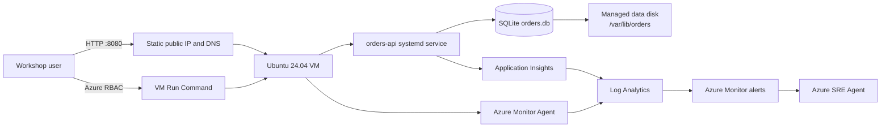

<ul class="sre-meta">
<li class="duration">Estimated time: 45 minutes</li>
<li>Module 01</li>
<li>Hands-on</li>
</ul>

## Overview

Deploy one Ubuntu VM that runs the .NET 8 Orders API as a hardened, non-root
`systemd` service. The application stores orders in SQLite on a separate managed
data disk mounted at `/var/lib/orders`. It is reachable through a public HTTP
endpoint on port 8080; SSH and public fault endpoints are not exposed.

Deployment also creates Log Analytics, workspace-based Application Insights,
Azure Monitor Agent, three alert rules, and a read-only Azure SRE Agent. The
`azd up` workflow configures the VM, initializes SQLite, enables the service,
creates the SRE Agent response plan, and calls the real public API. Provisioning
a VM is not enough: the live smoke check must pass.

## Learning objectives

* Prepare the Azure CLI, Azure Developer CLI, Python, and local shell.
* Deploy the complete workshop into a new Azure resource group.
* Verify the public API and the absence of destructive HTTP fault routes.
* Prove that `orders-api` runs under `systemd` and SQLite uses the managed disk.
* Restart the VM and prove that the service and persisted orders recover.
* Confirm healthy endpoint activity in VM Metrics and Application Insights.

## Architecture



The public endpoint is intentionally simple and suitable only for disposable
synthetic workshop data. Administration and controlled faults use authenticated
Azure VM Run Command. Do not add SSH access or copy this design into production.

## Tasks

### Task 1: Verify prerequisites

You need:

* An Azure subscription where you are `Owner`, or `Contributor` plus
  `User Access Administrator`.
* Azure Developer CLI 1.18 or later.
* Azure CLI 2.60 or later.
* Python 3.10 or later.
* Bash with `curl` and `jq`, or PowerShell 7, plus OpenSSH `ssh-keygen`.
* Permission to run VM Run Command and query Log Analytics.

=== "Bash"

    ```bash
    az version
    azd version
    python --version
    ssh-keygen -V 2>&1 | head -1 || true
    python -m pip install -r requirements.txt
    ```

=== "PowerShell"

    ```powershell
    az version
    azd version
    python --version
    Get-Command ssh-keygen | Select-Object -ExpandProperty Source
    python -m pip install -r requirements.txt
    ```

The deployment does not require Docker or a local .NET SDK. The VM installs the
Ubuntu-packaged .NET 8 SDK and builds a checksummed source bundle delivered
through Run Command.

### Task 2: Authenticate and choose the subscription

=== "Bash"

    ```bash
    az login
    az account set --subscription "<subscription-id-or-name>"
    az account show \
      --query "{Name:name, Subscription:id, Tenant:tenantId}" \
      --output table
    azd auth login
    ```

=== "PowerShell"

    ```powershell
    az login
    az account set --subscription "<subscription-id-or-name>"
    az account show `
      --query "{Name:name, Subscription:id, Tenant:tenantId}" `
      --output table
    azd auth login
    ```

Use the same identity and tenant for both CLIs. The preflight check rejects
mismatched logins before creating resources.

### Task 3: Create a fresh workshop environment

Use a new environment name. The deployment deliberately refuses to migrate a
resource group tagged with an older workshop architecture.

=== "Bash"

    ```bash
    azd env new "<your-alias>-sre-vm-aue"
    azd env set AZURE_LOCATION australiaeast
    ```

=== "PowerShell"

    ```powershell
    azd env new "<your-alias>-sre-vm-aue"
    azd env set AZURE_LOCATION australiaeast
    ```

Optionally configure an alert email before deployment:

=== "Bash"

    ```bash
    azd env set ALERT_EMAIL "you@example.com"
    ```

=== "PowerShell"

    ```powershell
    azd env set ALERT_EMAIL "you@example.com"
    ```

The default `Standard_D2as_v5` is an x64, two-vCPU, non-burstable VM. If it is
unavailable within your quota, choose another x64 Generation 2 size with at
least 4 GiB RAM:

=== "Bash"

    ```bash
    azd env set VM_SIZE "<available-x64-vm-size>"
    ```

=== "PowerShell"

    ```powershell
    azd env set VM_SIZE "<available-x64-vm-size>"
    ```

Preflight reports policy, provider, quota, SKU, or regional availability
problems explicitly. It never changes your subscription, requests quota, picks a
different region, or creates policy exemptions.

### Task 4: Deploy the workshop

=== "Bash"

    ```bash
    azd up
    ```

=== "PowerShell"

    ```powershell
    azd up
    ```

Allow approximately 8 to 15 minutes for a fresh deployment. The workflow:

1. Provisions the network, VM, managed disk, monitoring, alerts, and SRE Agent.
2. Mounts the data disk by UUID at `/var/lib/orders`.
3. Publishes and bootstraps the Orders API.
4. Enables `orders-api.service`.
5. Configures the Sev1/Sev2 SRE Agent response plan in Review mode.
6. Calls `/orders` and verifies that the retired `/fault/*` routes return 404.

If a later stage fails, correct the reported cause and rerun `azd up`. The
operation is repeatable: it preserves the disk, existing orders, seed rows, and
an unchanged application bundle.

### Task 5: Load the deployment outputs

=== "Bash"

    ```bash
    source .workshop/workshop.env
    printf 'API: %s\nVM: %s\nResource group: %s\n' \
      "${SERVICE_ORDERS_API_ENDPOINT_URL}" "${VM_NAME}" "${RESOURCE_GROUP}"
    ```

=== "PowerShell"

    ```powershell
    . ./.workshop/workshop.ps1
    "API: $env:SERVICE_ORDERS_API_ENDPOINT_URL"
    "VM: $env:VM_NAME"
    "Resource group: $env:RESOURCE_GROUP"
    ```

These generated files contain an allowlist of non-secret names, IDs, and
endpoints. They contain no VM private key, API credential, or administrative
secret.

### Task 6: Prove the application and storage layout

=== "Bash"

    ```bash
    python scripts/workshop.py smoke
    python scripts/workshop.py inspect
    ```

=== "PowerShell"

    ```powershell
    python scripts/workshop.py smoke
    python scripts/workshop.py inspect
    ```

`smoke` validates the public URL and persisted order shape. `inspect` runs a
read-only check through authenticated Run Command and verifies:

* `/var/lib/orders` is a separate ext4 filesystem at managed-disk LUN 0.
* `/var/lib/orders/orders.db` resides on that filesystem.
* SQLite quick-check returns `ok` and journal mode is `wal`.
* The five reserved seed orders exist exactly once.
* `orders-api` is active, enabled, configured to restart, and runs as user
  `orders`.

Call the same public endpoints yourself:

=== "Bash"

    ```bash
    curl --silent --fail "${SERVICE_ORDERS_API_ENDPOINT_URL}/health/live" | jq .
    curl --silent --fail "${SERVICE_ORDERS_API_ENDPOINT_URL}/health/ready" | jq .
    curl --silent --fail "${SERVICE_ORDERS_API_ENDPOINT_URL}/orders" | jq .
    curl --silent --fail "${SERVICE_ORDERS_API_ENDPOINT_URL}/storage" | jq .
    ```

=== "PowerShell"

    ```powershell
    Invoke-RestMethod "$env:SERVICE_ORDERS_API_ENDPOINT_URL/health/live"
    Invoke-RestMethod "$env:SERVICE_ORDERS_API_ENDPOINT_URL/health/ready"
    Invoke-RestMethod "$env:SERVICE_ORDERS_API_ENDPOINT_URL/orders"
    Invoke-RestMethod "$env:SERVICE_ORDERS_API_ENDPOINT_URL/storage"
    ```

Create a synthetic order:

=== "Bash"

    ```bash
    curl --silent --fail \
      --request POST "${SERVICE_ORDERS_API_ENDPOINT_URL}/orders" \
      --header 'Content-Type: application/json' \
      --data '{"customerId":"module-01","productId":"SKU-1002","quantity":2}' | jq .
    ```

=== "PowerShell"

    ```powershell
    $body = @{
      customerId = 'module-01'
      productId  = 'SKU-1002'
      quantity   = 2
    } | ConvertTo-Json

    Invoke-RestMethod `
      -Method Post `
      -Uri "$env:SERVICE_ORDERS_API_ENDPOINT_URL/orders" `
      -ContentType 'application/json' `
      -Body $body
    ```

### Task 7: Prove restart recovery and persistence

=== "Bash"

    ```bash
    python scripts/workshop.py verify-restart
    ```

=== "PowerShell"

    ```powershell
    python scripts/workshop.py verify-restart
    ```

The command creates or reuses a persistence witness, restarts only the selected
workshop VM, waits for readiness, and verifies:

* The VM boot ID changed.
* The managed-disk UUID did not change.
* `systemd` restarted the API automatically.
* The witness order is unchanged and readable through the public endpoint.

### Task 8: Confirm healthy telemetry before the incidents

Open the Azure portal and select:

1. **Resource groups** > your workshop resource group.
2. The virtual machine named `vm-orders-<suffix>`.
3. **Monitoring** > **Metrics**.
4. Metric **Percentage CPU**, aggregation **Average**, time granularity
   **1 minute**, and time range **Last 30 minutes**.

Generate two minutes of healthy endpoint activity in another terminal while the
chart is open:

=== "Bash"

    ```bash
    for i in $(seq 1 120); do
      curl --silent --fail \
        "${SERVICE_ORDERS_API_ENDPOINT_URL}/orders" > /dev/null
      sleep 1
    done
    ```

=== "PowerShell"

    ```powershell
    1..120 | ForEach-Object {
      Invoke-RestMethod "$env:SERVICE_ORDERS_API_ENDPOINT_URL/orders" | Out-Null
      Start-Sleep -Seconds 1
    }
    ```

Refresh the chart after one or two minutes. Confirm that **Percentage CPU** is
healthy before the saturation incident in Module 03. You do not need to record
an extended baseline or create a worksheet.

<!-- SCREENSHOT: VM Monitoring Metrics blade showing healthy Percentage CPU while /orders is called -->

From the workshop resource group, open `appi-<suffix>` and select
**Investigate** > **Performance**. Use **Last 30 minutes** and confirm that
`GET /orders` appears. Application Insights ingestion can lag by several
minutes.

Finally, verify that the required VM and application signals have arrived:

=== "Bash"

    ```bash
    python scripts/workshop.py telemetry
    ```

=== "PowerShell"

    ```powershell
    python scripts/workshop.py telemetry
    ```

The helper waits for VM heartbeat, guest CPU, data-disk free space, API
requests, SQLite dependencies, and the SQLite availability result. This short
check proves that the SRE Agent will have evidence to investigate; deeper
analysis happens inside the incident modules.

## Validation

* [x] `azd up` completed through the public smoke stage.
* [x] The public `/health/ready`, `/orders`, and `/storage` endpoints return 200.
* [x] VM inspection reports an active non-root service and valid SQLite WAL database.
* [x] Restart validation preserves the disk UUID and witness order.
* [x] You viewed healthy activity in VM Metrics and Application Insights.
* [x] `python scripts/workshop.py telemetry` confirmed the investigation signals.

## Knowledge check

??? question "Why does successful VM provisioning not complete the deployment?"
    ARM can report a healthy VM even when the application failed to publish, the data disk was not mounted, `systemd` did not start, or the public endpoint is unreachable. The post-provision smoke and inspection checks validate the service that attendees actually use.

??? question "Why does the service declare `RequiresMountsFor=/var/lib/orders`?"
    It prevents the API from silently starting against the OS disk when the managed disk is absent. Failing closed protects persistence and makes a storage problem visible instead of writing data to the wrong filesystem.

??? question "Why is the public API HTTP while administration is not exposed publicly?"
    The public endpoint keeps the disposable workshop easy to exercise and observe. Administrative operations can change VM state, so they remain behind Azure authentication, RBAC, and Run Command. This is a workshop tradeoff, not a production security pattern.

## Next steps

[Next: Module 02 - Operate the SRE Agent Response Plan :material-arrow-right:](../02-operate-response-plan/index.md){ .md-button .md-button--primary }

<div class="sre-nav" markdown>
[Workshop home](../../index.md)
[Module 02 - Operate the SRE Agent Response Plan :material-arrow-right:](../02-operate-response-plan/index.md)
</div>
