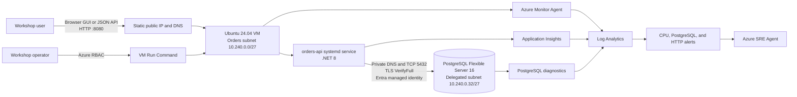

<ul class="sre-meta">
<li class="duration">Estimated time: 45 minutes</li>
<li>Module 01</li>
<li>Hands-on</li>
</ul>

## Overview

Deploy one Ubuntu VM that runs the .NET 8 Orders API and browser GUI as a
non-root `systemd` service. The public application reaches a private Azure
Database for PostgreSQL Flexible Server over a dedicated network path using its
system-assigned managed identity and TLS hostname verification.

Deployment also creates Log Analytics, workspace-based Application Insights,
Azure Monitor Agent, three alert rules, and a read-only Azure SRE Agent. A
successful resource deployment is not enough. The `azd up` workflow bootstraps
the schema, starts the service, configures the response plan, and runs a public
smoke test.

## Learning objectives

* Validate local prerequisites, identity, provider, region, and SKU readiness.
* Deploy the complete workshop into a new tagged resource group.
* Explain the private database network and identity boundaries.
* Exercise the public GUI and `/database` status route.
* Verify private DNS, TLS, PostgreSQL version, migration, seed, service, and
  health from the VM.
* Restart only the VM and prove that an order remains in the separate database.
* Confirm the telemetry required for later investigations.

## Architecture


```mermaid
flowchart LR
    User[Workshop user] -->|Browser GUI or JSON API<br/>HTTP :8080| IP[Static public IP and DNS]
    IP --> VM[Ubuntu 24.04 VM<br/>Orders subnet 10.240.0.0/27]
    VM --> Service[orders-api systemd service<br/>.NET 8]
    Service -->|Private DNS and TCP 5432<br/>TLS VerifyFull<br/>Entra managed identity| PG[(PostgreSQL Flexible Server 16<br/>Delegated subnet 10.240.0.32/27)]

    Service --> AI[Application Insights]
    VM --> AMA[Azure Monitor Agent]
    PG --> Diag[PostgreSQL diagnostics]
    AMA --> LAW[Log Analytics]
    AI --> LAW
    Diag --> LAW
    LAW --> Alerts[CPU, PostgreSQL, and HTTP alerts]
    Alerts --> Agent[Azure SRE Agent]

    Operator[Workshop operator] -->|Azure RBAC| RC[VM Run Command]
    RC --> VM
```

PostgreSQL settings are fixed for the workshop:

| Setting | Value |
| --- | --- |
| Service | Azure Database for PostgreSQL Flexible Server |
| Engine | PostgreSQL 16 |
| Compute | `Standard_B1ms`, Burstable |
| Storage | 32 GiB, auto-grow enabled |
| High availability | Disabled |
| Backup | Seven days, locally redundant |
| Public access | Disabled |
| Private DNS | `private.postgres.database.azure.com` |
| Authentication | Microsoft Entra only |
| Runtime principal | VM system-assigned managed identity |
| TLS | `VerifyFull` |

The VM identity is also the PostgreSQL Entra administrator. This is a
credential-free shortcut for a disposable lab. Production should use one
identity for controlled schema administration and a separate, least-privileged
runtime identity.

The managed server has a lifecycle separate from the VM, so restarting the VM
does not restart PostgreSQL. This is better isolation than hosting both
processes on one VM. It does not provide a production failure domain: the API
still has one VM, PostgreSQL has no HA, and both resources are in one region.

## Tasks

### Task 1: Verify prerequisites

You need:

* An Azure subscription where you are `Owner`, or `Contributor` plus
  `User Access Administrator`.
* Azure Developer CLI 1.18 or later.
* Azure CLI 2.60 or later.
* Python 3.10 or later.
* Bash with `curl` and `jq`, or PowerShell 7, plus OpenSSH `ssh-keygen`.
* Permission to execute VM Run Command and query Log Analytics.

=== "Bash"

    ```bash
    az version
    azd version
    python --version
    ssh-keygen -V 2>&1 | head -1 || true
    python -m pip install -r requirements.txt
    ```

=== "PowerShell"

    ```powershell
    az version
    azd version
    python --version
    Get-Command ssh-keygen | Select-Object -ExpandProperty Source
    python -m pip install -r requirements.txt
    ```

Azure deployment does not require Docker or a local .NET SDK. The VM installs
the .NET 8 SDK and PostgreSQL client and builds the checksummed source bundle
delivered through Run Command. Local application tests have different
prerequisites and use PostgreSQL 16 through Testcontainers or
`ORDERS_TEST_POSTGRES_CONNECTION_STRING`.

### Task 2: Authenticate and select the subscription

=== "Bash"

    ```bash
    az login
    az account set --subscription "<subscription-id-or-name>"
    az account show \
      --query "{Name:name,Subscription:id,Tenant:tenantId,Identity:user.name}" \
      --output table
    azd auth login
    ```

=== "PowerShell"

    ```powershell
    az login
    az account set --subscription "<subscription-id-or-name>"
    az account show `
      --query "{Name:name,Subscription:id,Tenant:tenantId,Identity:user.name}" `
      --output table
    azd auth login
    ```

Preflight compares both tools' token principal and tenant. It rejects a mismatch
before deployment because role assignment and post-provision operations must use
the same intended identity.

### Task 3: Create a fresh environment

Use a new environment name:

=== "Bash"

    ```bash
    azd env new "<your-alias>-sre-vm-aue"
    azd env set AZURE_LOCATION australiaeast
    ```

=== "PowerShell"

    ```powershell
    azd env new "<your-alias>-sre-vm-aue"
    azd env set AZURE_LOCATION australiaeast
    ```

The resource group will be named
`rg-sre-agent-workshop-<environment>` and tagged:

```text
workshop-architecture=single-vm-postgresql-v1
```

If that resource group already exists with another architecture tag, deployment
stops. Legacy resources and data are not migrated or deleted. Select a new
environment or remove the old disposable environment explicitly.

Optionally configure alert email:

```bash
azd env set ALERT_EMAIL "you@example.com"
```

The default application VM is `Standard_D2as_v5`. If unavailable, set another
x64 Generation 2 size:

```bash
azd env set VM_SIZE "<available-x64-vm-size>"
```

Use at least 4 GiB RAM for the on-VM build and Azure Monitor Agent. Burstable VM
credit behavior can make the CPU exercise misleading.

Preflight checks:

* Required Azure provider registration.
* Azure SRE Agent regional advertisement.
* VM architecture, generation, restrictions, and regional and family quota.
* PostgreSQL 16 and `Standard_B1ms` availability for the subscription and
  region.

It does not request quota, upgrade the subscription, remove spending limits,
change region, choose a different SKU, or create policy exemptions.

### Task 4: Deploy

=== "Bash"

    ```bash
    azd up
    ```

=== "PowerShell"

    ```powershell
    azd up
    ```

Allow approximately 8 to 15 minutes for a fresh run, but treat that as a target
rather than an Azure SLA. The workflow:

1. Creates the resource group and architecture tag.
2. Creates the VNet, Orders subnet, delegated PostgreSQL subnet, NSG, public IP,
   and private DNS zone and link.
3. Creates the Ubuntu VM with a system-assigned identity.
4. Creates PostgreSQL 16 and the `orders` database with Entra-only
   authentication and public access disabled.
5. Makes the VM identity the PostgreSQL Entra administrator.
6. Creates monitoring, alerts, SRE Agent, and read-only agent role assignments.
7. Uses VM Run Command to install packages, publish the API, and write a
   password-free connection configuration.
8. Waits for private DNS and TCP 5432, obtains a managed-identity token, applies
   schema migration 1, and inserts the five deterministic seed rows.
9. Enables and starts `orders-api.service`.
10. Creates and reads back the Sev1/Sev2 Review response plan.
11. Calls the public `/orders` and `/database` routes and verifies that public
    fault routes do not exist.

If a later stage fails, read the named stage and preserved evidence under
`.workshop/<environment>/`, correct the cause, and rerun `azd up`.

Repeated deployment is idempotent for schema and seed data. It also reconciles
the fixed `PostgreSqlFaultInjection` rule to its normal `Allow` state. It does
not migrate a legacy architecture.

### Task 5: Load and inspect safe outputs

=== "Bash"

    ```bash
    source .workshop/workshop.env
    printf 'API: %s\nVM: %s\nPostgreSQL: %s\nResource group: %s\n' \
      "${SERVICE_ORDERS_API_ENDPOINT_URL}" \
      "${VM_NAME}" \
      "${POSTGRESQL_SERVER_NAME}" \
      "${RESOURCE_GROUP}"
    ```

=== "PowerShell"

    ```powershell
    . ./.workshop/workshop.ps1
    "API: $env:SERVICE_ORDERS_API_ENDPOINT_URL"
    "VM: $env:VM_NAME"
    "PostgreSQL: $env:POSTGRESQL_SERVER_NAME"
    "Resource group: $env:RESOURCE_GROUP"
    ```

The generated shell files contain an explicit allowlist of non-secret resource
names, IDs, DNS names, and endpoints. Relevant PostgreSQL outputs include:

* `POSTGRESQL_SERVER_NAME` and `POSTGRESQL_SERVER_RESOURCE_ID`
* `POSTGRESQL_HOST`, `POSTGRESQL_DATABASE`, and `POSTGRESQL_USER`
* `POSTGRESQL_SUBNET_RESOURCE_ID`
* `POSTGRESQL_PRIVATE_DNS_ZONE_NAME` and its resource ID
* `POSTGRESQL_FAULT_RULE_NAME` and its resource ID

They contain no database password, Entra token, VM private key, or API
credential.

Inspect the server configuration:

=== "Bash"

    ```bash
    az postgres flexible-server show \
      --resource-group "${RESOURCE_GROUP}" \
      --name "${POSTGRESQL_SERVER_NAME}" \
      --query "{Name:name,State:state,Version:version,Sku:sku.name,Tier:sku.tier,StorageGiB:storage.storageSizeGb,AutoGrow:storage.autoGrow,HighAvailability:highAvailability.mode,BackupDays:backup.backupRetentionDays,GeoBackup:backup.geoRedundantBackup,PublicAccess:network.publicNetworkAccess}" \
      --output table
    ```

=== "PowerShell"

    ```powershell
    az postgres flexible-server show `
      --resource-group $env:RESOURCE_GROUP `
      --name $env:POSTGRESQL_SERVER_NAME `
      --query "{Name:name,State:state,Version:version,Sku:sku.name,Tier:sku.tier,StorageGiB:storage.storageSizeGb,AutoGrow:storage.autoGrow,HighAvailability:highAvailability.mode,BackupDays:backup.backupRetentionDays,GeoBackup:backup.geoRedundantBackup,PublicAccess:network.publicNetworkAccess}" `
      --output table
    ```

### Task 6: Validate the application and private database

=== "Bash"

    ```bash
    python scripts/workshop.py smoke
    python scripts/workshop.py inspect
    ```

=== "PowerShell"

    ```powershell
    python scripts/workshop.py smoke
    python scripts/workshop.py inspect
    ```

`smoke` verifies:

* Public readiness.
* At least five correctly shaped persisted orders.
* `/database` reports provider `PostgreSQL`, status `ready`, schema version 1,
  and a positive database size.
* `/fault/cpu`, `/fault/postgresql`, and `/fault/reset` do not exist publicly.

`inspect` uses authenticated VM Run Command and verifies:

* `orders-api` is active, enabled, set to restart, and runs as user `orders`.
* The configured PostgreSQL host resolves only to private addresses.
* The connection has no password and uses managed identity.
* TLS mode is `verify-full`.
* The VM can acquire a PostgreSQL access token from its managed identity.
* `psql` reaches PostgreSQL 16.
* Migration version 1 and all five deterministic seed rows exist.
* Local liveness and schema-backed readiness both succeed.

Open `SERVICE_ORDERS_API_ENDPOINT_URL` in a browser. List the seed data, create
one synthetic order, open its details, update its quantity, and select
**Refresh status**.

The status cards call `/health/live`, `/health/ready`, and `/database` every 30
seconds while the tab is visible. `/database` reports:

* `provider`
* `status`
* `serverVersion`
* `schemaVersion`
* `databaseBytes`

Call the routes directly:

=== "Bash"

    ```bash
    curl --silent --fail "${SERVICE_ORDERS_API_ENDPOINT_URL}/health/live" | jq .
    curl --silent --fail "${SERVICE_ORDERS_API_ENDPOINT_URL}/health/ready" | jq .
    curl --silent --fail "${SERVICE_ORDERS_API_ENDPOINT_URL}/orders" | jq .
    curl --silent --fail "${SERVICE_ORDERS_API_ENDPOINT_URL}/database" | jq .
    ```

=== "PowerShell"

    ```powershell
    Invoke-RestMethod "$env:SERVICE_ORDERS_API_ENDPOINT_URL/health/live"
    Invoke-RestMethod "$env:SERVICE_ORDERS_API_ENDPOINT_URL/health/ready"
    Invoke-RestMethod "$env:SERVICE_ORDERS_API_ENDPOINT_URL/orders"
    Invoke-RestMethod "$env:SERVICE_ORDERS_API_ENDPOINT_URL/database"
    ```

### Task 7: Prove persistence across a VM restart

=== "Bash"

    ```bash
    python scripts/workshop.py verify-restart
    ```

=== "PowerShell"

    ```powershell
    python scripts/workshop.py verify-restart
    ```

The helper creates or reuses a synthetic order and binds its local witness file
to `POSTGRESQL_SERVER_RESOURCE_ID`. It then:

1. Records the VM boot ID, PostgreSQL server version, and migration version.
2. Restarts only the selected VM.
3. Waits for public schema-backed readiness.
4. Confirms that the boot ID changed.
5. Confirms that PostgreSQL version and migration state remain valid.
6. Reads the unchanged order from the same PostgreSQL server.
7. Reruns the public smoke check.

A witness from another PostgreSQL resource is rejected. A witness from a
pre-PostgreSQL workshop is replaced. This prevents unrelated local evidence from
being mistaken for persistence proof.

### Task 8: Confirm healthy telemetry

Open the Azure portal:

1. Select your workshop resource group.
2. Open `vm-orders-<suffix>`.
3. Select **Monitoring** > **Metrics**.
4. Choose **Percentage CPU**, aggregation **Average**, time granularity
   **1 minute**, and **Last 30 minutes**.

Generate two minutes of healthy traffic:

=== "Bash"

    ```bash
    for i in $(seq 1 120); do
      curl --silent --fail "${SERVICE_ORDERS_API_ENDPOINT_URL}/orders" > /dev/null
      sleep 1
    done
    ```

=== "PowerShell"

    ```powershell
    1..120 | ForEach-Object {
      Invoke-RestMethod "$env:SERVICE_ORDERS_API_ENDPOINT_URL/orders" |
        Out-Null
      Start-Sleep -Seconds 1
    }
    ```

Refresh the chart. Save the healthy CPU range for comparison in Module 03.

<!-- SCREENSHOT: VM Metrics with a healthy Percentage CPU baseline from an actual workshop environment -->

Open `appi-<suffix>` > **Investigate** > **Performance** and confirm
`GET /orders`, `GET /health/ready`, and `GET /database` appear. Then run:

=== "Bash"

    ```bash
    python scripts/workshop.py telemetry
    ```

=== "PowerShell"

    ```powershell
    python scripts/workshop.py telemetry
    ```

The helper waits up to ten minutes for:

* VM heartbeat.
* Guest CPU samples.
* Orders API request telemetry.
* `AppDependencies` samples with
  `DependencyType == "PostgreSQL"`.
* `AppAvailabilityResults` from the database availability probe.

Exceptions are not required in a healthy baseline. Application Insights and Log
Analytics can lag by several minutes.

## Validation

* [x] `azd up` completed through public smoke.
* [x] The server is PostgreSQL 16 with the documented private, storage, backup,
  and HA settings.
* [x] No database credential was emitted.
* [x] `/health/ready`, `/orders`, and `/database` return HTTP 200.
* [x] The GUI displays PostgreSQL provider, version, schema, size, and latency.
* [x] Inspection validates private DNS, TLS, managed identity, schema, seed,
  service, and health.
* [x] Restart validation preserves an order in the same PostgreSQL resource.
* [x] Healthy CPU, request, dependency, and availability signals are visible.

## Knowledge check

??? question "Why does successful Bicep provisioning not complete the deployment?"
    Azure can report that resources exist while private DNS, identity propagation, schema bootstrap, service startup, or the public API is still broken. The guest inspection and public smoke checks validate the path attendees actually use.

??? question "Why does a VM restart prove more with a managed database?"
    The VM boot ID changes while the PostgreSQL resource remains separate. Reading the unchanged witness order demonstrates that application-compute restart and database lifecycle are independent.

??? question "Why is making the runtime identity a database administrator acceptable only here?"
    It removes credential and privilege-bootstrap complexity from a short-lived lab, but it grants the application more authority than it needs. Production should separate migration administration from runtime data access.

??? question "Why choose private Flexible Server instead of a public endpoint?"
    Private networking avoids exposing the database, provides realistic DNS and TCP dependency evidence, and lets Module 04 isolate one application-to-database path. It costs more and adds network complexity, which the workshop documents rather than hiding.

## Next steps

[Next: Module 02 - Operate the SRE Agent Response Plan :material-arrow-right:](../02-operate-response-plan/index.md){ .md-button .md-button--primary }

<div class="sre-nav" markdown>
[Workshop home](../../index.md)
[Module 02 - Operate the SRE Agent Response Plan :material-arrow-right:](../02-operate-response-plan/index.md)
</div>
