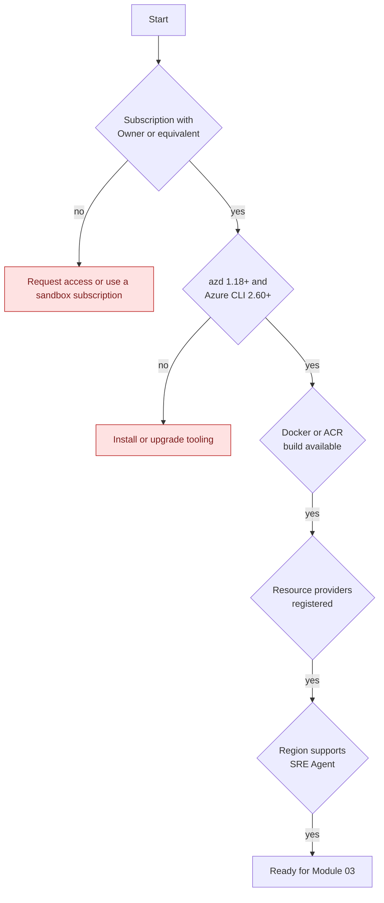

<ul class="sre-meta">
<li class="duration">Estimated time: 20 minutes</li>
<li>Module 01</li>
<li>Hands-on</li>
</ul>

## Overview

Ninety percent of workshop failures happen here and surface three modules later as an inscrutable deployment error. Spending twenty minutes confirming your subscription, tooling, and permissions is the highest-value time you will spend today.

Work through every task. Do not assume your environment is fine because you use Azure daily; the resource provider registrations in Task 4 in particular catch experienced engineers.

## Learning objectives

* Confirm your Azure subscription meets the workshop requirements.
* Install and verify the required command-line tooling.
* Validate that your account holds sufficient permissions to deploy and to assign roles.
* Register the resource providers the workshop depends on.
* Confirm regional availability for Azure SRE Agent.

## Architecture context

Everything in this module is a gate. Passing all five gates means Module 03 will deploy cleanly.



## Tasks

### Task 1: Confirm your Azure subscription

You need an Azure subscription where you can create resources and assign roles.

```bash
az login
az account show --output table
```

If you have more than one subscription, select the one you intend to use and record it.

```bash
az account list --query "[].{Name:name, SubscriptionId:id, State:state}" --output table
az account set --subscription "<your-subscription-name-or-id>"

export SUBSCRIPTION_ID=$(az account show --query id --output tsv)
export TENANT_ID=$(az account show --query tenantId --output tsv)

cat >> .workshop/workshop.env <<EOF
export SUBSCRIPTION_ID="${SUBSCRIPTION_ID}"
export TENANT_ID="${TENANT_ID}"
EOF
```

!!! warning "Shared or corporate subscriptions"
    Many enterprise subscriptions apply Azure Policy that blocks public network access, enforces private endpoints, or denies specific SKUs. The workshop deploys public endpoints intentionally so that fault injection is reachable. If your subscription blocks that, use a personal or sandbox subscription instead of fighting policy for an hour.

### Task 2: Verify your permissions

You need two distinct capabilities: creating resources, and assigning roles to a managed identity. Contributor alone is not enough, because Contributor cannot create role assignments.

```bash
export CURRENT_USER_ID=$(az ad signed-in-user show --query id --output tsv)

az role assignment list \
  --assignee "${CURRENT_USER_ID}" \
  --scope "/subscriptions/${SUBSCRIPTION_ID}" \
  --include-inherited \
  --query "[].{Role:roleDefinitionName, Scope:scope}" \
  --output table
```

You should see `Owner`, or the combination of `Contributor` plus `User Access Administrator` or `Role Based Access Control Administrator`.

!!! important "Why role assignment rights are required"
    [Module 05](../05-configure-sre-agent/index.md) grants the Azure SRE Agent managed identity `Reader` and `Monitoring Reader` on the workshop resource group. Without permission to create role assignments, the agent deploys but cannot see anything, and every investigation module fails.

### Task 3: Install the required tooling

=== "Linux and WSL"

    ```bash
    # Azure CLI
    curl -sL https://aka.ms/InstallAzureCLIDeb | sudo bash

    # Azure Developer CLI
    curl -fsSL https://aka.ms/install-azd.sh | bash

    # Docker Engine (optional; ACR build is used by default)
    curl -fsSL https://get.docker.com | sudo sh

    # jq for parsing command output
    sudo apt-get update && sudo apt-get install -y jq
    ```

=== "macOS"

    ```bash
    brew update
    brew tap azure/azd
    brew install azd azure-cli jq
    brew install --cask docker
    ```

=== "Windows (PowerShell)"

    ```powershell
    winget install --exact --id Microsoft.AzureCLI
    winget install --exact --id Microsoft.Azd
    winget install --exact --id jqlang.jq
    winget install --exact --id Docker.DockerDesktop
    ```

    Then run the workshop commands from a WSL, Git Bash, or Azure Cloud Shell session.

=== "Azure Cloud Shell"

    Cloud Shell already includes `azd`, the Azure CLI, `jq`, and Bicep. Open [https://shell.azure.com](https://shell.azure.com) and select Bash. Container images are built remotely in Azure Container Registry, so Docker is not required.

Now verify the versions.

```bash
az version --output table
azd version
az bicep version
jq --version
```

The workshop is validated against Azure Developer CLI 1.18 or later, Azure CLI 2.60 or later, and Bicep 0.28 or later. Upgrade if you are behind.

```bash
az upgrade
az bicep upgrade
```

### Task 4: Register resource providers

Unregistered providers produce deployment errors that name the provider but not the fix. Register them now; registration is idempotent and takes a few minutes to propagate.

```bash
for provider in \
  Microsoft.App \
  Microsoft.ContainerRegistry \
  Microsoft.OperationalInsights \
  Microsoft.Insights \
  Microsoft.Sql \
  Microsoft.AlertsManagement \
  Microsoft.ManagedIdentity \
  Microsoft.Monitor
do
  echo "Registering ${provider}..."
  az provider register --namespace "${provider}"
done
```

Check progress until every provider reports `Registered`.

```bash
az provider list \
  --query "[?namespace=='Microsoft.App' || namespace=='Microsoft.ContainerRegistry' || namespace=='Microsoft.OperationalInsights' || namespace=='Microsoft.Insights' || namespace=='Microsoft.Sql' || namespace=='Microsoft.AlertsManagement' || namespace=='Microsoft.ManagedIdentity' || namespace=='Microsoft.Monitor'].{Namespace:namespace, State:registrationState}" \
  --output table
```

### Task 5: Install the Azure CLI extensions

```bash
az extension add --name containerapp --upgrade --only-show-errors
az extension add --name application-insights --upgrade --only-show-errors
az extension add --name log-analytics --upgrade --only-show-errors
az extension list --query "[].{Name:name, Version:version}" --output table
```

### Task 6: Confirm regional availability and quota

Azure SRE Agent is not available in every region. Confirm your chosen region before you deploy an entire environment into the wrong one.

```bash
# Confirm Container Apps availability in your chosen region
az provider show --namespace Microsoft.App \
  --query "resourceTypes[?resourceType=='managedEnvironments'].locations[]" \
  --output tsv | grep -i "$(echo ${LOCATION} | sed 's/eastus/East US/I')" || echo "Check region name"

# Confirm you have vCPU quota for Container Apps
az vm list-usage --location "${LOCATION}" --query "[?contains(name.value, 'cores')].{Name:localName, Current:currentValue, Limit:limit}" --output table
```

!!! note "Region guidance"
    `eastus`, `westus3`, `westeurope`, and `swedencentral` are safe defaults at the time of writing. Check the [Azure SRE Agent documentation](https://learn.microsoft.com/azure/sre-agent/) for the current list before committing to a region, and set `LOCATION` in `.workshop/workshop.env` accordingly.

### Task 7: Clone the workshop repository

```bash
git clone https://github.com/charliekw411/sre-agent-workshop.git
cd sre-agent-workshop
```

If you created `.workshop/workshop.env` outside the repository in [How This Workshop Works](../00-workshop-intro/3-how-this-workshop-works.md), move it into the repository root now so that relative paths in later modules resolve.

## Validation

Run the readiness check. Every line must print `PASS`.

```bash
source .workshop/workshop.env

check() { if eval "$2" >/dev/null 2>&1; then echo "PASS: $1"; else echo "FAIL: $1"; fi }

check "Azure CLI installed"        "az version"
check "Azure Developer CLI installed" "azd version"
check "Bicep installed"            "az bicep version"
check "jq installed"               "jq --version"
check "Logged in to Azure"         "az account show"
check "Subscription variable set"  "test -n \"${SUBSCRIPTION_ID}\""
check "Location variable set"      "test -n \"${LOCATION}\""
check "Resource group name set"    "test -n \"${RESOURCE_GROUP}\""
check "containerapp extension"     "az extension show --name containerapp"
check "Microsoft.App registered"   "az provider show --namespace Microsoft.App --query registrationState -o tsv | grep -q Registered"
check "Microsoft.Sql registered"   "az provider show --namespace Microsoft.Sql --query registrationState -o tsv | grep -q Registered"
```

## Expected results

Eleven `PASS` lines and no `FAIL` lines. Your named `azd` environment contains `AZURE_ENV_NAME` and `AZURE_LOCATION`; Module 03 adds deployment outputs.

If any check fails, resolve it now. The deployment in Module 03 takes 12 to 15 minutes, and discovering a missing provider registration at minute 11 is a poor use of your afternoon.

## Knowledge check

??? question "Your account has Contributor on the subscription. Will Module 05 succeed?"
    No. Contributor can create resources but cannot create role assignments. The agent would deploy without the `Reader` and `Monitoring Reader` grants it needs, and every investigation would return no data. You need Owner, or Contributor plus User Access Administrator.

??? question "Why does the workshop register `Microsoft.AlertsManagement` separately from `Microsoft.Insights`?"
    `Microsoft.Insights` provides metric alert rules, action groups, and diagnostic settings. `Microsoft.AlertsManagement` provides the alert processing rules and the unified alerts experience that surfaces fired alerts to Azure SRE Agent. Module 04 uses both.

??? question "You are on a corporate subscription where Azure Policy denies public IP addresses. What is the pragmatic option?"
    Use a different subscription. The workshop deliberately exposes an ingress endpoint so you can trigger faults over HTTP. Reworking the environment for private endpoints, a jump host, and private DNS is a valid production pattern but it is a different exercise and will consume more time than the workshop itself.

## Next steps

Your environment is ready. Next you study the architecture you are about to deploy, so that the deployment output means something.

[Next: Module 02 - Solution Architecture :material-arrow-right:](../02-solution-architecture/index.md){ .md-button .md-button--primary }

<div class="sre-nav" markdown>
[:material-arrow-left: How This Workshop Works](../00-workshop-intro/3-how-this-workshop-works.md)
[Module 02 - Solution Architecture :material-arrow-right:](../02-solution-architecture/index.md)
</div>
