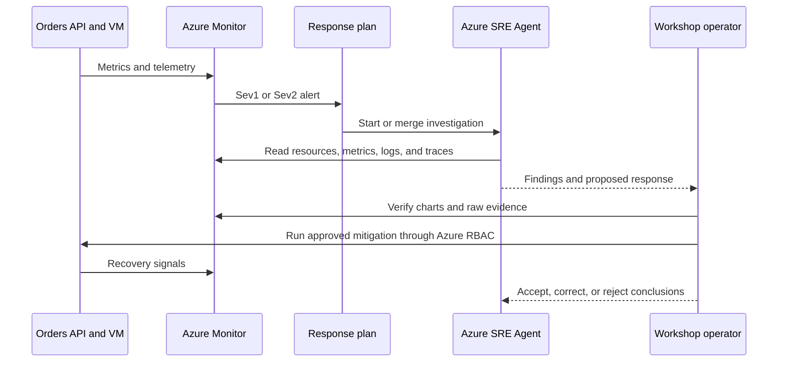

<ul class="sre-meta">
<li class="duration">Estimated time: 25 minutes</li>
<li>Module 02</li>
<li>Hands-on</li>
</ul>

## Overview

`azd up` creates an enabled response plan named
`workshop-sev1-sev2-review`. It accepts Azure Monitor Sev1 and Sev2 alerts,
routes them to the SRE Agent's coordinating agent, allows related alerts to be
merged within three hours, and runs in **Review** mode.

Review mode defines the operating workflow for both incidents:

1. Azure Monitor detects a threshold breach.
2. The response plan routes the alert to Azure SRE Agent.
3. The agent gathers resource and telemetry evidence.
4. You review its findings and verify material claims.
5. You run any mitigation through your own authenticated session.
6. Azure Monitor and the agent observe recovery.

The runtime is intentionally read-only. It can investigate, but it cannot run VM
fault commands, restart the VM, change the API, or delete resources.

## Learning objectives

* Inspect the SRE Agent resource and monitoring connectors.
* Verify the enabled Sev1/Sev2 response plan and Review mode.
* Explain the identities and least-privilege boundary.
* Inspect the alert rules that feed the response plan.
* Rehearse a healthy-state agent assessment and verify it visually.

## Response workflow



## Tasks

### Task 1: Verify the agent resource

=== "Bash"

    ```bash
    source .workshop/workshop.env

    az resource show \
      --ids "${SRE_AGENT_RESOURCE_ID}" \
      --api-version 2025-05-01-preview \
      --query "{Name:name, State:properties.provisioningState, Endpoint:properties.agentEndpoint, Access:properties.actionConfiguration.accessLevel, Mode:properties.actionConfiguration.mode}" \
      --output table
    ```

=== "PowerShell"

    ```powershell
    . ./.workshop/workshop.ps1

    az resource show `
      --ids $env:SRE_AGENT_RESOURCE_ID `
      --api-version 2025-05-01-preview `
      --query "{Name:name, State:properties.provisioningState, Endpoint:properties.agentEndpoint, Access:properties.actionConfiguration.accessLevel, Mode:properties.actionConfiguration.mode}" `
      --output table
    ```

Expect `Succeeded`, access level `Low`, and action mode `Review`.

In the Azure portal, open the SRE Agent resource from the workshop resource
group. Confirm that the Application Insights and Log Analytics data connectors
refer to this workshop's resources.

### Task 2: Verify the response plan

In the SRE Agent experience, open **Response plans** and select
`workshop-sev1-sev2-review`. Confirm:

| Setting | Expected value |
| --- | --- |
| Incident platform | Azure Monitor |
| Priorities | Sev1 and Sev2 |
| Handling agent | Coordinating or meta agent |
| Mode | Review |
| Enabled | Yes |
| Merge related incidents | Enabled |
| Merge window | 3 hours |
| Maximum investigation attempts | 3 |

The post-provision hook read the configuration back after creating it. Its local
evidence is stored in:

=== "Bash"

    ```bash
    cat ".workshop/${AZURE_ENV_NAME}/sre-agent-configuration.json"
    ```

=== "PowerShell"

    ```powershell
    Get-Content ".workshop/$env:AZURE_ENV_NAME/sre-agent-configuration.json"
    ```

Do not create a second catch-all response plan. Two overlapping enabled plans
make alert routing and investigation ownership ambiguous.

<!-- SCREENSHOT: SRE Agent response plan showing Sev1/Sev2 Azure Monitor routing in Review mode -->

### Task 3: Review the permission boundary

The agent uses both system-assigned and operational user-assigned identities for
resource and connector access. Review the assignments:

=== "Bash"

    ```bash
    az role assignment list \
      --assignee "${SRE_AGENT_PRINCIPAL_ID}" \
      --all \
      --query "[].{Role:roleDefinitionName, Scope:scope}" \
      --output table

    az role assignment list \
      --assignee "${SRE_AGENT_IDENTITY_PRINCIPAL_ID}" \
      --all \
      --query "[].{Role:roleDefinitionName, Scope:scope}" \
      --output table
    ```

=== "PowerShell"

    ```powershell
    az role assignment list `
      --assignee $env:SRE_AGENT_PRINCIPAL_ID `
      --all `
      --query "[].{Role:roleDefinitionName, Scope:scope}" `
      --output table

    az role assignment list `
      --assignee $env:SRE_AGENT_IDENTITY_PRINCIPAL_ID `
      --all `
      --query "[].{Role:roleDefinitionName, Scope:scope}" `
      --output table
    ```

The intended grants are resource read access and Log Analytics read access.
Neither identity should have `Owner`, `Contributor`, VM administration, or fault
execution rights.

!!! important "Configuration access is not runtime authority"
    You receive an agent-scoped administrator role so deployment can configure
    the response plan. That does not grant the agent runtime permission to change
    the VM. The human operator and the read-only agent have different identities
    and responsibilities.

### Task 4: Inspect the alert inputs

In the Azure portal, open **Monitor** > **Alerts** > **Alert rules** and filter
to the workshop resource group. Confirm these enabled rules:

| Alert | Severity | Condition |
| --- | --- | --- |
| `alert-orders-high-cpu` | Sev2 | VM average Percentage CPU above 80 percent for 5 minutes |
| `alert-orders-data-disk-free` | Sev1 | `/var/lib/orders` average free space below 15 percent |
| `alert-orders-http-5xx` | Sev1 | More than 10 HTTP 5xx responses in 5 minutes |

The CPU and data-disk exercises deliberately trigger the first two rules. The
HTTP 5xx rule remains a production-style safety signal; there is no public HTTP
endpoint that fabricates errors.

### Task 5: Tie a healthy request to visual evidence

Open the workshop VM's **Monitoring** > **Metrics** blade and configure the
**Percentage CPU** chart exactly as in Module 01. Then call:

=== "Bash"

    ```bash
    for i in $(seq 1 30); do
      curl --silent --fail "${SERVICE_ORDERS_API_ENDPOINT_URL}/health/ready" > /dev/null
      curl --silent --fail "${SERVICE_ORDERS_API_ENDPOINT_URL}/orders" > /dev/null
    done
    ```

=== "PowerShell"

    ```powershell
    1..30 | ForEach-Object {
      Invoke-RestMethod "$env:SERVICE_ORDERS_API_ENDPOINT_URL/health/ready" |
        Out-Null
      Invoke-RestMethod "$env:SERVICE_ORDERS_API_ENDPOINT_URL/orders" |
        Out-Null
    }
    ```

Refresh the VM chart after one or two minutes. Also open Application Insights
**Performance** and verify that the `GET /health/ready` and `GET /orders`
operations are visible for the same time range.

The purpose is not to create an alert. It is to rehearse the evidence path you
will use after the response plan opens an investigation.

### Task 6: Ask the agent for a healthy-state assessment

Open the agent's chat experience and enter:

```text
Describe the workload in this resource group using only current Azure resource
configuration and telemetry. Identify the public request path, the process that
runs the API, the data store and its mount, the monitoring data sources, and the
current alert state. State which facts are directly observed and which are inferred.
```

Then ask:

```text
For the last 30 minutes, summarize Orders API request volume, success rate, P95
duration, and VM CPU. State the current Azure Monitor alert state. Cite the
metric or table behind each value. Do not propose a change unless you first
identify an active incident.
```

Compare the answer with:

* The VM **Percentage CPU** chart.
* Application Insights **Performance**.
* Azure Monitor **Alerts**.

Save the response to `.workshop/notes/agent-healthy-state.md`. Mark unsupported
or incorrect claims now; the same verification discipline applies during
incidents.

## Validation

* [x] The SRE Agent is provisioned and connected to this workshop's telemetry.
* [x] `workshop-sev1-sev2-review` is enabled for Sev1 and Sev2 in Review mode.
* [x] The three alert rules are enabled.
* [x] The agent identities have no workload write role.
* [x] A healthy endpoint call appears in the VM and Application Insights views.
* [x] The agent's healthy-state assessment agrees with independently viewed evidence.

## Knowledge check

??? question "What does Review mode change?"
    The agent can investigate and present a proposed response, but a human reviews the evidence and decides what action to execute. It is not permission to mutate the VM, and the Azure RBAC boundary remains authoritative even if a prompt asks for a change.

??? question "Why can several alerts be merged into one incident?"
    One underlying failure can cross multiple thresholds. Merging related alerts within a bounded window reduces duplicate investigations and lets the agent reason about CPU, request, and storage evidence as one event. The human must still verify that the alerts actually share a cause.

??? question "Why retain an HTTP 5xx alert without an error-injection endpoint?"
    Real applications can fail without a planned exercise. The alert covers genuine server errors while the workshop avoids placing a destructive unauthenticated control on the public API.

## Next steps

[Next: Module 03 - Respond to High CPU :material-arrow-right:](../03-incident-high-cpu/index.md){ .md-button .md-button--primary }

<div class="sre-nav" markdown>
[:material-arrow-left: Module 01 - Deploy and Validate](../01-deploy-and-validate/index.md)
[Module 03 - Respond to High CPU :material-arrow-right:](../03-incident-high-cpu/index.md)
</div>
