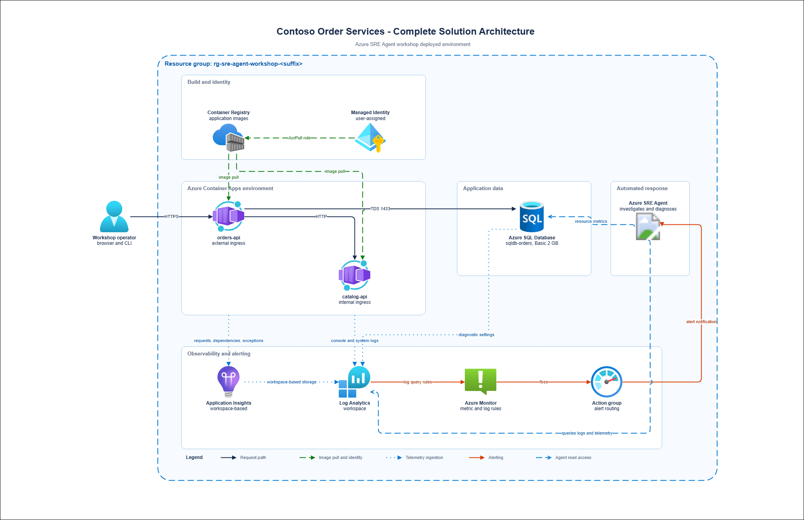
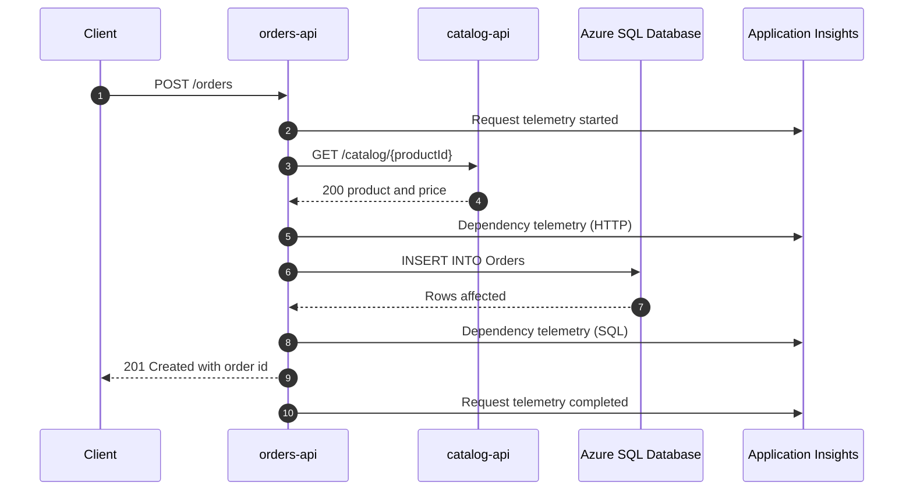
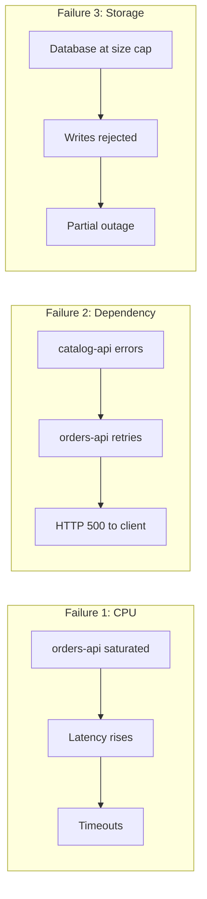

<ul class="sre-meta">
<li class="duration">Estimated time: 25 minutes</li>
<li>Module 02</li>
<li>Reading</li>
</ul>

## Overview

You cannot investigate a system you do not understand, and neither can an agent. This module walks the architecture you deploy in Module 03: what each component does, how requests flow, where telemetry goes, and which parts are designed to fail.

Read it properly. Deployment loads the checked-in architecture as agent knowledge. In Module 12 you improve that Markdown and synchronize it with `azd up` or `python scripts/workshop.py configure-agent`; the quality of that description directly affects the diagnoses you get.

## Learning objectives

* Describe each component of Contoso Order Services and its responsibility.
* Trace a request from ingress through to the database.
* Explain how telemetry reaches Log Analytics and Application Insights.
* Identify the three failure modes and the blast radius of each.
* Explain why the fault-injection endpoints are designed the way they are.

## Architecture context

This is the complete deployed environment.

## Component responsibilities

### orders-api

The public entry point. It accepts order submissions, queries order history, and calls `catalog-api` to resolve product details before persisting an order. It runs with external ingress on a single replica by default, which keeps the CPU incident in Module 06 reproducible; an autoscaled service would simply add replicas and hide the saturation.

It also hosts the fault-injection controller at `/fault/*`, gated by an `X-Fault-Token` header.

`PUT /orders/{id}/quantity` updates an existing order's quantity with values from
1 through 1000. This exercises the runtime's narrow SQL update permission without
granting schema-management rights.

### catalog-api

An internal-only service that returns product and pricing data. It has no ingress from outside the environment, which means the only way to reach it is through `orders-api`. That constraint matters in Module 08: when `catalog-api` degrades, the customer-visible symptom appears on `orders-api`, and the investigation has to walk the dependency chain backwards.

### Azure SQL Database

A Standard S0 database with a deliberately capped 1 GiB maximum size. The small
ceiling makes the storage exhaustion incident finish in minutes instead of hours.
Authentication is Entra-only: a separate SQL bootstrap job identity creates the
schema and grants; the Orders API identity has object-level permissions, not
`db_owner`. Initialization inserts the five deterministic seed orders documented
in [Module 03](../03-deploy-infrastructure/index.md) without overwriting existing
orders or storage ballast.

### Log Analytics workspace

The single destination for Container Apps console logs, Container Apps system logs, and Azure SQL Database diagnostics. Centralizing here is what lets a single KQL query correlate an application exception with a platform event.

### Application Insights

Workspace-based, backed by the same Log Analytics workspace. It captures the request, dependency, and exception telemetry that turns "the service is slow" into "the `GET /catalog/{id}` dependency call is timing out".

### Azure SRE Agent

Scoped to the resource group with read access to resources and telemetry.
`azd up` provisions it, assigns permissions, and synchronizes the checked-in
configuration. Module 05 verifies the deployment.

## Request flow

A successful order submission touches every component.

Each arrow to Application Insights is a correlated telemetry item sharing one operation ID. That correlation is what lets an agent reconstruct the sequence during an investigation rather than guessing at timestamps.

## Telemetry pipeline

| Source                   | Mechanism              | Destination            | Used by                       |
|--------------------------|------------------------|------------------------|-------------------------------|
| Container console output | Container Apps logging | `ContainerAppConsoleLogs_CL` | Log queries, log alert rules |
| Container platform events| Container Apps logging | `ContainerAppSystemLogs_CL`  | Restart and probe analysis   |
| Container Apps metrics   | Azure Monitor platform | Metric store           | CPU and memory metric alerts  |
| SQL diagnostics          | Diagnostic settings    | `AzureDiagnostics`     | Query and error analysis      |
| SQL metrics              | Azure Monitor platform | Metric store           | Storage percent metric alert  |
| App requests and traces  | OpenTelemetry / SDK    | Application Insights   | Dependency and exception analysis |

!!! note "Ingestion latency is real"
    Platform metrics surface in roughly one to three minutes. Log Analytics ingestion is typically two to five minutes. Log-based alert rules add their own evaluation window. When a module tells you to wait five minutes before checking, that number came from these delays, not from an abundance of caution.

## Fault injection design

The fault endpoints live in `orders-api` and follow three rules.

* Every endpoint requires a matching `X-Fault-Token` header. The secret stays in Key Vault; `scripts/inject-fault.sh` and `scripts/inject-fault.ps1` retrieve it just in time. Generated shell exports contain only safe identifiers and endpoints.
* Every endpoint is bounded. CPU load stops after a duration, error injection has a decaying time-to-live, and storage fill has a row cap.
* Every endpoint has a reset. `POST /fault/reset` clears all active fault state so you can return the system to health without redeploying.

| Endpoint              | Effect                                                        | Module |
|-----------------------|---------------------------------------------------------------|--------|
| `POST /fault/cpu`     | Saturates worker threads with a busy loop for N seconds       | 06     |
| `POST /fault/errors`  | Makes `catalog-api` calls fail at a configured rate            | 08     |
| `POST /fault/storage` | Bulk inserts padded rows until the database hits its size cap | 10     |
| `POST /fault/reset`   | Clears all fault state                                        | All    |
| `GET  /fault/status`  | Returns currently active faults                                | All    |

!!! danger "These endpoints are hostile by design"
    They exist to destroy the availability of the service that hosts them. Never merge this controller into a real application. If you adapt this workshop for internal training, keep the fault code behind a compile-time flag that is off in every configuration except the workshop.

## Failure modes

### Failure mode 1: CPU saturation

`orders-api` consumes all available CPU. Requests queue, latency climbs, and eventually the ingress times out. `catalog-api` and the database stay healthy, so the blast radius is a single service. This is the simplest incident and it teaches the baseline investigation loop.

### Failure mode 2: Dependency failure cascade

`catalog-api` calls begin failing. `orders-api` retries, retries amplify load, thread pool utilization rises, and the customer sees HTTP 500 from a service that is not itself broken. Blast radius is two services and the symptom appears on the wrong one, which is the entire point.

### Failure mode 3: Storage exhaustion

The database reaches its size ceiling. Reads keep working, writes fail, and the application returns errors only on the write path. Partial failure is harder to triage than total failure because dashboards showing average success rate look almost normal.

## Design decisions worth questioning

A workshop that presents architecture as settled fact teaches the wrong habit. Three choices here are debatable.

* Single replica for `orders-api`. Correct for reproducibility, wrong for production. Discuss what would change in each investigation if the service ran five replicas behind a load balancer.
* Basic tier SQL Database. Correct for cost, wrong for a workload that accepts orders. Consider how a serverless tier with auto-pause would change the storage incident.
* No circuit breaker between `orders-api` and `catalog-api`. Deliberately omitted so that Module 08 has something to find. Note that this omission is the actual root cause of the cascade, not the `catalog-api` failure itself.

## Validation

* [x] You can name the two services and explain which one has external ingress.
* [x] You can trace a `POST /orders` request through all four hops.
* [x] You can state which failure mode produces symptoms on a service that is not the faulty one.
* [x] You can explain why the fault endpoints require a token.

## Expected results

You should be able to sketch the architecture from memory on a whiteboard, including the telemetry paths. If you cannot, re-read the diagrams before continuing, because Module 07 asks you to evaluate whether an agent's description of the architecture is accurate.

## Knowledge check

??? question "During the Module 08 incident, which service shows HTTP 500 responses, and which service is actually at fault?"
    `orders-api` returns HTTP 500 to the client because it is the only externally reachable service. The fault originates in the `orders-api` to `catalog-api` dependency call. The deeper root cause is architectural: `orders-api` has no circuit breaker, so a failing dependency becomes a customer-facing outage rather than a degraded experience.

??? question "Why is Application Insights configured as workspace-based rather than classic?"
    Workspace-based Application Insights writes into the same Log Analytics workspace as platform logs. That lets a single KQL query join application exceptions against container restarts and SQL diagnostics. Classic Application Insights keeps telemetry in a separate store, forcing cross-resource queries and complicating correlation for both humans and the agent.

??? question "Storage exhaustion causes writes to fail while reads succeed. Why is that harder to triage than a total outage?"
    Aggregate health metrics stay in an acceptable range because the read path dominates request volume. Availability dashboards look mostly green, error rate rises but does not spike, and the failure is only obvious if you segment by operation. Partial failures need dimensional analysis, not averages.

## Next steps

You know what you are building and why. Time to deploy it.

[Next: Module 03 - Deploy Azure Infrastructure :material-arrow-right:](../03-deploy-infrastructure/index.md){ .md-button .md-button--primary }

[:material-arrow-left: Module 01 - Prerequisites](../01-prerequisites/index.md)
[Module 03 - Deploy Azure Infrastructure :material-arrow-right:](../03-deploy-infrastructure/index.md)

