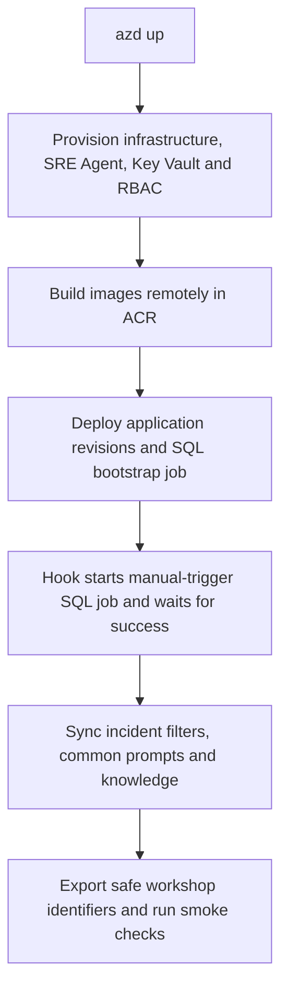

<ul class="sre-meta">
<li class="duration">Estimated time: 30 minutes</li>
<li>Module 03</li>
<li>Hands-on</li>
</ul>

## Overview

One `azd up` provisions the apps, monitoring, Azure SRE Agent, managed identities,
role assignments, and Key Vault. Hooks build images remotely in Azure Container
Registry, deploy revisions, run the SQL initialization job, and synchronize the
version-controlled agent configuration. No portal configuration, manual role
grants, SQL credentials, or pasted agent configuration are required.

## Learning objectives

* Deploy the complete environment from a named Azure Developer CLI environment.
* Explain the separation between SQL initialization and application identities.
* Verify seed data, application health, and deployment outputs.

## Architecture context



The job uses a **manual trigger**, but the hook starts it automatically: attendees
do not initialize SQL themselves. Its separate managed identity is the SQL
Microsoft Entra administrator. SQL authentication is disabled. The Orders API
uses its own managed identity with object-level grants only, not `db_owner`;
storage release is exposed through a narrowly scoped privileged stored procedure.

## Tasks

### Task 1: Confirm prerequisites and the selected environment

Complete [Module 01](../01-prerequisites/index.md), including both `az login` and
`azd auth login`. Python 3.10 or later with PyYAML must be available to the cross-platform
hooks; `python -m pip install -r requirements.txt` installs the repository's
dependencies. No local .NET SDK or Docker daemon is needed for remote builds.

```bash
azd env get-value AZURE_ENV_NAME
azd env get-value AZURE_LOCATION
```

Use the supported default `eastus2`. The SRE Agent resource uses preview API
`Microsoft.App/agents@2025-05-01-preview`; availability is region constrained.

Email notification is optional. To add an action-group receiver, set
`azd env set ALERT_EMAIL "you@example.com"` before deployment. Hooks do not look
up an email address in Microsoft Graph; leaving this unset does not block deployment.

### Task 2: Deploy

```bash
azd up
```

Select the same subscription used for Azure CLI authentication. Keep the
deployment output: a successful ARM deployment alone is not sufficient if a
later hook fails. Wait for SQL initialization and agent synchronization to
complete before starting the incidents. Retry `azd up` after resolving any
reported prerequisite, permission, regional availability, or propagation error.

Before provisioning, the common hook registers required resource providers,
waits up to fifteen minutes, and checks the selected region against the advertised
`Microsoft.App/agents` locations. Provider registration is automatic, not a
separate attendee setup task.

### Task 3: Load the safe outputs

=== "Bash"

    ```bash
    source .workshop/workshop.env
    az resource list --resource-group "${RESOURCE_GROUP}" \
      --query "[].{Name:name, Type:type}" --output table
    ```

=== "PowerShell"

    ```powershell
    . ./.workshop/workshop.ps1
    az resource list --resource-group $env:RESOURCE_GROUP `
      --query "[].{Name:name, Type:type}" --output table
    ```

The generated shell files use an explicit allowlist of non-secret identifiers,
names, and endpoints. They do not contain credentials. The fault helper retrieves
its secret just in time from Key Vault; do not export it or copy it into a file.
Keep `.workshop/` and `.azure/` excluded from source control.

### Task 4: Understand repeatable SQL initialization

The bootstrap job creates schema and grants, then inserts only missing reserved
seed IDs. Existing orders and storage ballast are preserved on redeployment.
The five seed orders all have customer `workshop-seed`, quantity `1`, and timestamp
`2026-01-01T00:00:00Z`:

| Order ID | Product ID | Unit price |
| --- | --- | --- |
| -1 | SKU-1001 | 129.99 |
| -2 | SKU-1002 | 349.00 |
| -3 | SKU-1003 | 219.50 |
| -4 | SKU-1004 | 45.75 |
| -5 | SKU-1005 | 189.00 |

Re-running deployment is not a fault reset. Use the fault helper to reset an
incident deliberately, rather than relying on initialization to delete data.

## Validation

```bash
source .workshop/workshop.env
curl --silent --fail "https://${ORDERS_API_FQDN}/" | jq .
curl --silent --fail "https://${ORDERS_API_FQDN}/orders" | jq .
curl --silent --fail --request POST "https://${ORDERS_API_FQDN}/orders" \
  --header 'Content-Type: application/json' \
  --data '{"customerId":"cust-001","productId":"SKU-1002","quantity":2}' | jq .
curl --silent --fail --request PUT "https://${ORDERS_API_FQDN}/orders/-1/quantity" \
  --header 'Content-Type: application/json' \
  --data '{"quantity":1}' --output /dev/null --write-out 'Quantity update: HTTP %{http_code}\n'
curl --silent --fail "https://${ORDERS_API_FQDN}/storage" | jq .
./scripts/inject-fault.sh status
```

The quantity update uses reserved seed order `-1` and returns HTTP 204 without a
response body. Quantities must be from 1 through 1000; invalid values return 400
and an unknown order returns 404. The update changes only the order's quantity.

For PowerShell fault operations, use `./scripts/inject-fault.ps1 status`.
Both wrappers call the common Python implementation and retrieve authentication
from Key Vault without displaying the secret.

## Expected results

* Metadata identifies `orders-api`.
* A fresh database has the five seed orders before any load generation.
* Order creation returns HTTP 201 with a unit price of `349.00`.
* Updating seed order `-1` to quantity `1` returns HTTP 204.
* Storage reports a 1 GiB cap and low utilization on a fresh deployment.
* Fault status shows no active faults on a fresh deployment.
* Both apps run, the SQL job succeeds, and agent synchronization completes.

These are checks to perform against your deployment, not a claim that a live
Azure deployment has been validated here. Use
[Troubleshooting](../30-appendix/02-troubleshooting.md) for failures.

## Knowledge check

??? question "Why is the SQL job separate from the Orders API?"
    Initialization needs schema and permission management rights. Giving those rights to the request-serving identity would unnecessarily expand its privileges. The job owns initialization; the runtime only receives the object permissions it needs.

??? question "Does another azd up erase the current incident?"
    No. Initialization inserts missing seed IDs without deleting orders or storage ballast. Reset an incident explicitly with the fault helper.

## Next steps

[Next: Module 04 - Enable Native Azure Monitoring :material-arrow-right:](../04-enable-monitoring/index.md){ .md-button .md-button--primary }

<div class="sre-nav" markdown>
[:material-arrow-left: Module 02 - Solution Architecture](../02-solution-architecture/index.md)
[Module 04 - Enable Native Azure Monitoring :material-arrow-right:](../04-enable-monitoring/index.md)
</div>
