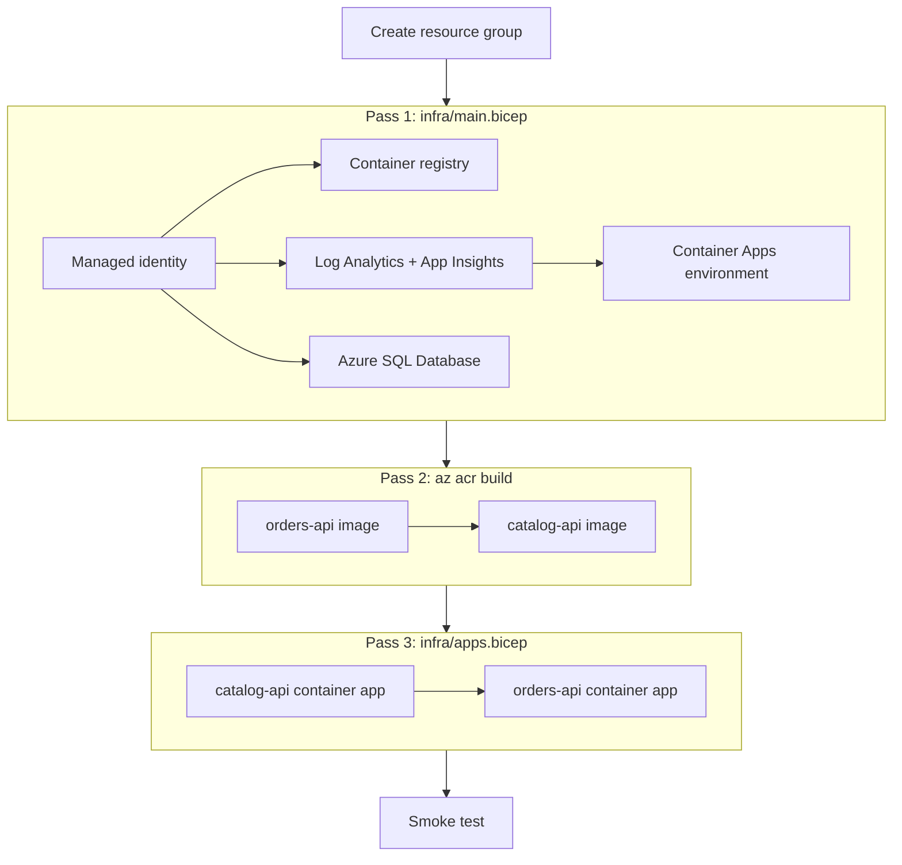

<ul class="sre-meta">
<li class="duration">Estimated time: 30 minutes</li>
<li>Module 03</li>
<li>Hands-on</li>
</ul>

## Overview

You deploy the workshop environment in three passes: foundation resources, container images, then the applications themselves. Splitting it that way is not bureaucracy. The container registry has to exist before you can push an image to it, and the container apps have to reference an image that exists.

Roughly 20 of the 30 minutes are Azure working while you watch. Use the wait to skim [Module 04](../04-enable-monitoring/index.md) so you know what comes next.

## Learning objectives

* Deploy the foundation resources with a parameterized Bicep template.
* Generate and safely store the workshop secrets.
* Build both container images directly in Azure Container Registry without a local Docker daemon.
* Deploy the two container apps with managed identity image pulls.
* Verify the full request path from public ingress through to the database.

## Architecture context

Each pass depends on the previous one.



## Tasks

### Task 1: Restore your workshop variables

```bash
cd sre-agent-workshop
source .workshop/workshop.env
echo "Suffix: ${WORKSHOP_SUFFIX} | Region: ${LOCATION} | RG: ${RESOURCE_GROUP}"
```

If any value is blank, return to [How This Workshop Works](../00-workshop-intro/3-how-this-workshop-works.md) and recreate the file.

### Task 2: Generate the workshop secrets

Two secrets are needed: the SQL administrator password and the fault-injection token. Generate both rather than inventing them, and never hardcode them into a template.

```bash
export SQL_ADMIN_LOGIN="sreworkshopadmin"
export SQL_ADMIN_PASSWORD="$(openssl rand -base64 24 | tr -d '/+=' | head -c 24)Aa1!"
export FAULT_TOKEN="$(openssl rand -hex 24)"
export ALERT_EMAIL="$(az ad signed-in-user show --query mail --output tsv)"

# Fall back to the user principal name when the directory has no mail attribute.
if [[ -z "${ALERT_EMAIL}" || "${ALERT_EMAIL}" == "null" ]]; then
  export ALERT_EMAIL="$(az ad signed-in-user show --query userPrincipalName --output tsv)"
fi

cat >> .workshop/workshop.env <<EOF
export SQL_ADMIN_LOGIN="${SQL_ADMIN_LOGIN}"
export SQL_ADMIN_PASSWORD="${SQL_ADMIN_PASSWORD}"
export FAULT_TOKEN="${FAULT_TOKEN}"
export ALERT_EMAIL="${ALERT_EMAIL}"
EOF

echo "Alert email: ${ALERT_EMAIL}"
```

!!! danger "These values are credentials"
    `.workshop/workshop.env` now contains a database administrator password and a token that unlocks endpoints designed to destroy the service. The repository `.gitignore` excludes the folder. Verify with `git check-ignore -v .workshop/workshop.env` before you commit anything.

### Task 3: Create the resource group

```bash
az group create \
  --name "${RESOURCE_GROUP}" \
  --location "${LOCATION}" \
  --tags workload=sre-agent-workshop environment=workshop \
  --output table
```

### Task 4: Deploy the foundation resources

```bash
export ENTRA_ADMIN_OBJECT_ID="$(az ad signed-in-user show --query id --output tsv)"
export ENTRA_ADMIN_NAME="$(az ad signed-in-user show --query userPrincipalName --output tsv)"

az deployment group create \
  --resource-group "${RESOURCE_GROUP}" \
  --name "foundation-$(date +%Y%m%d%H%M%S)" \
  --template-file infra/main.bicep \
  --parameters \
      suffix="${WORKSHOP_SUFFIX}" \
      location="${LOCATION}" \
      sqlAdminLogin="${SQL_ADMIN_LOGIN}" \
      sqlAdminPassword="${SQL_ADMIN_PASSWORD}" \
      sqlEntraAdminObjectId="${ENTRA_ADMIN_OBJECT_ID}" \
      sqlEntraAdminName="${ENTRA_ADMIN_NAME}" \
  --output none

echo "Foundation deployment complete."
```

This takes eight to twelve minutes, dominated by the Container Apps environment and the SQL logical server.

!!! tip "Watch it rather than staring at a blank terminal"
    In a second shell, run `watch -n 15 "az resource list --resource-group ${RESOURCE_GROUP} --query '[].{Name:name,Type:type}' --output table"` to see resources appear.

### Task 5: Capture the deployment outputs

```bash
export DEPLOYMENT_NAME="$(az deployment group list \
  --resource-group "${RESOURCE_GROUP}" \
  --query "[?starts_with(name, 'foundation-')] | sort_by(@, &properties.timestamp) | [-1].name" \
  --output tsv)"

OUTPUTS="$(az deployment group show \
  --resource-group "${RESOURCE_GROUP}" \
  --name "${DEPLOYMENT_NAME}" \
  --query properties.outputs)"

export ACR_NAME="$(echo "${OUTPUTS}" | jq -r .registryName.value)"
export ACR_LOGIN_SERVER="$(echo "${OUTPUTS}" | jq -r .registryLoginServer.value)"
export LOG_ANALYTICS_NAME="$(echo "${OUTPUTS}" | jq -r .workspaceName.value)"
export LOG_ANALYTICS_ID="$(echo "${OUTPUTS}" | jq -r .workspaceResourceId.value)"
export LOG_ANALYTICS_CUSTOMER_ID="$(echo "${OUTPUTS}" | jq -r .workspaceCustomerId.value)"
export APP_INSIGHTS_NAME="$(echo "${OUTPUTS}" | jq -r .appInsightsName.value)"
export SQL_SERVER_NAME="$(echo "${OUTPUTS}" | jq -r .sqlServerName.value)"
export SQL_DATABASE_NAME="$(echo "${OUTPUTS}" | jq -r .sqlDatabaseName.value)"
export CONTAINER_ENV_NAME="$(echo "${OUTPUTS}" | jq -r .containerAppsEnvironmentName.value)"

cat >> .workshop/workshop.env <<EOF
export ACR_NAME="${ACR_NAME}"
export ACR_LOGIN_SERVER="${ACR_LOGIN_SERVER}"
export LOG_ANALYTICS_NAME="${LOG_ANALYTICS_NAME}"
export LOG_ANALYTICS_ID="${LOG_ANALYTICS_ID}"
export LOG_ANALYTICS_CUSTOMER_ID="${LOG_ANALYTICS_CUSTOMER_ID}"
export APP_INSIGHTS_NAME="${APP_INSIGHTS_NAME}"
export SQL_SERVER_NAME="${SQL_SERVER_NAME}"
export SQL_DATABASE_NAME="${SQL_DATABASE_NAME}"
export CONTAINER_ENV_NAME="${CONTAINER_ENV_NAME}"
EOF

echo "Registry: ${ACR_LOGIN_SERVER}"
```

### Task 6: Build the container images

`az acr build` builds in Azure, so you do not need Docker installed locally. Each build takes two to four minutes.

```bash
az acr build \
  --registry "${ACR_NAME}" \
  --image catalog-api:v1 \
  --file src/CatalogApi/Dockerfile \
  src/CatalogApi

az acr build \
  --registry "${ACR_NAME}" \
  --image orders-api:v1 \
  --file src/OrdersApi/Dockerfile \
  src/OrdersApi

az acr repository list --name "${ACR_NAME}" --output table
```

### Task 7: Deploy the container apps

```bash
az deployment group create \
  --resource-group "${RESOURCE_GROUP}" \
  --name "apps-$(date +%Y%m%d%H%M%S)" \
  --template-file infra/apps.bicep \
  --parameters \
      suffix="${WORKSHOP_SUFFIX}" \
      location="${LOCATION}" \
      ordersImage="${ACR_LOGIN_SERVER}/orders-api:v1" \
      catalogImage="${ACR_LOGIN_SERVER}/catalog-api:v1" \
      sqlAdminLogin="${SQL_ADMIN_LOGIN}" \
      sqlAdminPassword="${SQL_ADMIN_PASSWORD}" \
      faultToken="${FAULT_TOKEN}" \
  --output none

export ORDERS_API_FQDN="$(az containerapp show \
  --name orders-api \
  --resource-group "${RESOURCE_GROUP}" \
  --query properties.configuration.ingress.fqdn \
  --output tsv)"

cat >> .workshop/workshop.env <<EOF
export ORDERS_API_FQDN="${ORDERS_API_FQDN}"
EOF

echo "orders-api is reachable at https://${ORDERS_API_FQDN}"
```

!!! warning "Managed identity role propagation"
    The image pull uses a user-assigned managed identity with `AcrPull`. Role assignments can take up to five minutes to propagate. If the first revision reports `ImagePullFailure`, wait three minutes and run `az containerapp revision restart --name orders-api --resource-group "${RESOURCE_GROUP}" --revision "$(az containerapp revision list --name orders-api --resource-group "${RESOURCE_GROUP}" --query '[0].name' -o tsv)"`.

### Task 8: Make the scripts executable

```bash
chmod +x scripts/*.sh
```

## Validation

Run a full smoke test that exercises ingress, the internal dependency call, and the database write.

```bash
source .workshop/workshop.env

echo "--- Service metadata ---"
curl --silent --fail "https://${ORDERS_API_FQDN}/" | jq .

echo "--- Create an order ---"
curl --silent --fail --request POST "https://${ORDERS_API_FQDN}/orders" \
  --header 'Content-Type: application/json' \
  --data '{"customerId":"cust-001","productId":"SKU-1002","quantity":2}' | jq .

echo "--- Read recent orders ---"
curl --silent --fail "https://${ORDERS_API_FQDN}/orders" | jq '. | length'

echo "--- Database storage usage ---"
curl --silent --fail "https://${ORDERS_API_FQDN}/storage" | jq .

echo "--- Fault endpoint reachable and authenticated ---"
curl --silent --fail --header "X-Fault-Token: ${FAULT_TOKEN}" \
  "https://${ORDERS_API_FQDN}/fault/status" | jq .

echo "--- Fault endpoint rejects a wrong token ---"
curl --silent --output /dev/null --write-out 'HTTP %{http_code} (expected 401)\n' \
  --header "X-Fault-Token: definitely-not-the-token" \
  "https://${ORDERS_API_FQDN}/fault/status"
```

Confirm both container apps are running.

```bash
az containerapp list \
  --resource-group "${RESOURCE_GROUP}" \
  --query "[].{Name:name, Status:properties.runningStatus, Replicas:properties.template.scale.minReplicas, Fqdn:properties.configuration.ingress.fqdn}" \
  --output table
```

## Expected results

* The service metadata call returns `"service": "orders-api"`.
* The order creation call returns HTTP 201 with an `orderId` and a `unitPrice` of `349.00`.
* The recent orders call returns a count of at least 1.
* The storage call returns `maxBytes` of `1073741824` and a small `usedPercent`.
* The fault status call returns all faults inactive.
* The wrong-token call returns `HTTP 401`.
* Both container apps report `Running`.

If the order creation returns HTTP 500 with a catalog message, `catalog-api` has not finished starting. Wait 60 seconds and retry. If it returns HTTP 500 with a SQL message, check that the firewall rule allowing Azure services exists on the SQL server.

<!-- SCREENSHOT: Azure portal resource group overview showing all deployed resources -->

## Knowledge check

??? question "Why does the workshop use `az acr build` instead of building images locally and pushing them?"
    It removes the Docker dependency entirely, which matters for Cloud Shell users and for anyone on a locked-down corporate machine. It also builds on Azure infrastructure close to the registry, so the push is fast and does not depend on your upload bandwidth.

??? question "The container apps pull images with a user-assigned managed identity rather than registry admin credentials. What is the practical benefit?"
    There is no shared username and password to store, rotate, or leak. Access is a role assignment you can audit and revoke in one place, and it is scoped to `AcrPull` rather than to full registry administration. Registry admin accounts are a single credential shared by everything that pulls, which makes rotation an outage.

??? question "`orders-api` is fixed at exactly one replica. What would you change for a production deployment, and what would that break in this workshop?"
    Production would use `minReplicas: 2` or higher with an HTTP concurrency scale rule so a single unhealthy replica does not take out the service. In this workshop that change would let the platform absorb the Module 06 CPU load by adding replicas, hiding the saturation signal that the whole investigation depends on.

## Next steps

The application runs, but nothing is watching it. Next you build the detection layer.

[Next: Module 04 - Enable Native Azure Monitoring :material-arrow-right:](../04-enable-monitoring/index.md){ .md-button .md-button--primary }

<div class="sre-nav" markdown>
[:material-arrow-left: Module 02 - Solution Architecture](../02-solution-architecture/index.md)
[Module 04 - Enable Native Azure Monitoring :material-arrow-right:](../04-enable-monitoring/index.md)
</div>
