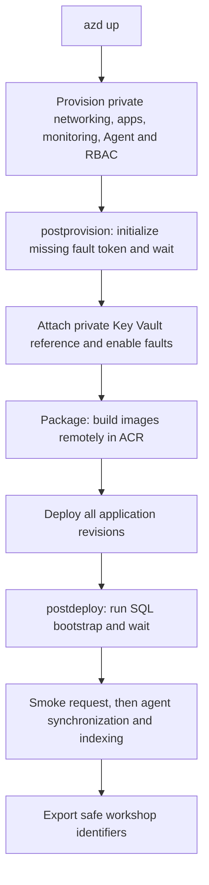

<ul class="sre-meta">
<li class="duration">Estimated time: 30 minutes</li>
<li>Module 03</li>
<li>Hands-on</li>
</ul>

## Overview

One `azd up` provisions the VNet-integrated apps, private SQL and Key Vault
endpoints, private DNS, monitoring, Azure SRE Agent, managed identities, and role
assignments. Its workflow remains `provision`, then `package`, then `deploy --all`.
The `postprovision` hook initializes the fault token inside the VNet before
enabling fault endpoints. Packaging builds images remotely in Azure Container
Registry; `postdeploy` runs SQL initialization, a smoke request, and
version-controlled agent synchronization and indexing. No portal configuration,
manual role grants, SQL credentials, or pasted agent configuration are required.

## Learning objectives

* Deploy the complete environment from a named Azure Developer CLI environment.
* Explain the separation between SQL initialization and application identities.
* Explain why private-vault initialization runs before fault endpoints are enabled.
* Verify seed data, application health, and deployment outputs.

## Architecture context



SQL and Key Vault have `publicNetworkAccess: Disabled`, private endpoints, and
VNet-linked private DNS. The Consumption workload-profile environment
`cae-private-<suffix>` uses a delegated subnet in `vnet-<suffix>`. Orders public
HTTPS and Catalog internal ingress are unchanged. ACR remote builds and Azure
Monitor ingestion/query still use public endpoints; this is not an all-private
architecture.

The SQL job uses a **manual trigger**, but the hook starts it automatically:
attendees do not initialize SQL themselves. Its separate managed identity is the
SQL Microsoft Entra administrator. SQL authentication is disabled. The Orders API
uses its own managed identity with object-level grants only, not `db_owner`;
storage release is exposed through a narrowly scoped privileged stored procedure.

## Tasks

### Task 1: Confirm prerequisites and the selected environment

Complete [Module 01](../01-prerequisites/index.md), including both `az login` and
`azd auth login`. Python 3.10 or later with PyYAML must be available to the cross-platform
hooks; `python -m pip install -r requirements.txt` installs the repository's
dependencies. No local .NET SDK or Docker daemon is needed for remote builds.

```bash
azd env get-value AZURE_ENV_NAME
azd env get-value AZURE_LOCATION
```

Use the supported default `eastus2`. The SRE Agent resource uses preview API
`Microsoft.App/agents@2025-05-01-preview`; availability is region constrained.

Email notification is optional. To add an action-group receiver, set
`azd env set ALERT_EMAIL "you@example.com"` before deployment. Hooks do not look
up an email address in Microsoft Graph; leaving this unset does not block deployment.

### Task 2: Deploy

```bash
azd up
```

Select the same subscription used for Azure CLI authentication. Keep the
deployment output: a successful ARM deployment alone is not sufficient if a
later hook fails. Wait for private-vault initialization, SQL initialization, and
agent indexing to complete before starting the incidents. Retry `azd up` after
resolving any reported prerequisite, permission, regional availability, or
propagation error, subject to the migration constraints below.

Before provisioning, the common hook registers required resource providers and
the `Microsoft.Network/AllowBringYourOwnPublicIpAddress` subscription feature,
waits up to fifteen minutes for each phase, refreshes `Microsoft.Network`, and
checks the selected region against the advertised
`Microsoft.App/agents` locations. Registration is automatic, not a
separate attendee setup task.

#### Updating an earlier deployment

Existing non-VNet Container Apps environments and their apps or jobs cannot be moved in
place. Updating your checkout alone does not change Azure resources.

* If a failed deployment created no workshop apps or jobs, rerun
  `azd up` in the same azd environment. It creates `cae-private-<suffix>` and
  reuses the existing SQL server, database, vault, and data.
* If a workshop app or job already exists on the old environment, preprovision fails before
  attempting a move or deletion. Choose a new azd environment name for a separate
  deployment, rather than deleting apps to force a migration. Existing data stays
  in the old environment; there is no automatic data migration.

Current templates also replace the earlier generic managed-identity names with
purpose-specific names such as `id-orders-api-<suffix>` and
`id-orders-db-bootstrap-<suffix>`. An incremental deployment creates and attaches
the new identities but does not delete retired identities or their role
assignments. For a clean resource inventory or a fresh E2E timing run, follow the
[cleanup procedure](../14-cleanup/index.md), choose **No** if asked to purge the
protected vault, and deploy with a new azd environment name so the soft-deleted
vault name is not reused.

For the second case, after reviewing which environment you want to deploy:

```bash
azd env new "<your-alias>-private-workshop"
azd env set AZURE_LOCATION eastus2
azd up
```

Old empty `cae-*` environments and old failed `generate-fault-token`
deployment-script metadata are not automatically deleted. They remain until
deliberate [resource-group cleanup](../14-cleanup/index.md) after you review the
inventory. The new design removes the ARM `Microsoft.Resources/deploymentScripts`
resource and needs neither script-supporting storage nor Azure Container Instances.

### Task 3: Load the safe outputs

=== "Bash"

    ```bash
    source .workshop/workshop.env
    az resource list --resource-group "${RESOURCE_GROUP}" \
      --query "[].{Name:name, Type:type}" --output table
    ```

=== "PowerShell"

    ```powershell
    . ./.workshop/workshop.ps1
    az resource list --resource-group $env:RESOURCE_GROUP `
      --query "[].{Name:name, Type:type}" --output table
    ```

The generated shell files use an explicit allowlist of non-secret identifiers,
names, and endpoints. They do not contain credentials. New exports identify the
token and fault-client jobs, VNet, and SQL/vault private endpoints; existing output
names remain unchanged. The fault-client job retrieves its credential inside the
VNet, never on your machine. Keep `.workshop/` and `.azure/` excluded from source
control. See the [variable reference](../30-appendix/01-variables.md).

### Task 4: Understand repeatable initialization

The `workshop-token-init` job uses `id-fault-token-init-<suffix>` with vault-scoped
`Key Vault Secrets Officer` and creates only a missing `fault-token`. An existing
token is preserved. Initial app provisioning leaves faults disabled.
`postprovision` waits for the job, attaches the managed-identity private Key Vault
secret reference to Orders, then enables faults. Do not manually fetch the token,
configure a secret in the portal, or grant extra runtime roles.

The SQL bootstrap job creates schema and grants, then inserts only missing reserved
seed IDs. Existing orders and storage ballast are preserved on redeployment.
The five seed orders all have customer `workshop-seed`, quantity `1`, and timestamp
`2026-01-01T00:00:00Z`:

| Order ID | Product ID | Unit price |
| --- | --- | --- |
| -1 | SKU-1001 | 129.99 |
| -2 | SKU-1002 | 349.00 |
| -3 | SKU-1003 | 219.50 |
| -4 | SKU-1004 | 45.75 |
| -5 | SKU-1005 | 189.00 |

Re-running deployment is not a fault reset. Use the fault helper to reset an
incident deliberately, rather than relying on initialization to delete data.

## Validation

```bash
source .workshop/workshop.env
curl --silent --fail "https://${ORDERS_API_FQDN}/" | jq .
curl --silent --fail "https://${ORDERS_API_FQDN}/orders" | jq .
curl --silent --fail --request POST "https://${ORDERS_API_FQDN}/orders" \
  --header 'Content-Type: application/json' \
  --data '{"customerId":"cust-001","productId":"SKU-1002","quantity":2}' | jq .
curl --silent --fail --request PUT "https://${ORDERS_API_FQDN}/orders/-1/quantity" \
  --header 'Content-Type: application/json' \
  --data '{"quantity":1}' --output /dev/null --write-out 'Quantity update: HTTP %{http_code}\n'
curl --silent --fail "https://${ORDERS_API_FQDN}/storage" | jq .
./scripts/inject-fault.sh status
```

The quantity update uses reserved seed order `-1` and returns HTTP 204 without a
response body. Quantities must be from 1 through 1000; invalid values return 400
and an unknown order returns 404. The update changes only the order's quantity.

For PowerShell fault operations, use `./scripts/inject-fault.ps1 status`.
Both wrappers start `workshop-fault-client` through ARM, wait for success, and
retrieve only its non-secret JSON result from Log Analytics. The job reads the
credential inside the VNet, so no VPN or laptop access to the private vault is
needed. The required subscription roles include job-start and workspace-query
permissions; the Azure CLI `log-analytics` extension must be installed.

Result retrieval waits up to five minutes after job success. Status is a snapshot
captured by the job and can be stale on arrival. On a result timeout, use the
reported 32-character request ID with
`python scripts/workshop.py fault-result <request-id>` to retry only log retrieval,
not the fault. See [result timing and retry](../30-appendix/01-variables.md#fault-helper-results-and-retry).

## Expected results

* Metadata identifies `orders-api`.
* A fresh database has the five seed orders before any load generation.
* Order creation returns HTTP 201 with a unit price of `349.00`.
* Updating seed order `-1` to quantity `1` returns HTTP 204.
* Storage reports a 1 GiB cap and low utilization on a fresh deployment.
* The fault status snapshot shows no active faults on a fresh deployment.
* Both apps run in `cae-private-<suffix>`, the token and SQL jobs succeed, and agent indexing completes.
* SQL and Key Vault public network access remains disabled.

These are checks to perform against your deployment, not a claim that a live
Azure deployment has been validated here. Use
[Troubleshooting](../30-appendix/02-troubleshooting.md) for failures.

## Knowledge check

??? question "Why is the SQL job separate from the Orders API?"
    Initialization needs schema and permission management rights. Giving those rights to the request-serving identity would unnecessarily expand its privileges. The job owns initialization; the runtime only receives the object permissions it needs.

??? question "Does another azd up erase the current incident?"
    No. Initialization preserves the fault token and inserts missing seed IDs without deleting orders or storage ballast. Reset an incident explicitly with the fault helper; do not use reinjection to retry delayed result retrieval.

## Next steps

[Next: Module 04 - Enable Native Azure Monitoring :material-arrow-right:](../04-enable-monitoring/index.md){ .md-button .md-button--primary }

<div class="sre-nav" markdown>
[:material-arrow-left: Module 02 - Solution Architecture](../02-solution-architecture/index.md)
[Module 04 - Enable Native Azure Monitoring :material-arrow-right:](../04-enable-monitoring/index.md)
</div>
