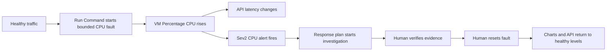

<ul class="sre-meta">
<li class="duration">Estimated time: 40 minutes</li>
<li>Module 03</li>
<li class="incident">Incident 1 of 2</li>
</ul>

## Overview

This incident consumes the VM's two vCPUs with a time-limited `systemd` unit.
You will see the change directly in the VM's **Percentage CPU** chart, observe
the effect on API latency, wait for the Sev2 alert, and review the investigation
created by the SRE Agent response plan.

The fault is not an API feature. The helper authenticates to Azure, invokes VM
Run Command, and starts a bounded guest process. It expires automatically and can
also be stopped with `fault reset`.

## Learning objectives

* Inject CPU pressure through the authenticated control plane.
* Compare healthy and incident CPU visually on the VM Metrics blade.
* Correlate VM saturation with public API latency.
* Follow a fired Azure Monitor alert into the SRE Agent response-plan workflow.
* Verify the agent's causal claims with raw telemetry and Activity Log evidence.
* Apply a human-approved mitigation and prove recovery.

## Incident loop



## Interactive incident launcher

Connect to Azure from the control in the top-right site header, select your
workshop environment, and use the launcher below. Documentation remains public,
but run, reset, status, and telemetry requests stay disabled until the
single-tenant connection succeeds.

<div data-sre-incident="cpu">
<p><strong>JavaScript is required for the interactive launcher.</strong> Use the terminal fallback in Task 2 when browser controls are unavailable.</p>
</div>

The graph reads **Percentage CPU** from Azure Monitor Metrics with Average
aggregation, one-minute granularity, a rolling 30-minute window, and automatic
refresh. The buttons invoke only the same bounded VM-local commands used by the
terminal helper; no command text can be supplied from the browser.

## Tasks

### Task 1: Prepare healthy traffic and notes

=== "Bash"

    ```bash
    source .workshop/workshop.env
    python scripts/workshop.py fault reset
    python scripts/workshop.py smoke
    ```

=== "PowerShell"

    ```powershell
    . ./.workshop/workshop.ps1
    python scripts/workshop.py fault reset
    python scripts/workshop.py smoke
    ```

Start normal traffic in another terminal:

=== "Bash"

    ```bash
    source .workshop/workshop.env
    ./scripts/generate-load.sh "${SERVICE_ORDERS_API_ENDPOINT_URL}" 5 900
    ```

=== "PowerShell"

    ```powershell
    . ./.workshop/workshop.ps1
    $until = (Get-Date).AddMinutes(15)
    $products = 'SKU-1001','SKU-1002','SKU-1003','SKU-1004','SKU-1005'
    while ((Get-Date) -lt $until) {
      $body = @{
        customerId = "cpu-incident-$((Get-Random -Maximum 500))"
        productId  = $products | Get-Random
        quantity   = Get-Random -Minimum 1 -Maximum 6
      } | ConvertTo-Json
      Invoke-RestMethod `
        -Method Post `
        -Uri "$env:SERVICE_ORDERS_API_ENDPOINT_URL/orders" `
        -ContentType 'application/json' `
        -Body $body | Out-Null
      Start-Sleep -Milliseconds 200
    }
    ```

Record the start time:

=== "Bash"

    ```bash
    mkdir -p .workshop/notes
    INCIDENT_START="$(date -u +%Y-%m-%dT%H:%M:%SZ)"
    printf '# CPU incident\n\nFault requested at UTC: %s\n\n' "${INCIDENT_START}" \
      > .workshop/notes/incident-01-cpu.md
    echo "${INCIDENT_START}"
    ```

=== "PowerShell"

    ```powershell
    New-Item -ItemType Directory -Force .workshop/notes | Out-Null
    $INCIDENT_START = (Get-Date).ToUniversalTime().ToString(
      'yyyy-MM-ddTHH:mm:ssZ'
    )
    "# CPU incident`n`nFault requested at UTC: $INCIDENT_START`n" |
      Set-Content .workshop/notes/incident-01-cpu.md
    $INCIDENT_START
    ```

Open the workshop VM's **Monitoring** > **Metrics** blade before injecting the
fault. Select **Percentage CPU**, **Average**, **1 minute**, and **Last 30
minutes**. Leave the chart open.

### Task 2: Inject bounded CPU pressure

Select **Run CPU incident** in the inline launcher. If browser authentication or
JavaScript is unavailable, use the equivalent terminal fallback:

=== "Bash"

    ```bash
    python scripts/workshop.py fault cpu 600 2
    ```

=== "PowerShell"

    ```powershell
    python scripts/workshop.py fault cpu 600 2
    ```

This starts two CPU workers for ten minutes. Valid durations are 10 through 1800
seconds and valid worker counts are 1 through 8. The fault process has a 256 MiB
memory limit and runs at a reduced scheduling priority.

!!! warning "Inspect before retrying"
    If the Run Command request times out, the guest operation may still have
    succeeded. Run `python scripts/workshop.py fault status` before submitting
    another injection. A second active CPU fault is rejected.

### Task 3: Hit the API and observe customer impact

While the fault is active, poll the endpoint:

=== "Bash"

    ```bash
    for i in $(seq 1 40); do
      curl --silent --output /dev/null --max-time 20 \
        --write-out "$(date -u +%H:%M:%S) status=%{http_code} seconds=%{time_total}\n" \
        "${SERVICE_ORDERS_API_ENDPOINT_URL}/orders"
      sleep 10
    done
    ```

=== "PowerShell"

    ```powershell
    1..40 | ForEach-Object {
      $timer = [System.Diagnostics.Stopwatch]::StartNew()
      try {
        $response = Invoke-WebRequest `
          -Uri "$env:SERVICE_ORDERS_API_ENDPOINT_URL/orders" `
          -TimeoutSec 20 `
          -SkipHttpErrorCheck `
          -ErrorAction Stop
        $status = [int]$response.StatusCode
      }
      catch {
        $status = 0
      }
      $timer.Stop()
      '{0} status={1} seconds={2:N3}' -f @(
        (Get-Date).ToUniversalTime().ToString('HH:mm:ss')
        $status
        $timer.Elapsed.TotalSeconds
      )
      Start-Sleep -Seconds 10
    }
    ```

Watch the load-generator response counts at the same time. Depending on Azure
host scheduling and current load, requests can remain successful but become
slower, or some can time out. Saturation is the required signal; a complete API
outage is not.

### Task 4: Watch the CPU rise in the VM portal

Return to the VM **Percentage CPU** chart. Refresh it until the fault window
appears. Hover over the line and record:

* The last pre-fault value.
* The first value above 80 percent.
* The maximum value.
* The time the line returns below the threshold.

Add a horizontal threshold line at 80 percent if the Metrics blade offers that
chart option. Keep the time range wide enough to show both the healthy traffic
from Module 01 and the incident.

<!-- SCREENSHOT: VM Monitoring Metrics blade showing Percentage CPU rising above 80 percent -->

In Application Insights, open **Live Metrics** or **Performance** and view the
same interval. Compare request rate, duration, and failures with the CPU line.
The API calls supply the customer-side evidence; the VM chart supplies the
resource-side evidence.

### Task 5: Wait for the alert and response plan

The rule evaluates a five-minute average every minute. Expect several minutes
between fault start and the alert firing.

In the portal:

1. Open **Monitor** > **Alerts**.
2. Filter to the workshop resource group.
3. Open `alert-orders-high-cpu` when it reaches **Fired**.
4. Record its start time, severity, threshold, and affected VM.
5. Open Azure SRE Agent and find the incident or investigation created by
   `workshop-sev1-sev2-review`.

If you configured `ALERT_EMAIL`, the action group also sends a common-alert
schema email. Email is optional; the portal alert and SRE response plan are not.

<!-- SCREENSHOT: Fired alert-orders-high-cpu and its linked SRE Agent investigation -->

### Task 6: Review the agent investigation

Start with the automatically collected findings, then ask:

```text
Investigate the high-CPU alert for the Orders VM.
1. State when CPU first departed from baseline and when the alert fired.
2. Quantify the customer impact using request volume, success rate, and P95 duration.
3. Check Azure Activity Log for a VM Run Command operation near the start.
4. Identify which evidence supports CPU pressure as the cause rather than an API,
   network, or SQLite failure.
5. Propose a mitigation, but do not claim that you executed it.
Cite every chart, metric, or query used.
```

Review mode means the answer is a proposal. Do not approve a causal claim merely
because it is plausible.

### Task 7: Verify the investigation independently

Query the platform metric:

=== "Bash"

    ```bash
    az monitor metrics list \
      --resource "${VM_RESOURCE_ID}" \
      --metric "Percentage CPU" \
      --interval PT1M \
      --aggregation Average Maximum \
      --start-time "${INCIDENT_START}" \
      --output table
    ```

=== "PowerShell"

    ```powershell
    az monitor metrics list `
      --resource $env:VM_RESOURCE_ID `
      --metric "Percentage CPU" `
      --interval PT1M `
      --aggregation Average Maximum `
      --start-time $INCIDENT_START `
      --output table
    ```

Query request impact:

=== "Bash"

    ```bash
    az monitor log-analytics query \
      --workspace "${LOG_ANALYTICS_CUSTOMER_ID}" \
      --analytics-query "
    AppRequests
    | where TimeGenerated > ago(45m)
    | where AppRoleName == 'orders-api'
    | summarize
        Requests = sum(ItemCount),
        SuccessRate = round(100.0 * sumif(ItemCount, Success == true) / sum(ItemCount), 2),
        P95Ms = round(percentile(DurationMs, 95), 1)
      by bin(TimeGenerated, 1m)
    | order by TimeGenerated asc
    " \
      --output table
    ```

=== "PowerShell"

    ```powershell
    $query = @'
    AppRequests
    | where TimeGenerated > ago(45m)
    | where AppRoleName == 'orders-api'
    | summarize
        Requests = sum(ItemCount),
        SuccessRate = round(100.0 * sumif(ItemCount, Success == true) / sum(ItemCount), 2),
        P95Ms = round(percentile(DurationMs, 95), 1)
      by bin(TimeGenerated, 1m)
    | order by TimeGenerated asc
    '@

    az monitor log-analytics query `
      --workspace $env:LOG_ANALYTICS_CUSTOMER_ID `
      --analytics-query $query `
      --output table
    ```

Check the control-plane change:

=== "Bash"

    ```bash
    az monitor activity-log list \
      --resource-id "${VM_RESOURCE_ID}" \
      --offset 2h \
      --query "[].{Time:eventTimestamp, Operation:operationName.localizedValue, Status:status.value, Caller:caller}" \
      --output table
    ```

=== "PowerShell"

    ```powershell
    az monitor activity-log list `
      --resource-id $env:VM_RESOURCE_ID `
      --offset 2h `
      --query "[].{Time:eventTimestamp, Operation:operationName.localizedValue, Status:status.value, Caller:caller}" `
      --output table
    ```

The expected causal chain is: authenticated Run Command started a bounded guest
unit, VM CPU crossed the threshold, and request behavior changed in the same
window. SQLite exceptions are not required and should not be invented.

### Task 8: Mitigate and prove recovery

The fault stops after ten minutes, but reset it explicitly once you have enough
evidence:

=== "Bash"

    ```bash
    python scripts/workshop.py fault reset
    python scripts/workshop.py fault status
    python scripts/workshop.py smoke
    ```

=== "PowerShell"

    ```powershell
    python scripts/workshop.py fault reset
    python scripts/workshop.py fault status
    python scripts/workshop.py smoke
    ```

Keep the load generator running for another five minutes. In the VM Metrics
blade, watch **Percentage CPU** return toward its healthy range. In
Application Insights, confirm request duration also recovers. The Azure Monitor
alert auto-resolves after the evaluation window is healthy.

Record fault start, degradation start, alert time, mitigation time, recovery
time, and alert resolution in `.workshop/notes/incident-01-cpu.md`.

## Validation

* [x] CPU pressure was started through authenticated Run Command.
* [x] The VM chart visibly crossed 80 percent CPU.
* [x] You compared API behavior with the same chart window.
* [x] `alert-orders-high-cpu` fired at Sev2.
* [x] The response plan created or updated an SRE Agent investigation.
* [x] You verified the diagnosis with platform metrics, requests, and Activity Log.
* [x] CPU and request behavior returned to baseline after reset.

## Knowledge check

??? question "Why is the alert time later than the degradation start?"
    The metric must be sampled, the five-minute average must cross the threshold, and the rule must evaluate. The difference is detection latency. Record both times rather than treating the alert timestamp as the incident start.

??? question "Does resetting the fault remediate the underlying production risk?"
    It mitigates this synthetic event. A real CPU incident still needs identification of the offending workload, capacity policy, code path, or demand change, followed by a durable engineering change. Stopping the worker restores service but does not make future saturation impossible.

??? question "Why is Activity Log evidence important here?"
    CPU metrics prove saturation but not what started it. The Run Command operation supplies a correlated control-plane event. Together they support causation more strongly than two telemetry lines moving at the same time.

## Next steps

[Next: Module 04 - Respond to Data-Disk Pressure :material-arrow-right:](../04-incident-data-disk/index.md){ .md-button .md-button--primary }

<div class="sre-nav" markdown>
[:material-arrow-left: Module 02 - Operate the Response Plan](../02-operate-response-plan/index.md)
[Module 04 - Respond to Data-Disk Pressure :material-arrow-right:](../04-incident-data-disk/index.md)
</div>
