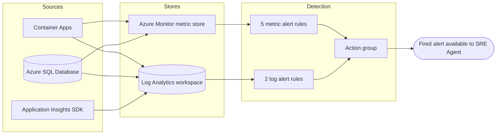

<ul class="sre-meta">
<li class="duration">Estimated time: 30 minutes</li>
<li>Module 04</li>
<li>Hands-on</li>
</ul>

## Overview

Detection is the part of incident response most teams get wrong, usually by alerting on everything and therefore on nothing. This module builds a small, deliberate detection layer: five metric alerts and two log alerts, each mapped to a specific failure mode you reproduce later.

You also establish a healthy baseline. An investigation that cannot answer "what does normal look like" is guesswork, for you and for the agent.

## Learning objectives

* Inspect Azure Monitor alert rules that map to concrete failure modes.
* Confirm that Container Apps logs, SQL diagnostics, and Application Insights telemetry all reach the workspace.
* Write KQL queries that establish a healthy baseline for latency, errors, and saturation.
* Explain why each alert threshold was chosen rather than accepting defaults.

## Architecture context

Telemetry converges on one workspace; alert rules read from it and from the metric store.



## Tasks

### Task 1: Start baseline traffic

Alert rules cannot establish a baseline against zero traffic, and neither can you. Start a load generator in a dedicated terminal and leave it running for the rest of the workshop.

```bash
source .workshop/workshop.env
./scripts/generate-load.sh "${ORDERS_API_FQDN}" 5 7200
```

This sends five orders per second for two hours. Leave that terminal alone and continue in a new one.

!!! tip "Restarting the generator"
    If the generator stops, restart it with the same command. Gaps in traffic show up as gaps in your baseline and make percentile comparisons noisy.

### Task 2: Verify diagnostic settings

The foundation deployment configured diagnostic settings on the SQL database and the Container Apps environment. Confirm they exist rather than assuming.

```bash
source .workshop/workshop.env

echo "--- SQL database diagnostics ---"
az monitor diagnostic-settings list \
  --resource "/subscriptions/${SUBSCRIPTION_ID}/resourceGroups/${RESOURCE_GROUP}/providers/Microsoft.Sql/servers/${SQL_SERVER_NAME}/databases/${SQL_DATABASE_NAME}" \
  --query "value[].{Name:name, Workspace:workspaceId}" \
  --output table

echo "--- Container Apps environment diagnostics ---"
az monitor diagnostic-settings list \
  --resource "/subscriptions/${SUBSCRIPTION_ID}/resourceGroups/${RESOURCE_GROUP}/providers/Microsoft.App/managedEnvironments/${CONTAINER_ENV_NAME}" \
  --query "value[].{Name:name, Workspace:workspaceId}" \
  --output table
```

### Task 3: Inspect the alert rules

```bash
az monitor metrics alert list \
  --resource-group "${RESOURCE_GROUP}" \
  --query "[].{Name:name, Severity:severity, Enabled:enabled, Window:windowSize}" \
  --output table

az monitor scheduled-query list \
  --resource-group "${RESOURCE_GROUP}" \
  --query "[].{Name:name, Severity:properties.severity, Enabled:properties.enabled}" \
  --output table
```

### Task 4: Understand the thresholds

Every threshold in [infra/alerts.bicep](https://github.com/charliekw411/sre-agent-workshop/blob/main/infra/alerts.bicep) is a decision, not a default. Read this table before you continue, because Module 12 asks you to justify these numbers to the agent.

| Alert                              | Signal                          | Threshold                         | Reasoning                                                                              |
|------------------------------------|---------------------------------|-----------------------------------|-----------------------------------------------------------------------------------------|
| `alert-orders-api-high-cpu`        | `UsageNanoCores` average        | Over 400,000,000 for 5 minutes    | 80 percent of the 0.5 vCPU allocation, sustained long enough to exclude a normal burst  |
| `alert-orders-api-http-5xx`        | `Requests` where category = 5xx | More than 10 in 5 minutes         | Below the volume a real outage produces, above the noise from a single transient failure |
| `alert-orders-api-restarts`        | `RestartCount` total            | More than 2 in 5 minutes          | One restart is maintenance, three is a crash loop                                       |
| `alert-catalog-api-high-cpu`       | `UsageNanoCores` average        | Over 200,000,000 for 5 minutes    | 80 percent of the smaller 0.25 vCPU allocation                                          |
| `alert-sqldb-storage-critical`     | `storage_percent` maximum       | Over 85 percent                   | Leaves headroom to react before writes start failing at 100 percent                     |
| `alert-application-exception-spike`| `AppExceptions` count           | More than 10 per problem in 15 min | Catches a recurring exception signature, ignores one-off failures                       |
| `alert-dependency-failure-rate`    | `AppDependencies` failure ratio | Over 20 percent of at least 20 calls | Ratio rather than count, so it works at any traffic volume                            |

!!! note "Why the dependency alert uses a ratio"
    A count-based threshold behaves differently at 5 requests per second than at 500. Ratios survive traffic growth, which means the rule keeps working after the workshop ends and your load pattern changes. The minimum call count of 20 prevents a single failure in a quiet window from firing at 100 percent.

### Task 5: Confirm telemetry is arriving

Ingestion takes a few minutes after the first request. Run these queries until each returns rows.

```bash
export LAW_CUSTOMER_ID="${LOG_ANALYTICS_CUSTOMER_ID}"

az monitor log-analytics query \
  --workspace "${LAW_CUSTOMER_ID}" \
  --analytics-query "AppRequests | where TimeGenerated > ago(15m) | summarize Requests = count() by AppRoleName | order by Requests desc" \
  --output table
```

```bash
az monitor log-analytics query \
  --workspace "${LAW_CUSTOMER_ID}" \
  --analytics-query "AppDependencies | where TimeGenerated > ago(15m) | summarize Calls = count(), Failures = countif(Success == false) by AppRoleName, Type, Target" \
  --output table
```

```bash
az monitor log-analytics query \
  --workspace "${LAW_CUSTOMER_ID}" \
  --analytics-query "ContainerAppConsoleLogs_CL | where TimeGenerated > ago(15m) | summarize Lines = count() by ContainerAppName_s" \
  --output table
```

### Task 6: Record the healthy baseline

Save these numbers. Every investigation module compares against them.

```bash
az monitor log-analytics query \
  --workspace "${LAW_CUSTOMER_ID}" \
  --analytics-query "
AppRequests
| where TimeGenerated > ago(30m)
| summarize
    Requests = count(),
    SuccessRate = round(100.0 * countif(Success == true) / count(), 2),
    P50Ms = round(percentile(DurationMs, 50), 1),
    P95Ms = round(percentile(DurationMs, 95), 1),
    P99Ms = round(percentile(DurationMs, 99), 1)
  by AppRoleName
" \
  --output table
```

```bash
az monitor metrics list \
  --resource "/subscriptions/${SUBSCRIPTION_ID}/resourceGroups/${RESOURCE_GROUP}/providers/Microsoft.App/containerApps/orders-api" \
  --metric UsageNanoCores WorkingSetBytes \
  --interval PT5M \
  --aggregation Average \
  --start-time "$(date -u -d '30 minutes ago' +%Y-%m-%dT%H:%M:%SZ 2>/dev/null || date -u -v-30M +%Y-%m-%dT%H:%M:%SZ)" \
  --output table
```

Write the results into your notes file so you can refer to them later.

```bash
mkdir -p .workshop/notes
cat > .workshop/notes/baseline.md <<'EOF'
# Healthy baseline

Recorded before any fault injection.

| Metric                     | orders-api | catalog-api |
|----------------------------|------------|-------------|
| Requests per 30 min        |            |             |
| Success rate percent       |            |             |
| P50 latency ms             |            |             |
| P95 latency ms             |            |             |
| P99 latency ms             |            |             |
| Average CPU nanocores      |            |             |
| Average working set bytes  |            |             |
| SQL storage percent        |            |             |
EOF

echo "Fill in .workshop/notes/baseline.md with the values above."
```

### Task 7: Confirm the action group can reach you

```bash
az monitor action-group show \
  --name ag-sre-workshop \
  --resource-group "${RESOURCE_GROUP}" \
  --query "{Name:name, ShortName:groupShortName, Email:emailReceivers[0].emailAddress, Status:emailReceivers[0].status}" \
  --output table
```

Azure sends a confirmation email when the receiver is created. If the status is not `Enabled`, check your inbox and spam folder.

<!-- SCREENSHOT: Azure Monitor alert rules list showing all seven rules enabled -->

## Validation

```bash
source .workshop/workshop.env

METRIC_COUNT=$(az monitor metrics alert list --resource-group "${RESOURCE_GROUP}" --query "length([?enabled])" --output tsv)
LOG_COUNT=$(az monitor scheduled-query list --resource-group "${RESOURCE_GROUP}" --query "length([?properties.enabled])" --output tsv)
REQ_ROWS=$(az monitor log-analytics query --workspace "${LOG_ANALYTICS_CUSTOMER_ID}" \
  --analytics-query "AppRequests | where TimeGenerated > ago(15m) | count" --output tsv | head -1)

[[ "${METRIC_COUNT}" == "5" ]] && echo "PASS: 5 metric alert rules enabled" || echo "FAIL: found ${METRIC_COUNT} metric alert rules"
[[ "${LOG_COUNT}" == "2" ]] && echo "PASS: 2 log alert rules enabled" || echo "FAIL: found ${LOG_COUNT} log alert rules"
[[ "${REQ_ROWS}" -gt 0 ]] 2>/dev/null && echo "PASS: request telemetry is arriving" || echo "FAIL: no request telemetry in the last 15 minutes"
```

## Expected results

* Five metric alert rules and two log alert rules, all enabled.
* `AppRequests` returns rows for both `orders-api` and `catalog-api`.
* `AppDependencies` shows HTTP calls from `orders-api` to `catalog-api` and SQL calls to the orders database, all succeeding.
* Success rate is at or very near 100 percent.
* P95 latency for `orders-api` is under roughly 250 milliseconds.
* `UsageNanoCores` for `orders-api` sits well below 100,000,000, which is under 20 percent of its allocation.
* No alerts have fired.

!!! warning "Do not continue until telemetry is flowing"
    If `AppRequests` returns no rows after ten minutes, stop and resolve it. Check that `APPLICATIONINSIGHTS_CONNECTION_STRING` is present on both container apps with `az containerapp show --name orders-api --resource-group "${RESOURCE_GROUP}" --query "properties.template.containers[0].env"`. Every remaining module depends on this data existing.

## Knowledge check

??? question "The CPU alert uses a 5-minute window with a 1-minute evaluation frequency. What would change if you used a 1-minute window instead?"
    Detection would be faster but far noisier. A single garbage collection pause, a deployment, or a burst of traffic can push a small container over 80 percent for one minute. The 5-minute window requires the saturation to be sustained, which is what distinguishes an incident from normal variance. You trade roughly four minutes of detection latency for a large reduction in false positives.

??? question "You have both a metric alert on HTTP 5xx and a log alert on exception spikes. Is that redundant?"
    No, they answer different questions. The metric alert reports what the customer experienced, counting responses at the ingress. The log alert reports what the application threw, grouped by exception signature. An incident can produce exceptions without 5xx responses if they are caught and handled, and it can produce 5xx responses without exceptions if the platform rejects requests before your code runs. During an investigation, having both tells you where the failure boundary is.

??? question "Why record a baseline instead of relying on the alert thresholds as the definition of healthy?"
    A threshold is the point at which something is unambiguously wrong. A baseline is what normal looks like. Most incidents show a meaningful deviation from baseline long before they reach a threshold, and in Module 07 you use the baseline to determine when degradation actually started, which is usually earlier than when the alert fired.

## Next steps

Detection is in place. Now connect the agent that consumes it.

[Next: Module 05 - Configure Azure SRE Agent :material-arrow-right:](../05-configure-sre-agent/index.md){ .md-button .md-button--primary }

<div class="sre-nav" markdown>
[:material-arrow-left: Module 03 - Deploy Azure Infrastructure](../03-deploy-infrastructure/index.md)
[Module 05 - Configure Azure SRE Agent :material-arrow-right:](../05-configure-sre-agent/index.md)
</div>
