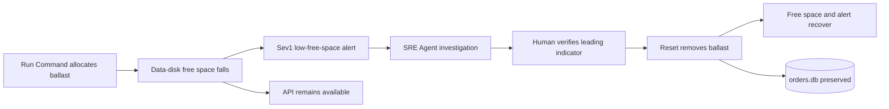

<ul class="sre-meta">
<li class="duration">Estimated time: 40 minutes</li>
<li>Module 04</li>
<li class="incident">Incident 2 of 2</li>
</ul>

## Overview

This incident creates a temporary ballast file on `/var/lib/orders`, the managed
filesystem that stores SQLite. It targets 90 percent used space, crossing the
alert threshold of less than 15 percent free. The exercise preserves at least
128 MiB for recovery, expires automatically, and never deletes `orders.db`.

Unlike the CPU exercise, low free space is a leading indicator. The alert should
fire while the API can still read and write orders. Responding before customer
impact is the desired outcome.

## Learning objectives

* Inject bounded pressure only on the managed data disk.
* Visualize `/var/lib/orders` free space as a Log Analytics timechart.
* Compare the storage signal with the VM CPU chart and API behavior.
* Follow the Sev1 capacity alert through the SRE Agent response plan.
* Distinguish a leading indicator from an observed outage.
* Reset the ballast safely and verify SQLite integrity and persistence.

## Failure model



## Interactive incident launcher

Connect to Azure from the control in the top-right site header, select your
workshop environment, and use the launcher below. Documentation remains public,
but run, reset, status, and telemetry requests stay disabled until the
single-tenant connection succeeds.

<div data-sre-incident="disk">
<p><strong>JavaScript is required for the interactive launcher.</strong> Use the terminal fallback in Task 3 when browser controls are unavailable.</p>
</div>

The graph queries Log Analytics guest telemetry for `/var/lib/orders` with
one-minute bins, a rolling 30-minute window, and automatic refresh. The buttons
invoke only the same bounded VM-local commands used by the terminal helper.
Reset removes only the dedicated workshop ballast file and never changes
`orders.db`.

!!! tip "Keep the operator and customer views separate"
    Use this authenticated documentation tab to start, inspect, and reset the
    incident. Open `SERVICE_ORDERS_API_ENDPOINT_URL` in a second tab for the
    public Orders GUI. The first changes workshop state; the second only makes
    customer and status API requests.

The workshop intentionally stops before a destructive filesystem-full state.
If writes remain successful, that is evidence that detection provided a response
window, not evidence that the alert was false.

## Tasks

### Task 1: Confirm recovery from the CPU incident

=== "Bash"

    ```bash
    source .workshop/workshop.env
    python scripts/workshop.py fault reset
    python scripts/workshop.py inspect
    python scripts/workshop.py smoke
    curl --silent --fail "${SERVICE_ORDERS_API_ENDPOINT_URL}/storage" | jq .
    ```

=== "PowerShell"

    ```powershell
    . ./.workshop/workshop.ps1
    python scripts/workshop.py fault reset
    python scripts/workshop.py inspect
    python scripts/workshop.py smoke
    Invoke-RestMethod "$env:SERVICE_ORDERS_API_ENDPOINT_URL/storage"
    ```

Record the starting `usedPercent`, `availableBytes`, and `databaseBytes`.

Optionally open `SERVICE_ORDERS_API_ENDPOINT_URL` in a browser and record the
same baseline from the **Data disk** card. Keep the terminal output as the
authoritative numeric fallback.

Start low-rate traffic in another terminal:

=== "Bash"

    ```bash
    source .workshop/workshop.env
    ./scripts/generate-load.sh "${SERVICE_ORDERS_API_ENDPOINT_URL}" 2 900
    ```

=== "PowerShell"

    ```powershell
    . ./.workshop/workshop.ps1
    $until = (Get-Date).AddMinutes(15)
    $products = 'SKU-1001','SKU-1002','SKU-1003','SKU-1004','SKU-1005'
    while ((Get-Date) -lt $until) {
      $body = @{
        customerId = "disk-load-$((Get-Random -Maximum 500))"
        productId  = $products | Get-Random
        quantity   = Get-Random -Minimum 1 -Maximum 6
      } | ConvertTo-Json
      Invoke-RestMethod `
        -Method Post `
        -Uri "$env:SERVICE_ORDERS_API_ENDPOINT_URL/orders" `
        -ContentType 'application/json' `
        -Body $body | Out-Null
      Start-Sleep -Milliseconds 500
    }
    ```

### Task 2: Prepare both visual comparisons

Open two portal views with **Last 30 minutes** selected:

1. Workshop VM > **Monitoring** > **Metrics** > **Percentage CPU**.
2. Log Analytics workspace > **Logs**.

In Logs, run:

```kusto
Perf
| where ObjectName == "Logical Disk"
| where CounterName == "% Free Space"
| where InstanceName == "/var/lib/orders"
| summarize AverageFreeSpace = avg(CounterValue) by bin(TimeGenerated, 1m)
| render timechart
```

The last point is the pre-incident storage baseline. Leave both views open.

### Task 3: Record the incident start and inject disk pressure

Select **Run disk incident** in the inline launcher. If browser authentication or
JavaScript is unavailable, record the incident start and use the equivalent
terminal fallback:

=== "Bash"

    ```bash
    mkdir -p .workshop/notes
    INCIDENT_START="$(date -u +%Y-%m-%dT%H:%M:%SZ)"
    printf '# Data-disk incident\n\nFault requested at UTC: %s\n\n' "${INCIDENT_START}" \
      > .workshop/notes/incident-02-data-disk.md
    echo "${INCIDENT_START}"

    python scripts/workshop.py fault disk 90 600
    ```

=== "PowerShell"

    ```powershell
    New-Item -ItemType Directory -Force .workshop/notes | Out-Null
    $INCIDENT_START = (Get-Date).ToUniversalTime().ToString(
      'yyyy-MM-ddTHH:mm:ssZ'
    )
    "# Data-disk incident`n`nFault requested at UTC: $INCIDENT_START`n" |
      Set-Content .workshop/notes/incident-02-data-disk.md
    $INCIDENT_START

    python scripts/workshop.py fault disk 90 600
    ```

The arguments are target used percent and duration in seconds. Valid targets are
50 through 97 percent and durations are 30 through 1800 seconds.

Safety checks refuse to run when:

* `/var/lib/orders` is not a separate mount.
* The mount is not the expected managed disk at LUN 0.
* A disk fault or ballast file already exists.
* The allocation would violate the 128 MiB recovery reserve.

### Task 4: Hit read and write endpoints during pressure

The optional Orders GUI exposes the same customer paths. Refresh the status
cards to see disk usage, create one synthetic order, and refresh the list. A
successful write while the card reports low capacity demonstrates a response
window rather than an outage. Use the loop below for consistent timestamped
evidence.

Poll application storage and both customer paths:

=== "Bash"

    ```bash
    for i in $(seq 1 30); do
      STORAGE=$(curl --silent --fail \
        "${SERVICE_ORDERS_API_ENDPOINT_URL}/storage" \
        | jq -r '"used=\(.usedPercent)% available=\(.availableBytes) database=\(.databaseBytes)"')
      READ=$(curl --silent --output /dev/null --write-out '%{http_code}' \
        "${SERVICE_ORDERS_API_ENDPOINT_URL}/orders")
      WRITE=$(curl --silent --output /dev/null --write-out '%{http_code}' \
        --request POST "${SERVICE_ORDERS_API_ENDPOINT_URL}/orders" \
        --header 'Content-Type: application/json' \
        --data '{"customerId":"disk-incident","productId":"SKU-1001","quantity":1}')
      printf '%s %s read=%s write=%s\n' \
        "$(date -u +%H:%M:%S)" "${STORAGE}" "${READ}" "${WRITE}"
      sleep 20
    done
    ```

=== "PowerShell"

    ```powershell
    $writeBody = @{
      customerId = 'disk-incident'
      productId  = 'SKU-1001'
      quantity   = 1
    } | ConvertTo-Json

    1..30 | ForEach-Object {
      $storage = Invoke-RestMethod `
        "$env:SERVICE_ORDERS_API_ENDPOINT_URL/storage"
      $read = Invoke-WebRequest `
        -Uri "$env:SERVICE_ORDERS_API_ENDPOINT_URL/orders" `
        -SkipHttpErrorCheck
      $write = Invoke-WebRequest `
        -Method Post `
        -Uri "$env:SERVICE_ORDERS_API_ENDPOINT_URL/orders" `
        -ContentType 'application/json' `
        -Body $writeBody `
        -SkipHttpErrorCheck

      '{0} used={1}% available={2} database={3} read={4} write={5}' -f @(
        (Get-Date).ToUniversalTime().ToString('HH:mm:ss')
        $storage.usedPercent
        $storage.availableBytes
        $storage.databaseBytes
        [int]$read.StatusCode
        [int]$write.StatusCode
      )
      Start-Sleep -Seconds 20
    }
    ```

The expected response is HTTP 200 for reads and HTTP 201 for writes. If a real
SQLite failure occurs, the API returns HTTP 503 and records dependency and
exception telemetry; do not manufacture that outcome.

### Task 5: Watch the portal charts

Refresh the Log Analytics query after two Azure Monitor Agent samples. The line
should fall from its baseline to approximately 10 percent free. Record:

* Last pre-fault free-space value.
* Lowest free-space value.
* First timestamp below 15 percent.
* Read and write status at that time.

<!-- SCREENSHOT: Log Analytics timechart showing /var/lib/orders free space falling below 15 percent -->

Return to the VM's **Percentage CPU** chart. The endpoint traffic can create
minor movement, but CPU should not resemble the saturation shape from Module 03.
This visual comparison helps rule out CPU as the cause of the capacity alert.

In Application Insights **Performance**, inspect `GET /storage`, `GET /orders`,
and `POST /orders` for the same interval.

### Task 6: Follow the Sev1 alert into SRE Agent

In **Monitor** > **Alerts**, filter to the resource group and open
`alert-orders-data-disk-free` after it fires. Record that the rule is scoped to
Log Analytics guest data and identifies `/var/lib/orders`.

Open the corresponding SRE Agent investigation and ask:

```text
Investigate the Orders data-disk low-free-space alert.
1. Identify the filesystem, current free-space percentage, and first threshold breach.
2. Determine whether GET /orders, POST /orders, readiness, or SQLite availability
   shows customer impact.
3. Compare VM CPU with its earlier baseline so CPU is not treated as the cause.
4. Check Activity Log for a VM Run Command operation near the start.
5. Recommend the safest immediate mitigation and explain what data it preserves.
Do not describe a capacity alert as an outage unless telemetry shows failed requests.
```

The response plan can merge a related HTTP 5xx alert if genuine server errors
also occur within the three-hour window. Do not assume two alerts share a cause
until their times and affected operations align.

### Task 7: Verify the agent's claims

Query the storage samples:

=== "Bash"

    ```bash
    az monitor log-analytics query \
      --workspace "${LOG_ANALYTICS_CUSTOMER_ID}" \
      --analytics-query "
    Perf
    | where TimeGenerated > ago(45m)
    | where ObjectName == 'Logical Disk'
    | where CounterName == '% Free Space'
    | where InstanceName == '/var/lib/orders'
    | summarize AverageFreeSpace = round(avg(CounterValue), 2) by bin(TimeGenerated, 1m)
    | order by TimeGenerated asc
    " \
      --output table
    ```

=== "PowerShell"

    ```powershell
    $query = @'
    Perf
    | where TimeGenerated > ago(45m)
    | where ObjectName == 'Logical Disk'
    | where CounterName == '% Free Space'
    | where InstanceName == '/var/lib/orders'
    | summarize AverageFreeSpace = round(avg(CounterValue), 2) by bin(TimeGenerated, 1m)
    | order by TimeGenerated asc
    '@

    az monitor log-analytics query `
      --workspace $env:LOG_ANALYTICS_CUSTOMER_ID `
      --analytics-query $query `
      --output table
    ```

Verify customer impact by operation:

=== "Bash"

    ```bash
    az monitor log-analytics query \
      --workspace "${LOG_ANALYTICS_CUSTOMER_ID}" \
      --analytics-query "
    AppRequests
    | where TimeGenerated > ago(45m)
    | where AppRoleName == 'orders-api'
    | summarize
        Requests = sum(ItemCount),
        Failures = sumif(ItemCount, Success == false),
        P95Ms = round(percentile(DurationMs, 95), 1)
      by Name, ResultCode, bin(TimeGenerated, 5m)
    | order by TimeGenerated asc, Name asc
    " \
      --output table
    ```

=== "PowerShell"

    ```powershell
    $query = @'
    AppRequests
    | where TimeGenerated > ago(45m)
    | where AppRoleName == 'orders-api'
    | summarize
        Requests = sum(ItemCount),
        Failures = sumif(ItemCount, Success == false),
        P95Ms = round(percentile(DurationMs, 95), 1)
      by Name, ResultCode, bin(TimeGenerated, 5m)
    | order by TimeGenerated asc, Name asc
    '@

    az monitor log-analytics query `
      --workspace $env:LOG_ANALYTICS_CUSTOMER_ID `
      --analytics-query $query `
      --output table
    ```

Check SQLite telemetry:

=== "Bash"

    ```bash
    az monitor log-analytics query \
      --workspace "${LOG_ANALYTICS_CUSTOMER_ID}" \
      --analytics-query "
    union
      (AppDependencies
       | where AppRoleName == 'orders-api' and DependencyType == 'SQLite'
       | summarize Samples=sum(ItemCount), Failures=sumif(ItemCount, Success == false)
         by Signal='SQLite dependencies', bin(TimeGenerated, 5m)),
      (AppAvailabilityResults
       | where AppRoleName == 'orders-api'
       | summarize Samples=sum(ItemCount), Failures=sumif(ItemCount, Success == false)
         by Signal='SQLite availability', bin(TimeGenerated, 5m))
    | where TimeGenerated > ago(45m)
    | order by TimeGenerated asc
    " \
      --output table
    ```

=== "PowerShell"

    ```powershell
    $query = @'
    union
      (AppDependencies
       | where AppRoleName == 'orders-api' and DependencyType == 'SQLite'
       | summarize Samples=sum(ItemCount), Failures=sumif(ItemCount, Success == false)
         by Signal='SQLite dependencies', bin(TimeGenerated, 5m)),
      (AppAvailabilityResults
       | where AppRoleName == 'orders-api'
       | summarize Samples=sum(ItemCount), Failures=sumif(ItemCount, Success == false)
         by Signal='SQLite availability', bin(TimeGenerated, 5m))
    | where TimeGenerated > ago(45m)
    | order by TimeGenerated asc
    '@

    az monitor log-analytics query `
      --workspace $env:LOG_ANALYTICS_CUSTOMER_ID `
      --analytics-query $query `
      --output table
    ```

A correct investigation reports critical remaining capacity and, when requests
remain successful, explicitly states that no customer outage is observed.

### Task 8: Reset and prove data safety

=== "Bash"

    ```bash
    python scripts/workshop.py fault reset
    python scripts/workshop.py fault status
    python scripts/workshop.py inspect
    python scripts/workshop.py smoke
    curl --silent --fail "${SERVICE_ORDERS_API_ENDPOINT_URL}/storage" | jq .
    ```

=== "PowerShell"

    ```powershell
    python scripts/workshop.py fault reset
    python scripts/workshop.py fault status
    python scripts/workshop.py inspect
    python scripts/workshop.py smoke
    Invoke-RestMethod "$env:SERVICE_ORDERS_API_ENDPOINT_URL/storage"
    ```

Refresh the Log Analytics timechart after several collection and evaluation
intervals. Free space should return near its baseline and the alert should
auto-resolve after a healthy evaluation window. Guest-log ingestion means the
alert can fire or resolve after the filesystem itself has already recovered.
Confirm the VM CPU chart remains healthy and the order created in Task 4 is
still returned by `/orders`.

In the optional Orders GUI, refresh status and confirm that available space
returns near its baseline, the data-disk card visibly recovers, and the order is
still listed.

The reset stops the transient unit and removes only
`/var/lib/orders/.workshop-disk-pressure`. It never deletes or recreates SQLite.

Complete `.workshop/notes/incident-02-data-disk.md` with threshold, alert,
mitigation, recovery, and resolution times.

## Validation

* [x] The ballast was allocated only on the managed data disk.
* [x] The Log Analytics chart fell below 15 percent free space.
* [x] You viewed VM CPU and API operations over the same window.
* [x] `alert-orders-data-disk-free` fired at Sev1.
* [x] The response plan opened or updated an SRE Agent investigation.
* [x] You distinguished capacity risk from demonstrated customer impact.
* [x] Reset restored free space and preserved SQLite integrity and orders.
* [x] The optional Orders GUI showed low capacity and recovery, or the terminal fallback captured both.

## Knowledge check

??? question "Why is a low-space alert valuable when every request still succeeds?"
    It creates a response window before the filesystem is exhausted. Capacity alerts should normally fire on a leading indicator; waiting for SQLite writes to fail converts a manageable risk into a customer incident.

??? question "Why compare the disk chart with VM CPU?"
    Correlation requires checking plausible alternatives. A healthy CPU line while filesystem free space collapses narrows the cause and prevents the previous incident's saturation pattern from being reused as an explanation.

??? question "Why does reset remove a dedicated ballast file rather than deleting database rows?"
    The ballast is isolated synthetic pressure. Removing it is predictable and leaves customer-shaped workshop data untouched. Deleting SQLite content during recovery would make the mitigation destructive and would prevent persistence verification.

## Next steps

[Next: Module 05 - Review and Improve the Response :material-arrow-right:](../05-review-and-improve/index.md){ .md-button .md-button--primary }

<div class="sre-nav" markdown>
[:material-arrow-left: Module 03 - Respond to High CPU](../03-incident-high-cpu/index.md)
[Module 05 - Review and Improve the Response :material-arrow-right:](../05-review-and-improve/index.md)
</div>
