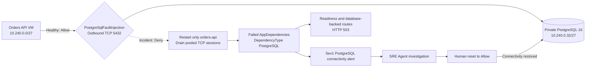

<ul class="sre-meta">
<li class="duration">Estimated time: 40 minutes</li>
<li>Module 04</li>
<li class="incident">Incident 2 of 2</li>
</ul>

## Overview

This incident removes the Orders API's ability to open PostgreSQL connections.
The fault changes one existing network security group child rule,
`PostgreSqlFaultInjection`, from `Allow` to `Deny`.

The fixed rule is priority 100, outbound TCP only, from the Orders VM subnet
`10.240.0.0/27` to the delegated PostgreSQL subnet `10.240.0.32/27` on port
5432. It does not block other outbound traffic, change database rows or schema,
stop the Flexible Server, enable public access, or change DNS.

Azure NSGs are stateful: changing an allow rule does not terminate an existing
TCP flow. The injector therefore restarts only `orders-api` after the `Deny`
read-back, draining the Npgsql pool without restarting the VM or PostgreSQL. It
retries the recycle while the rule propagates and succeeds only after liveness
returns HTTP 200 and both readiness and `/orders` return the controlled
database-unavailable HTTP 503.

You will observe the difference between process liveness and dependency-backed
readiness, follow failed PostgreSQL dependencies into the Sev1 alert and SRE
Agent response plan, verify the network change, and restore `Allow`.

## Learning objectives

* Establish a healthy PostgreSQL dependency baseline.
* Explain the exact scope and normal state of the fault rule.
* Correlate HTTP 503 responses with failed PostgreSQL dependencies.
* Distinguish an application dependency outage from a stopped database or broad
  network outage.
* Follow `alert-orders-postgresql-connectivity` into an SRE Agent
  investigation.
* Verify the control-plane change and restore connectivity without changing
  application data.

## Failure model



Microsoft Entra authentication and private DNS remain configured throughout the
exercise. The VM's system-assigned identity remains the PostgreSQL
administrator and runtime identity. That combined privilege is a documented
lab shortcut, not the cause of this incident.

## Interactive incident launcher

Connect to Azure from the control in the site header, select your workshop
environment, and use the launcher below:

<div data-sre-incident="postgresql">
<p><strong>JavaScript is required for the interactive launcher.</strong> Use the terminal fallback in Task 3 when browser controls are unavailable.</p>
</div>

The graph queries `AppDependencies` for
`DependencyType == "PostgreSQL"` and shows one-minute failure percentage. The
launcher uses authenticated ARM calls to:

1. Read the current rule and its ETag.
2. Conditionally PUT the same fixed properties with access `Deny` or `Allow`.
3. Read the rule back and verify every property and final access state.
4. Invoke authenticated VM Run Command to restart only `orders-api`.
5. Verify bounded data-plane results before reporting success.

For injection, the verified results are liveness HTTP 200 plus readiness and
`/orders` HTTP 503 with the sanitized `Orders database unavailable` problem.
For reset, all three routes must return HTTP 200. Status reads both the rule and
the current application probes without recycling. An interrupted post-write
recycle is a partial operation, so the launcher requires a status check before
retry.

!!! important "Participant RBAC is not provisioned"
    The workshop deployment does not assign browser participants. The signed-in
    participant needs environment and telemetry read access, VM Run Command for
    CPU/status/API-recycle/reset, and read/write permission on the specific
    `PostgreSqlFaultInjection` security-rule resource. Prefer a narrowly scoped
    custom role over Network Contributor.

!!! tip "Keep operator and customer views separate"
    Use this authenticated documentation tab for the incident control and
    telemetry. Keep `SERVICE_ORDERS_API_ENDPOINT_URL` open in another tab as the
    unauthenticated customer view.

## Tasks

### Task 1: Confirm a healthy baseline

Load the deployment exports, restore both fault controls, and validate the
environment:

=== "Bash"

    ```bash
    source .workshop/workshop.env
    python scripts/workshop.py fault reset-postgresql
    python scripts/workshop.py fault status
    python scripts/workshop.py inspect
    python scripts/workshop.py smoke
    curl --silent --fail "${SERVICE_ORDERS_API_ENDPOINT_URL}/database" | jq .
    ```

=== "PowerShell"

    ```powershell
    . ./.workshop/workshop.ps1
    python scripts/workshop.py fault reset-postgresql
    python scripts/workshop.py fault status
    python scripts/workshop.py inspect
    python scripts/workshop.py smoke
    Invoke-RestMethod "$env:SERVICE_ORDERS_API_ENDPOINT_URL/database"
    ```

Expect fault status to identify PostgreSQL as `inactive`, `postgresqlAccess` as
`Allow`, and `postgresqlConnectivity` as `ready`. `/database` returns a shape
like:

```json
{
  "provider": "PostgreSQL",
  "status": "ready",
  "serverVersion": "16.x",
  "schemaVersion": 1,
  "databaseBytes": 123456
}
```

The exact version and size vary. Record them rather than copying the illustrative
values.

Read the rule that will change:

=== "Bash"

    ```bash
    az network nsg rule show \
      --resource-group "${RESOURCE_GROUP}" \
      --nsg-name "${NETWORK_SECURITY_GROUP_NAME}" \
      --name "${POSTGRESQL_FAULT_RULE_NAME}" \
      --query "{Name:name,Access:access,Priority:priority,Direction:direction,Protocol:protocol,Source:sourceAddressPrefix,Destination:destinationAddressPrefix,Port:destinationPortRange}" \
      --output table
    ```

=== "PowerShell"

    ```powershell
    az network nsg rule show `
      --resource-group $env:RESOURCE_GROUP `
      --nsg-name $env:NETWORK_SECURITY_GROUP_NAME `
      --name $env:POSTGRESQL_FAULT_RULE_NAME `
      --query "{Name:name,Access:access,Priority:priority,Direction:direction,Protocol:protocol,Source:sourceAddressPrefix,Destination:destinationAddressPrefix,Port:destinationPortRange}" `
      --output table
    ```

Create a persistence witness before the outage:

=== "Bash"

    ```bash
    INCIDENT_ORDER_ID="$(
      curl --silent --fail \
        --request POST "${SERVICE_ORDERS_API_ENDPOINT_URL}/orders" \
        --header 'Content-Type: application/json' \
        --data '{"customerId":"postgresql-incident","productId":"SKU-1001","quantity":1}' |
        jq -r .orderId
    )"
    echo "Witness order: ${INCIDENT_ORDER_ID}"
    ```

=== "PowerShell"

    ```powershell
    $body = @{
      customerId = 'postgresql-incident'
      productId  = 'SKU-1001'
      quantity   = 1
    } | ConvertTo-Json

    $created = Invoke-RestMethod `
      -Method Post `
      -Uri "$env:SERVICE_ORDERS_API_ENDPOINT_URL/orders" `
      -ContentType 'application/json' `
      -Body $body
    $INCIDENT_ORDER_ID = $created.orderId
    "Witness order: $INCIDENT_ORDER_ID"
    ```

### Task 2: Prepare the evidence views

In Log Analytics **Logs**, run this healthy baseline query:

```kusto
AppDependencies
| where TimeGenerated > ago(30m)
| where AppRoleName == "orders-api"
| where DependencyType == "PostgreSQL"
| extend Samples = tolong(coalesce(ItemCount, 1))
| summarize
    Total = sum(Samples),
    Failed = sumif(Samples, Success == false)
  by bin(TimeGenerated, 1m)
| extend FailurePercent = 100.0 * todouble(Failed) / todouble(Total)
| order by TimeGenerated asc
| render timechart
```

Open two more views for the same time range:

1. Application Insights **Performance**, with `GET /health/ready`,
   `GET /database`, `GET /orders`, and `POST /orders` visible.
2. Azure Monitor **Alerts**, filtered to the workshop resource group.

The baseline dependency failure percentage should be zero. Missing recent
samples are not the same as successful samples. Generate a few healthy
database-backed calls if needed:

=== "Bash"

    ```bash
    for i in $(seq 1 20); do
      curl --silent --fail "${SERVICE_ORDERS_API_ENDPOINT_URL}/health/ready" > /dev/null
      curl --silent --fail "${SERVICE_ORDERS_API_ENDPOINT_URL}/orders" > /dev/null
      sleep 1
    done
    ```

=== "PowerShell"

    ```powershell
    1..20 | ForEach-Object {
      Invoke-RestMethod "$env:SERVICE_ORDERS_API_ENDPOINT_URL/health/ready" |
        Out-Null
      Invoke-RestMethod "$env:SERVICE_ORDERS_API_ENDPOINT_URL/orders" |
        Out-Null
      Start-Sleep -Seconds 1
    }
    ```

### Task 3: Record the start and block PostgreSQL

Record a UTC start time:

=== "Bash"

    ```bash
    mkdir -p .workshop/notes
    INCIDENT_START="$(date -u +%Y-%m-%dT%H:%M:%SZ)"
    printf '# PostgreSQL connectivity incident\n\nFault requested at UTC: %s\n\n' \
      "${INCIDENT_START}" > .workshop/notes/incident-02-postgresql.md
    echo "${INCIDENT_START}"
    ```

=== "PowerShell"

    ```powershell
    New-Item -ItemType Directory -Force .workshop/notes | Out-Null
    $INCIDENT_START = (Get-Date).ToUniversalTime().ToString(
      'yyyy-MM-ddTHH:mm:ssZ'
    )
    "# PostgreSQL connectivity incident`n`nFault requested at UTC: $INCIDENT_START`n" |
      Set-Content .workshop/notes/incident-02-postgresql.md
    $INCIDENT_START
    ```

Select **Block PostgreSQL access** in the inline launcher. The terminal fallback
is:

=== "Bash"

    ```bash
    python scripts/workshop.py fault postgresql
    python scripts/workshop.py fault status
    ```

=== "PowerShell"

    ```powershell
    python scripts/workshop.py fault postgresql
    python scripts/workshop.py fault status
    ```

The injection command reports success only after PostgreSQL is `active` with
access `Deny`, `apiRecycled` is `true`, `postgresqlConnectivity` is
`unavailable`, liveness is HTTP 200, and readiness plus `/orders` are HTTP 503.
The following status command probes the same data plane without another
restart. Rerun the rule-show command from Task 1 and confirm that only `Access`
changed.

!!! important "Why the API is deliberately recycled"
    NSG rules are stateful, so the established Npgsql TCP sessions could
    otherwise remain healthy indefinitely. The authenticated Run Command
    restarts only `orders-api` after the rule read-back and retries boundedly
    while the NSG propagates. This recycle delivers a deterministic exercise;
    it is not the root cause. The scoped `Deny` rule is the trigger, and the VM,
    PostgreSQL server, IMDS, private DNS, and unrelated egress remain available.
    If either the recycle or HTTP verification fails, the command reports a
    partial operation rather than success. Run status and safely retry or reset.

### Task 4: Observe the customer and health behavior

Liveness does not query PostgreSQL. Readiness, the database card, and order
operations do. Sample them for up to ten minutes:

=== "Bash"

    ```bash
    for i in $(seq 1 40); do
      printf '%s ' "$(date -u +%H:%M:%S)"
      for path in health/live health/ready database orders; do
        code="$(
          curl --silent --output /dev/null --max-time 10 \
            --write-out '%{http_code}' \
            "${SERVICE_ORDERS_API_ENDPOINT_URL}/${path}" || true
        )"
        printf '%s=%s ' "${path}" "${code:-000}"
      done
      printf '\n'
      sleep 15
    done
    ```

=== "PowerShell"

    ```powershell
    1..40 | ForEach-Object {
      $samples = foreach ($path in 'health/live','health/ready','database','orders') {
        try {
          $response = Invoke-WebRequest `
            -Uri "$env:SERVICE_ORDERS_API_ENDPOINT_URL/$path" `
            -TimeoutSec 10 `
            -SkipHttpErrorCheck
          "$path=$([int]$response.StatusCode)"
        }
        catch {
          "$path=000"
        }
      }
      '{0} {1}' -f @(
        (Get-Date).ToUniversalTime().ToString('HH:mm:ss')
        ($samples -join ' ')
      )
      Start-Sleep -Seconds 15
    }
    ```

Expected incident behavior immediately after a successful injection:

| Route | Expected behavior | Meaning |
| --- | --- | --- |
| `/health/live` | HTTP 200 | The process is running |
| `/health/ready` | HTTP 503 | The required schema cannot be reached |
| `/database` | HTTP 503 | Database status cannot be queried |
| `/orders` | HTTP 503 | The customer operation cannot reach its dependency |

The exception handler records failed dependency and exception telemetry before
returning HTTP 503. The public GUI should show liveness as healthy while
readiness and PostgreSQL become unavailable. This distinction is core incident
evidence.

If every database-backed request still succeeds after several minutes, confirm
the rule is `Deny`, keep the calls running, and use
[Troubleshooting](../30-appendix/02-troubleshooting.md). Do not broaden the deny
rule or stop PostgreSQL to force an outcome.

### Task 5: Watch dependency telemetry and alerts

Refresh the dependency timechart. Then run:

```kusto
union
  (AppDependencies
   | where AppRoleName == "orders-api"
   | where DependencyType == "PostgreSQL"
   | extend Samples = tolong(coalesce(ItemCount, 1))
   | summarize
       Samples = sum(Samples),
       Failures = sumif(Samples, Success == false)
     by Signal = "PostgreSQL dependencies", bin(TimeGenerated, 1m)),
  (AppAvailabilityResults
   | where AppRoleName == "orders-api"
   | where Name == "orders-api-postgresql"
   | extend Samples = tolong(coalesce(ItemCount, 1))
   | summarize
       Samples = sum(Samples),
       Failures = sumif(Samples, Success == false)
     by Signal = "Database availability", bin(TimeGenerated, 1m))
| where TimeGenerated > ago(45m)
| order by TimeGenerated asc
```

Record:

* The first failed PostgreSQL dependency.
* The first failed `orders-api-postgresql` availability result.
* The first HTTP 503 request.
* The delay from the rule change to each signal.

`alert-orders-postgresql-connectivity` is Sev1 and evaluates every minute over
a five-minute window. Its condition is any failed PostgreSQL dependency in that
window. In **Monitor** > **Alerts**, open the alert when it fires and record the
start time, affected workspace, condition, and severity.

Repeated 503 calls can also cross `alert-orders-http-5xx`. Treat it as a
customer-impact signal, not as the primary cause. The response plan can merge
related Sev1 alerts within its three-hour window.

Telemetry ingestion and alert evaluation are asynchronous. Do not toggle the
rule again because a chart or alert has not updated yet.

<!-- SCREENSHOT: PostgreSQL dependency failure chart and fired alert, captured from an actual workshop run -->

### Task 6: Review the SRE Agent investigation

Open the incident created or updated by
`workshop-sev1-sev2-review` and ask:

```text
Investigate the Orders PostgreSQL connectivity alert.
1. State the first failed PostgreSQL dependency and the alert time separately.
2. Quantify impact for readiness, /database, and order operations.
3. Verify whether the Orders VM process and PostgreSQL Flexible Server stayed running.
4. Check private DNS configuration and the VM-to-PostgreSQL TCP 5432 path.
5. Identify the exact NSG security-rule write near the start of the incident.
6. Explain why the evidence supports a scoped connectivity failure rather than
   data loss, a stopped server, an authentication change, or a broad network outage.
7. Recommend the minimum mitigation, but do not claim to execute it.
Cite every Azure resource, metric, table, query, or Activity Log event used.
```

Review mode makes this a proposal. The agent has resource and telemetry read
access, not permission to change the NSG.

### Task 7: Verify the causal chain independently

Confirm the server remained available and private:

=== "Bash"

    ```bash
    az postgres flexible-server show \
      --resource-group "${RESOURCE_GROUP}" \
      --name "${POSTGRESQL_SERVER_NAME}" \
      --query "{Name:name,State:state,Version:version,PublicAccess:network.publicNetworkAccess,Fqdn:fullyQualifiedDomainName}" \
      --output table
    ```

=== "PowerShell"

    ```powershell
    az postgres flexible-server show `
      --resource-group $env:RESOURCE_GROUP `
      --name $env:POSTGRESQL_SERVER_NAME `
      --query "{Name:name,State:state,Version:version,PublicAccess:network.publicNetworkAccess,Fqdn:fullyQualifiedDomainName}" `
      --output table
    ```

Confirm private DNS still resolves on the VM while TCP 5432 is denied:

=== "Bash"

    ```bash
    az vm run-command invoke \
      --resource-group "${RESOURCE_GROUP}" \
      --name "${VM_NAME}" \
      --command-id RunShellScript \
      --scripts "getent ahostsv4 '${POSTGRESQL_HOST}'; timeout 5 bash -c 'exec 3<>/dev/tcp/${POSTGRESQL_HOST}/5432'; echo tcp_exit=\$?" \
      --output json
    ```

=== "PowerShell"

    ```powershell
    $script = "getent ahostsv4 '$env:POSTGRESQL_HOST'; " +
      "timeout 5 bash -c 'exec 3<>/dev/tcp/$env:POSTGRESQL_HOST/5432'; " +
      'echo tcp_exit=$?'
    az vm run-command invoke `
      --resource-group $env:RESOURCE_GROUP `
      --name $env:VM_NAME `
      --command-id RunShellScript `
      --scripts $script `
      --output json
    ```

The host should resolve only to a private address. The TCP probe should return a
nonzero exit code during the deny state.

Query failed dependencies:

=== "Bash"

    ```bash
    az monitor log-analytics query \
      --workspace "${LOG_ANALYTICS_CUSTOMER_ID}" \
      --analytics-query "
    AppDependencies
    | where TimeGenerated > ago(45m)
    | where AppRoleName == 'orders-api'
    | where DependencyType == 'PostgreSQL'
    | extend Samples = tolong(coalesce(ItemCount, 1))
    | summarize
        Samples = sum(Samples),
        Failures = sumif(Samples, Success == false)
      by Name, ResultCode, bin(TimeGenerated, 1m)
    | order by TimeGenerated asc
    " \
      --output table
    ```

=== "PowerShell"

    ```powershell
    $query = @'
    AppDependencies
    | where TimeGenerated > ago(45m)
    | where AppRoleName == 'orders-api'
    | where DependencyType == 'PostgreSQL'
    | extend Samples = tolong(coalesce(ItemCount, 1))
    | summarize
        Samples = sum(Samples),
        Failures = sumif(Samples, Success == false)
      by Name, ResultCode, bin(TimeGenerated, 1m)
    | order by TimeGenerated asc
    '@

    az monitor log-analytics query `
      --workspace $env:LOG_ANALYTICS_CUSTOMER_ID `
      --analytics-query $query `
      --output table
    ```

Query customer impact:

=== "Bash"

    ```bash
    az monitor log-analytics query \
      --workspace "${LOG_ANALYTICS_CUSTOMER_ID}" \
      --analytics-query "
    AppRequests
    | where TimeGenerated > ago(45m)
    | where AppRoleName == 'orders-api'
    | where Name in ('GET /health/ready', 'GET /database', 'GET /orders', 'POST /orders')
    | extend Samples = tolong(coalesce(ItemCount, 1))
    | summarize
        Requests = sum(Samples),
        Failures = sumif(Samples, Success == false),
        P95Ms = round(percentile(DurationMs, 95), 1)
      by Name, ResultCode, bin(TimeGenerated, 1m)
    | order by TimeGenerated asc, Name asc
    " \
      --output table
    ```

=== "PowerShell"

    ```powershell
    $query = @'
    AppRequests
    | where TimeGenerated > ago(45m)
    | where AppRoleName == 'orders-api'
    | where Name in ('GET /health/ready', 'GET /database', 'GET /orders', 'POST /orders')
    | extend Samples = tolong(coalesce(ItemCount, 1))
    | summarize
        Requests = sum(Samples),
        Failures = sumif(Samples, Success == false),
        P95Ms = round(percentile(DurationMs, 95), 1)
      by Name, ResultCode, bin(TimeGenerated, 1m)
    | order by TimeGenerated asc, Name asc
    '@

    az monitor log-analytics query `
      --workspace $env:LOG_ANALYTICS_CUSTOMER_ID `
      --analytics-query $query `
      --output table
    ```

Finally, correlate the rule write:

=== "Bash"

    ```bash
    az monitor activity-log list \
      --resource-group "${RESOURCE_GROUP}" \
      --offset 2h \
      --query "[?contains(resourceId, 'PostgreSqlFaultInjection')].{Time:eventTimestamp,Operation:operationName.localizedValue,Status:status.value,Caller:caller,Resource:resourceId}" \
      --output table
    ```

=== "PowerShell"

    ```powershell
    az monitor activity-log list `
      --resource-group $env:RESOURCE_GROUP `
      --offset 2h `
      --query "[?contains(resourceId, 'PostgreSqlFaultInjection')].{Time:eventTimestamp,Operation:operationName.localizedValue,Status:status.value,Caller:caller,Resource:resourceId}" `
      --output table
    ```

The supported causal chain is: an authenticated update changed the fixed rule to
`Deny`; the deliberate API-only recycle drained existing stateful connections;
new TCP 5432 connections failed; PostgreSQL dependencies and database-backed
requests failed; and the connectivity alert fired. The expected Run Command is
the deterministic fault-delivery mechanism, not the root cause. DNS, IMDS,
unrelated egress, the VM, and the database resource remained available.

### Task 8: Restore access and prove data safety

Reset before collecting final recovery evidence:

=== "Bash"

    ```bash
    python scripts/workshop.py fault reset-postgresql
    python scripts/workshop.py fault status
    python scripts/workshop.py inspect
    python scripts/workshop.py smoke
    curl --silent --fail \
      "${SERVICE_ORDERS_API_ENDPOINT_URL}/orders/${INCIDENT_ORDER_ID}" | jq .
    curl --silent --fail "${SERVICE_ORDERS_API_ENDPOINT_URL}/database" | jq .
    ```

=== "PowerShell"

    ```powershell
    python scripts/workshop.py fault reset-postgresql
    python scripts/workshop.py fault status
    python scripts/workshop.py inspect
    python scripts/workshop.py smoke
    Invoke-RestMethod `
      "$env:SERVICE_ORDERS_API_ENDPOINT_URL/orders/$INCIDENT_ORDER_ID"
    Invoke-RestMethod "$env:SERVICE_ORDERS_API_ENDPOINT_URL/database"
    ```

Confirm:

* PostgreSQL is `inactive` and `postgresqlAccess` is `Allow`.
* PostgreSQL reset reported `apiRecycled` as `true` and
  `postgresqlConnectivity` as `ready`; the following status probe remains
  `ready`.
* CPU fault state was unchanged by the PostgreSQL reset.
* Inspection again validates private DNS, TLS `verify-full`, PostgreSQL 16,
  migration version, seed rows, service state, and health.
* The pre-incident witness order is unchanged.
* Liveness, readiness, `/database`, and `/orders` return successfully.
* New PostgreSQL dependency samples succeed.
* The alert resolves after a healthy evaluation window.

The database size can change as telemetry and writes occur; it is not a content
checksum. The witness order is the persistence proof.

If reset is interrupted, run `fault status` before retrying. A later `azd up`
also reconciles the normal rule to `Allow`, but reset is the faster incident
mitigation and should be completed before evidence collection or cleanup.

Complete `.workshop/notes/incident-02-postgresql.md` with the rule-change,
first-failure, alert, mitigation, recovery, and resolution times.

## Validation

* [x] The healthy rule allowed only the scoped TCP 5432 path.
* [x] The incident changed only rule access from `Allow` to `Deny`.
* [x] The API-only recycle drained established pooled connections after the
  `Deny` read-back, and controlled 503 responses were verified before success.
* [x] Liveness remained distinct from dependency-backed readiness.
* [x] Failed dependencies used `DependencyType == "PostgreSQL"`.
* [x] `alert-orders-postgresql-connectivity` fired at Sev1.
* [x] The SRE Agent investigation was checked against raw telemetry and Activity
  Log evidence.
* [x] You ruled out a stopped server, public exposure, DNS removal, data
  mutation, and broad network denial.
* [x] Reset restored and read back `Allow`, recycled only the API, and verified
  readiness plus order recovery before success.
* [x] The pre-incident order remained unchanged.

## Knowledge check

??? question "Why can liveness stay healthy while readiness returns HTTP 503?"
    Liveness answers whether the API process is running. Readiness executes a PostgreSQL schema probe, so it fails when the process cannot reach its required dependency. The injector restarts the process only to drain stateful pooled connections; that restart does not repair the NSG denial. Recovery requires restoring `Allow`.

??? question "Why is the rule write stronger causal evidence than coincident telemetry?"
    The Activity Log identifies an authenticated change to the exact VM-to-PostgreSQL path. Its time precedes failed dependencies, while DNS, server state, and unrelated traffic remain healthy. That sequence and scope support causation better than timing alone.

??? question "Why not stop PostgreSQL to make the incident more obvious?"
    Stopping the service changes database lifecycle and availability for every client. The scoped rule isolates one dependency path, preserves data and server state, and teaches network diagnosis and minimum-impact mitigation.

??? question "What should production do differently with database identity?"
    Separate the schema-administration principal from the application runtime principal. Grant runtime only the required database permissions and retain auditable, time-bounded administration for migrations.

## Next steps

[Next: Module 05 - Review and Improve the Response :material-arrow-right:](../05-review-and-improve/index.md){ .md-button .md-button--primary }

<div class="sre-nav" markdown>
[:material-arrow-left: Module 03 - Respond to High CPU](../03-incident-high-cpu/index.md)
[Module 05 - Review and Improve the Response :material-arrow-right:](../05-review-and-improve/index.md)
</div>
