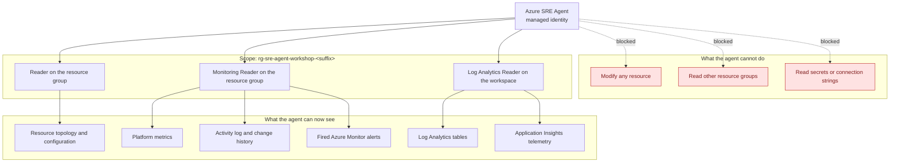

<ul class="sre-meta">
<li class="duration">Estimated time: 25 minutes</li>
<li>Module 05</li>
<li>Hands-on</li>
</ul>

## Deployment API contract and permission record

The automation targets the preview ARM resource `Microsoft.App/agents@2025-05-01-preview`.
Region availability is constrained; use the supported default `eastus2` and verify
current availability before choosing another region. This contract is based on
Microsoft's pinned first-party examples:
[apply-extras.sh](https://github.com/microsoft/sre-agent/blob/3fa8db85bd72b407eacc0d9f6de0f865c82afdf4/sreagent-templates/bicep/apply-extras.sh)
and [agent-core.bicep](https://github.com/microsoft/sre-agent/blob/3fa8db85bd72b407eacc0d9f6de0f865c82afdf4/sreagent-templates/bicep/agent-core.bicep).
These sources document the integration contract, not a successful live deployment
of this workshop.

| Configuration | API contract |
| --- | --- |
| Endpoint and authentication | Read ARM `properties.agentEndpoint`; acquire a token for audience `https://azuresre.dev`. |
| Incident filters | Use YAML `metadata.name` as the stable key in `PUT /api/v2/extendedAgent/incidentFilters/{name}`. Send `{name, type: "IncidentFilter", tags: [], properties: spec}`; the platform is selected by `spec.incidentPlatform: AzMonitor`. |
| Common prompts | `PUT /api/v2/extendedAgent/commonprompts/{name}` with `{name, type: "CommonPrompt", tags: [], properties: {prompt: "<Markdown>"}}`. |
| Knowledge | Resolve the local references in `agent/knowledge.yaml`; upload multipart field `files` to `POST /api/v1/AgentMemory/upload`. List with `GET /api/v1/AgentMemory/files` and delete with `DELETE /api/v1/AgentMemory/document/{name}`. Remove owned `workshop-*.md` filenames, including retired entries, before reuploading because duplicate-filename replacement semantics are uncertain. Trigger indexing and preserve files outside that reserved ownership namespace. |

| Principal | Required role and scope | Purpose |
| --- | --- | --- |
| Attendee/deployer | Subscription `Owner`, or `Contributor` plus `User Access Administrator` | Create the resource group and all deployment role assignments. |
| Attendee/configuration caller | `SRE Agent Administrator` at the agent resource, assigned by hooks | Synchronize version-controlled agent configuration. |
| Attendee/fault-helper caller | `Key Vault Secrets User` at the workshop vault, assigned by deployment | Retrieve fault authentication just in time. This grant does not apply to the SRE runtime. |
| SRE runtime managed identity | `Reader` and `Monitoring Reader` at the workshop resource group; `Log Analytics Reader` at the workspace | Read-only automated investigation. |

Deployment resolves the attendee identity through azd's built-in
`AZURE_PRINCIPAL_ID` and `AZURE_PRINCIPAL_TYPE` values, supported in azd 1.18 or
later. There are no custom deployer identity variables to populate. Required
parameters are initialized before the pre-provision hook, so that hook does not
attempt to supply them afterward. It compares the Azure CLI and azd ARM token
`oid` and `tid` claims in memory and refuses mismatched logins without printing
or persisting either token.

The workshop does **not** grant the runtime subscription-wide `Monitoring Contributor`.
Full Azure Monitor alert lifecycle integration requires that broader permission;
do not expect the agent to acknowledge or close alerts. Configuration access for
the attendee is distinct from the runtime identity's read-only access.

The preview resource uses `accessLevel: Low` and action mode `Review`, not
invented `Reader` or `ReadOnly` API enum values. Scoped Azure RBAC grants enforce
the runtime's read-only boundary for both its operational user-assigned and
system-assigned identities.

## Overview

`azd up` has provisioned Azure SRE Agent and its permissions, then synchronized
`agent/incident-filters.yaml` and `agent/knowledge.yaml` after SQL initialization.
This module verifies that configuration and the read-only investigation boundary.
There are no portal setup steps or manual role grants.

Getting the scope right matters more than getting it working. An agent with subscription-wide Contributor will produce excellent demos and terrible audit reviews.

## Learning objectives

* Verify the provisioned Azure SRE Agent and its workshop resource group scope.
* Inspect the agent identity's least-privilege access to resources and telemetry.
* Verify the agent can enumerate resources and query the workspace.
* Establish the read-only operating posture used for the rest of the workshop.
* Run a first conversational query to confirm the agent understands the topology.

## Architecture context

The agent's view of your system is exactly the intersection of what it is scoped to and what it has permission to read.



## Tasks

### Task 1: Inspect the provisioned agent

```bash
source .workshop/workshop.env

az resource show \
  --resource-group "${RESOURCE_GROUP}" \
  --name "${SRE_AGENT_NAME}" \
  --resource-type Microsoft.App/agents \
  --api-version 2025-05-01-preview \
  --query "{Name:name, State:properties.provisioningState, Endpoint:properties.agentEndpoint}" \
  --output table
```

PowerShell users load `. ./.workshop/workshop.ps1` and use `$env:VARIABLE_NAME`
for the same exported identifiers. If the resource or outputs are missing, finish
`azd up`; do not create a separate agent in the portal.

### Task 2: Review the deployed role assignments

```bash
az role assignment list \
  --assignee "${SRE_AGENT_PRINCIPAL_ID}" \
  --all \
  --query "[].{Role:roleDefinitionName, Scope:scope}" \
  --output table
```

!!! danger "Roles this workshop deliberately does not grant"
    The SRE runtime has no `Contributor`, `Owner`, `Key Vault Secrets User`, or subscription-wide `Monitoring Contributor` grant. It can investigate resources and telemetry but cannot retrieve fault secrets, perform remediation, or acknowledge/close Azure Monitor alerts. Do not confuse the attendee's agent-scoped administration role with runtime privileges.

### Task 3: Review version-controlled configuration

Read `agent/incident-filters.yaml` and `agent/knowledge.yaml`. Incident filters
select Azure Monitor incidents using `incidentPlatform: AzMonitor`; the knowledge manifest
references checked-in Markdown instructions and runbooks. Both are applied by
`azd up`, rather than entered in a portal blade.

Both manifests declare `version: 1`. The incident manifest has a `filters` list
of `{metadata: {name}, spec}` entries. Workshop filters use `agentMode: Review`,
`handlingAgent: default`, and priorities `Sev1` and `Sev2`. The knowledge manifest
has `instructions` and `documents` lists of `{name, source}` entries; `source`
paths are relative to `agent/`. All managed names use the `workshop-` prefix.
Reserve `workshop-*.md` for this deployment's knowledge documents.

For an optional configuration-only refresh after editing those files:

```bash
python scripts/workshop.py configure-agent
```

The command uses the selected environment and your Azure CLI login. It updates
named incident filters and common prompts, then verifies their exact configured
field values through read-back. It deletes all owned `workshop-*.md` knowledge
documents, including retired entries, uploads the desired files, and triggers
indexing. Files outside that namespace are preserved.

Knowledge verification polls `/api/v1/AgentMemory/files` for `isIndexed` or
`indexStatus` for up to ten minutes. Uploaded source bytes are not remotely
downloadable through this contract, so indexing verification is not a remote
byte-for-byte content comparison. Wait for indexing before judging new answers.

!!! important "Retire incident filters explicitly"
    A stale `workshop-` incident filter that is absent from YAML causes synchronization to fail closed. Keep its entry in `agent/incident-filters.yaml` with `spec.isEnabled: false` instead of removing it. The hook does not guess an undocumented v2 DELETE route.

### Task 4: Ask the agent to describe your environment

Open the agent's chat experience in the portal and enter this prompt.

```text
Describe the workload deployed in this resource group. List every service, how they
depend on each other, which one is publicly reachable, and what data store is in use.
Identify any single points of failure you can infer from the configuration.
```

Read the answer carefully against what you learned in [Module 02](../02-solution-architecture/index.md). You are checking three things: is it complete, is it correct, and does it notice anything you did not.

Then ask a baseline question.

```text
Over the last 30 minutes, what is the request volume, success rate, and P95 latency
for each service in this resource group? Is anything currently degraded?
```

Compare the answer against the baseline you recorded in Module 04.

!!! tip "Save the agent's first answer"
    Paste both responses into `.workshop/notes/agent-baseline.md`. In Module 12 you rewrite the agent's instructions and re-ask these exact prompts. Having the original answer is the only way to prove the instructions actually helped.

## Validation

```bash
source .workshop/workshop.env

ROLES=$(az role assignment list --assignee "${SRE_AGENT_PRINCIPAL_ID}" --all --query "[].roleDefinitionName" --output tsv)

echo "${ROLES}" | grep -q "^Reader$"              && echo "PASS: Reader granted"              || echo "FAIL: Reader missing"
echo "${ROLES}" | grep -q "^Monitoring Reader$"   && echo "PASS: Monitoring Reader granted"   || echo "FAIL: Monitoring Reader missing"
echo "${ROLES}" | grep -q "^Log Analytics Reader$" && echo "PASS: Log Analytics Reader granted" || echo "FAIL: Log Analytics Reader missing"
echo "${ROLES}" | grep -qE "^(Owner|Contributor)$" && echo "FAIL: over-privileged role assigned" || echo "PASS: no write roles assigned"
```

Then confirm by conversation:

* [x] The agent correctly names `orders-api` and `catalog-api`.
* [x] The agent identifies `orders-api` as the externally reachable service.
* [x] The agent identifies Azure SQL Database as the data store.
* [x] The agent reports a healthy current state consistent with your Module 04 baseline.

## Expected results

Four `PASS` lines from the script. The agent describes a two-service application with an external front end, an internal dependency, and a SQL back end.

A capable answer also flags the single replica configuration as a single point of failure. If the agent misses that, note it. That gap is one of the things you fix with custom instructions in [Module 12](../12-agent-instructions/index.md).

If the agent reports that it cannot see any resources, role assignment propagation is the usual cause. Wait five minutes and retry before changing anything.

## Knowledge check

??? question "Why grant Log Analytics Reader at the workspace scope instead of including it in the resource group grant?"
    Scoping to the workspace resource makes the grant explicit and independently revocable. If you later move the workspace to a shared monitoring resource group, which is common in production, the assignment follows the workspace rather than silently breaking or silently widening. Explicit scope also makes access reviews readable: someone can see exactly which workspace the agent queries.

??? question "Can the SRE runtime retrieve the fault secret or SQL administrator credentials?"
    No. It has no Key Vault data-plane secret permissions. SQL is Entra-only: a separate bootstrap managed identity performs initialization, and the Orders managed identity receives narrow runtime grants. There are no SQL administrator passwords to retrieve.

??? question "Your security team asks what happens if someone prompts the agent to delete a resource. What is your answer?"
    In this configuration the action fails at the Azure Resource Manager authorization layer, because the identity holds no write permissions on any resource. The attempt is recorded in the Activity log with the agent identity as the caller. Prompt-level guardrails are useful defense in depth, but the permission boundary is the control you rely on, because it is enforced outside the model.

## Next steps

Everything is deployed, monitored, and observed. Time to break it.

[Next: Module 06 - Generate High CPU Incident :material-arrow-right:](../06-incident-high-cpu/index.md){ .md-button .md-button--primary }

<div class="sre-nav" markdown>
[:material-arrow-left: Module 04 - Enable Native Azure Monitoring](../04-enable-monitoring/index.md)
[Module 06 - Generate High CPU Incident :material-arrow-right:](../06-incident-high-cpu/index.md)
</div>
