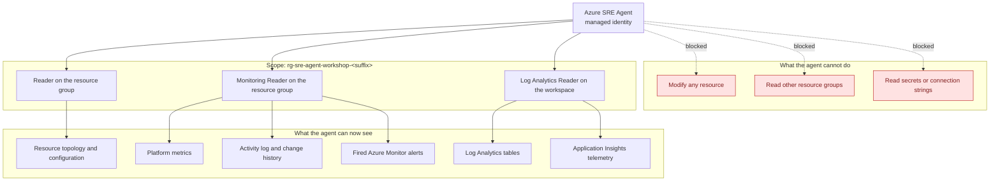

<ul class="sre-meta">
<li class="duration">Estimated time: 25 minutes</li>
<li>Module 05</li>
<li>Hands-on</li>
</ul>

## Overview

You now have a running workload and a detection layer. This module connects Azure SRE Agent to both, using the narrowest permission set that still lets it do useful work.

Getting the scope right matters more than getting it working. An agent with subscription-wide Contributor will produce excellent demos and terrible audit reviews.

## Learning objectives

* Create an Azure SRE Agent and attach it to the workshop resource group.
* Grant the agent identity least-privilege access to resources and telemetry.
* Verify the agent can enumerate resources and query the workspace.
* Establish the read-only operating posture used for the rest of the workshop.
* Run a first conversational query to confirm the agent understands the topology.

## Architecture context

The agent's view of your system is exactly the intersection of what it is scoped to and what it has permission to read.



## Tasks

### Task 1: Create the Azure SRE Agent

Azure SRE Agent is created through the Azure portal.

1. Sign in to the [Azure portal](https://portal.azure.com).
2. Search for **SRE Agent** and select **Azure SRE Agent**.
3. Select **Create**.
4. On the **Basics** tab, provide:
   * Subscription: the subscription you recorded in Module 01.
   * Resource group: your workshop resource group, `rg-sre-agent-workshop-<suffix>`.
   * Name: `sre-agent-workshop`.
   * Region: the same region as your workload.
5. On the **Resources** tab, set the management scope to the workshop resource group. Do not select the subscription.
6. On the **Permissions** tab, choose the read-only or diagnostics-only posture. Do not enable autonomous actions.
7. Review and create.

<!-- SCREENSHOT: Azure SRE Agent creation blade with resource group scope selected -->

!!! important "Scope to the resource group, every time"
    Selecting the subscription is one extra click and permanently widens the blast radius of every prompt anyone types for the lifetime of the agent. Resource group scope is the correct default for a pilot, and it is what the rest of this workshop assumes.

!!! note "If Azure SRE Agent is unavailable in your region or subscription"
    The capability is rolling out progressively. Check the [Azure SRE Agent documentation](https://learn.microsoft.com/azure/sre-agent/) for current availability. You can still complete Modules 06 through 11 by performing the investigations manually with the KQL queries each module provides, and the analytical content of those modules is unchanged.

### Task 2: Capture the agent identity

```bash
source .workshop/workshop.env

export SRE_AGENT_NAME="sre-agent-workshop"

# Locate the managed identity that the agent runs as.
export SRE_AGENT_PRINCIPAL_ID="$(az resource list \
  --resource-group "${RESOURCE_GROUP}" \
  --name "${SRE_AGENT_NAME}" \
  --query "[0].identity.principalId" \
  --output tsv)"

cat >> .workshop/workshop.env <<EOF
export SRE_AGENT_NAME="${SRE_AGENT_NAME}"
export SRE_AGENT_PRINCIPAL_ID="${SRE_AGENT_PRINCIPAL_ID}"
EOF

echo "Agent principal: ${SRE_AGENT_PRINCIPAL_ID}"
```

If the value is empty, open the agent resource in the portal, select **Identity**, and copy the object ID from there.

### Task 3: Grant least-privilege access

The agent needs to read resources, read metrics and alerts, and query the workspace. Nothing else.

```bash
source .workshop/workshop.env

RG_SCOPE="/subscriptions/${SUBSCRIPTION_ID}/resourceGroups/${RESOURCE_GROUP}"

az role assignment create \
  --assignee-object-id "${SRE_AGENT_PRINCIPAL_ID}" \
  --assignee-principal-type ServicePrincipal \
  --role "Reader" \
  --scope "${RG_SCOPE}" \
  --output none

az role assignment create \
  --assignee-object-id "${SRE_AGENT_PRINCIPAL_ID}" \
  --assignee-principal-type ServicePrincipal \
  --role "Monitoring Reader" \
  --scope "${RG_SCOPE}" \
  --output none

az role assignment create \
  --assignee-object-id "${SRE_AGENT_PRINCIPAL_ID}" \
  --assignee-principal-type ServicePrincipal \
  --role "Log Analytics Reader" \
  --scope "${LOG_ANALYTICS_ID}" \
  --output none

echo "Role assignments created."
```

Review what you granted.

```bash
az role assignment list \
  --assignee "${SRE_AGENT_PRINCIPAL_ID}" \
  --all \
  --query "[].{Role:roleDefinitionName, Scope:scope}" \
  --output table
```

!!! danger "Roles this workshop deliberately does not grant"
    `Contributor`, `Owner`, `Key Vault Secrets User`, and `Azure Service Bus Data Owner` are all absent. The agent can read that a connection string secret exists on a container app; it cannot read the value. When you later widen permissions in your own environment, add one role at a time and write down why.

### Task 4: Configure the operating posture

In the agent resource, open **Settings** and confirm:

* Operating mode is read-only or diagnostics-only. Autonomous actions are off.
* Alert sources include the action group `ag-sre-workshop` created in Module 04.
* Notification target is set so investigation summaries reach you.

<!-- SCREENSHOT: SRE Agent settings pane showing read-only mode and connected alert sources -->

### Task 5: Ask the agent to describe your environment

Open the agent's chat experience in the portal and enter this prompt.

```text
Describe the workload deployed in this resource group. List every service, how they
depend on each other, which one is publicly reachable, and what data store is in use.
Identify any single points of failure you can infer from the configuration.
```

Read the answer carefully against what you learned in [Module 02](../02-solution-architecture/index.md). You are checking three things: is it complete, is it correct, and does it notice anything you did not.

Then ask a baseline question.

```text
Over the last 30 minutes, what is the request volume, success rate, and P95 latency
for each service in this resource group? Is anything currently degraded?
```

Compare the answer against the baseline you recorded in Module 04.

!!! tip "Save the agent's first answer"
    Paste both responses into `.workshop/notes/agent-baseline.md`. In Module 12 you rewrite the agent's instructions and re-ask these exact prompts. Having the original answer is the only way to prove the instructions actually helped.

## Validation

```bash
source .workshop/workshop.env

ROLES=$(az role assignment list --assignee "${SRE_AGENT_PRINCIPAL_ID}" --all --query "[].roleDefinitionName" --output tsv)

echo "${ROLES}" | grep -q "^Reader$"              && echo "PASS: Reader granted"              || echo "FAIL: Reader missing"
echo "${ROLES}" | grep -q "^Monitoring Reader$"   && echo "PASS: Monitoring Reader granted"   || echo "FAIL: Monitoring Reader missing"
echo "${ROLES}" | grep -q "^Log Analytics Reader$" && echo "PASS: Log Analytics Reader granted" || echo "FAIL: Log Analytics Reader missing"
echo "${ROLES}" | grep -qE "^(Owner|Contributor)$" && echo "FAIL: over-privileged role assigned" || echo "PASS: no write roles assigned"
```

Then confirm by conversation:

* [x] The agent correctly names `orders-api` and `catalog-api`.
* [x] The agent identifies `orders-api` as the externally reachable service.
* [x] The agent identifies Azure SQL Database as the data store.
* [x] The agent reports a healthy current state consistent with your Module 04 baseline.

## Expected results

Four `PASS` lines from the script. The agent describes a two-service application with an external front end, an internal dependency, and a SQL back end.

A capable answer also flags the single replica configuration as a single point of failure. If the agent misses that, note it. That gap is one of the things you fix with custom instructions in [Module 12](../12-agent-instructions/index.md).

If the agent reports that it cannot see any resources, role assignment propagation is the usual cause. Wait five minutes and retry before changing anything.

## Knowledge check

??? question "Why grant Log Analytics Reader at the workspace scope instead of including it in the resource group grant?"
    Scoping to the workspace resource makes the grant explicit and independently revocable. If you later move the workspace to a shared monitoring resource group, which is common in production, the assignment follows the workspace rather than silently breaking or silently widening. Explicit scope also makes access reviews readable: someone can see exactly which workspace the agent queries.

??? question "The agent can see that `orders-api` has a secret named `sql-connection-string`. Can it read the value, and why does that distinction matter?"
    It cannot. `Reader` grants visibility of resource configuration metadata, including the names of container app secrets, but retrieving values requires a separate list-secrets action that `Reader` does not include. The distinction matters because the agent can reason about the fact that a database connection is configured, which is all it needs for diagnosis, without ever holding a credential that could be leaked through a chat transcript.

??? question "Your security team asks what happens if someone prompts the agent to delete a resource. What is your answer?"
    In this configuration the action fails at the Azure Resource Manager authorization layer, because the identity holds no write permissions on any resource. The attempt is recorded in the Activity log with the agent identity as the caller. Prompt-level guardrails are useful defense in depth, but the permission boundary is the control you rely on, because it is enforced outside the model.

## Next steps

Everything is deployed, monitored, and observed. Time to break it.

[Next: Module 06 - Generate High CPU Incident :material-arrow-right:](../06-incident-high-cpu/index.md){ .md-button .md-button--primary }

<div class="sre-nav" markdown>
[:material-arrow-left: Module 04 - Enable Native Azure Monitoring](../04-enable-monitoring/index.md)
[Module 06 - Generate High CPU Incident :material-arrow-right:](../06-incident-high-cpu/index.md)
</div>
