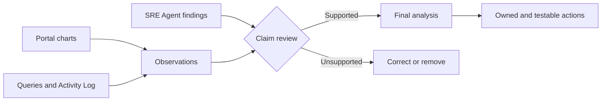

<ul class="sre-meta">
<li class="duration">Estimated time: 40 minutes</li>
<li>Module 05</li>
<li>Hands-on</li>
</ul>

## Overview

The two incidents produced different shapes:

* CPU pressure created a resource-saturation signal with possible request
  latency or timeouts.
* Data-disk pressure created a leading capacity signal that should be handled
  before requests fail.

This module compares the portal charts, alert history, SRE Agent findings, and
raw telemetry. You will correct unsupported claims, write a concise two-incident
analysis, and define improvements that are owned and testable.

## Learning objectives

* Compare incident windows visually instead of relying on memory.
* Separate observation, inference, cause, mitigation, and remediation.
* Critique SRE Agent claims against specific evidence.
* Measure detection and recovery times.
* Convert response gaps into alerting, telemetry, and workflow improvements.

## Evidence model



## Tasks

### Task 1: Confirm the environment is healthy now

=== "Bash"

    ```bash
    source .workshop/workshop.env
    python scripts/workshop.py fault reset
    python scripts/workshop.py smoke
    python scripts/workshop.py inspect
    ```

=== "PowerShell"

    ```powershell
    . ./.workshop/workshop.ps1
    python scripts/workshop.py fault reset
    python scripts/workshop.py smoke
    python scripts/workshop.py inspect
    ```

Generate a short healthy segment:

=== "Bash"

    ```bash
    for i in $(seq 1 60); do
      curl --silent --fail "${SERVICE_ORDERS_API_ENDPOINT_URL}/orders" > /dev/null
      sleep 1
    done
    ```

=== "PowerShell"

    ```powershell
    1..60 | ForEach-Object {
      Invoke-RestMethod "$env:SERVICE_ORDERS_API_ENDPOINT_URL/orders" |
        Out-Null
      Start-Sleep -Seconds 1
    }
    ```

Open the VM's **Monitoring** > **Metrics** blade, select **Percentage CPU**, and
set the time range wide enough to show the Module 03 spike and the current
healthy segment. Record the contrast between incident and recovery.

<!-- SCREENSHOT: VM Percentage CPU chart showing the incident spike and healthy recovered traffic -->

### Task 2: Rebuild the two visual timelines

Use portal time ranges that include both incidents.

For CPU:

1. Open the VM **Percentage CPU** chart.
2. Note baseline, first threshold breach, maximum, mitigation, and recovery.
3. Open Application Insights **Performance** for the same range and compare
   request duration.

For disk:

1. Open Log Analytics **Logs**.
2. Run the `/var/lib/orders` free-space timechart from Module 04.
3. Note baseline, first value below 15 percent, minimum, reset, and recovery.
4. Open Application Insights **Failures** and determine whether customer errors
   occurred in the same interval.

For alert handling:

1. Open **Monitor** > **Alerts**.
2. Include resolved alerts in the filter.
3. Compare alert start and resolution times with your visual timelines.
4. Open the corresponding SRE Agent investigations.

Do not compare charts with different time zones or time ranges. Use UTC in the
written timeline.

### Task 3: Ask the agent for a two-incident review

In SRE Agent, ask:

```text
Produce an evidence-backed review of the high-CPU and data-disk alerts for this
resource group.

For each event:
- Separate degradation start, alert start, mitigation, recovery, and alert resolution.
- Quantify customer impact by operation and do not infer failures from a capacity
  threshold alone.
- Identify the triggering control-plane event and the affected resource.
- Distinguish immediate mitigation from durable remediation.
- Cite the Azure metric, Application Insights table, Log Analytics query, or
  Activity Log event supporting every material claim.

Then identify common response gaps and rank three improvements by risk reduced
relative to effort.
```

Save the response verbatim to `.workshop/notes/agent-review.md`.

### Task 4: Grade every material claim

Use this rubric:

| Check | Question |
| --- | --- |
| Time | Does the claim use the first telemetry deviation or merely the alert time? |
| Scope | Does it name the correct VM, filesystem, and API operations? |
| Impact | Is customer impact measured, not inferred from infrastructure state? |
| Trigger | Is there a correlated Run Command operation or only temporal coincidence? |
| Exclusion | Were CPU, storage, API, and SQLite alternatives checked where relevant? |
| Recovery | Does the evidence show the signal returned to baseline? |
| Action | Does the recommendation name an owner and a verification method? |

Mark each claim **supported**, **partially supported**, or **unsupported**.
Challenge at least one weak claim by pasting the contradictory metric or query
result back into the investigation and asking the agent to revise it.

### Task 5: Verify the cross-incident telemetry

View request behavior across the full period:

=== "Bash"

    ```bash
    az monitor log-analytics query \
      --workspace "${LOG_ANALYTICS_CUSTOMER_ID}" \
      --analytics-query "
    AppRequests
    | where TimeGenerated > ago(6h)
    | where AppRoleName == 'orders-api'
    | summarize
        Requests = sum(ItemCount),
        Failures = sumif(ItemCount, Success == false),
        P95Ms = round(percentile(DurationMs, 95), 1)
      by Name, bin(TimeGenerated, 5m)
    | order by TimeGenerated asc, Name asc
    " \
      --output table
    ```

=== "PowerShell"

    ```powershell
    $query = @'
    AppRequests
    | where TimeGenerated > ago(6h)
    | where AppRoleName == 'orders-api'
    | summarize
        Requests = sum(ItemCount),
        Failures = sumif(ItemCount, Success == false),
        P95Ms = round(percentile(DurationMs, 95), 1)
      by Name, bin(TimeGenerated, 5m)
    | order by TimeGenerated asc, Name asc
    '@

    az monitor log-analytics query `
      --workspace $env:LOG_ANALYTICS_CUSTOMER_ID `
      --analytics-query $query `
      --output table
    ```

Check whether SQLite actually failed:

=== "Bash"

    ```bash
    az monitor log-analytics query \
      --workspace "${LOG_ANALYTICS_CUSTOMER_ID}" \
      --analytics-query "
    union AppExceptions, AppDependencies
    | where TimeGenerated > ago(6h)
    | where AppRoleName == 'orders-api'
    | where (DependencyType == 'SQLite' and Success == false) or Type == 'AppExceptions'
    | project TimeGenerated, Type, DependencyType, Name, Success, ResultCode, ProblemId, OuterMessage
    | order by TimeGenerated asc
    " \
      --output table
    ```

=== "PowerShell"

    ```powershell
    $query = @'
    union AppExceptions, AppDependencies
    | where TimeGenerated > ago(6h)
    | where AppRoleName == 'orders-api'
    | where (DependencyType == 'SQLite' and Success == false) or Type == 'AppExceptions'
    | project TimeGenerated, Type, DependencyType, Name, Success, ResultCode, ProblemId, OuterMessage
    | order by TimeGenerated asc
    '@

    az monitor log-analytics query `
      --workspace $env:LOG_ANALYTICS_CUSTOMER_ID `
      --analytics-query $query `
      --output table
    ```

An empty exception result during the disk exercise supports the conclusion that
the alert was preventative. It is not missing evidence that should be filled in
with a guess.

### Task 6: Write the final review

Create `.workshop/notes/final-review.md` with this structure:

```markdown
# Workshop incident review

## Executive summary

## Incident 1: VM CPU saturation

| Event | UTC time | Evidence |
| --- | --- | --- |
| Fault requested | | |
| Degradation began | | |
| Alert fired | | |
| Mitigation | | |
| Recovery | | |

Impact:

Trigger:

Contributing factors:

Mitigation:

Durable remediation:

## Incident 2: SQLite data-disk pressure

| Event | UTC time | Evidence |
| --- | --- | --- |
| Fault requested | | |
| Free space crossed 15 percent | | |
| Alert fired | | |
| Mitigation | | |
| Recovery | | |

Observed customer impact:

Risk if left unresolved:

Trigger:

Mitigation:

Durable remediation:

## Agent assessment

What it got right:

What required correction:

Unsupported claims removed:

## Improvements

| Priority | Improvement | Owner role | Verification |
| --- | --- | --- | --- |
| P1 | | | |
| P1 | | | |
| P2 | | | |
```

The final version should be shorter than the agent draft and contain more direct
evidence references.

### Task 7: Improve the response design

Choose at least one improvement from each category:

| Category | Example improvement |
| --- | --- |
| Visualization | Pin the CPU, request-duration, and disk-free-space charts to an operator dashboard with one UTC time picker. |
| Detection | Tune thresholds only after measuring a longer baseline; keep capacity alerts ahead of customer failure. |
| Telemetry | Add an external availability test and business-level order-submission SLI. |
| Investigation | Require control-plane change correlation and explicit observed-versus-inferred labels. |
| Response plan | Use narrower service or alert-title filters when a production estate has multiple owning teams. |
| Remediation | Add capacity forecasting and a tested VM/application recovery procedure. |

Do not change the deployed response plan merely to finish the exercise. Record
the proposed change, its risk, and how you would test it before production use.

## Validation

* [x] You viewed the recovered CPU line alongside the incident spike.
* [x] You compared CPU, disk, request, and alert timelines in the portal.
* [x] Every material agent claim was graded.
* [x] At least one weak claim was challenged and revised or removed.
* [x] The final review distinguishes observed impact from future risk.
* [x] Improvements have owners and verification methods.

## Knowledge check

??? question "Why is a well-formatted agent report not sufficient evidence?"
    Formatting demonstrates presentation quality, not factual support. A defensible report links each material claim to a metric, query, configuration, or control-plane event and states where evidence is incomplete.

??? question "Why should the disk event not automatically be called an outage?"
    The workshop alert fires on a leading capacity threshold. If API requests, SQLite dependencies, and availability remain successful, the event is an incident requiring action but has no demonstrated customer outage.

??? question "What is the most useful improvement to carry into a real service?"
    A shared visual timeline that joins resource saturation, customer operations, alerts, and changes. It reduces context switching and makes unsupported causal stories easier to detect, regardless of whether the investigator is human or automated.

## Next steps

[Next: Module 06 - Preserve Evidence and Clean Up :material-arrow-right:](../06-cleanup/index.md){ .md-button .md-button--primary }

<div class="sre-nav" markdown>
[:material-arrow-left: Module 04 - Respond to Data-Disk Pressure](../04-incident-data-disk/index.md)
[Module 06 - Preserve Evidence and Clean Up :material-arrow-right:](../06-cleanup/index.md)
</div>
