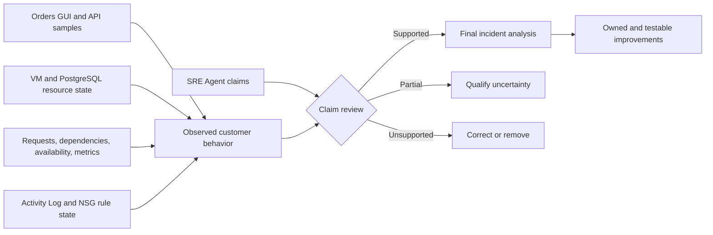

<ul class="sre-meta">
<li class="duration">Estimated time: 40 minutes</li>
<li>Module 05</li>
<li>Hands-on</li>
</ul>

## Overview

The two incidents affected different layers:

* CPU pressure saturated application compute and could increase latency or
  produce timeouts.
* The PostgreSQL fault denied only new TCP 5432 connections from the Orders
  subnet, leaving the process and database resource running while
  database-backed routes returned HTTP 503.

This module aligns customer observations, resource state, dependency telemetry,
alerts, Activity Log, and SRE Agent findings on one UTC timeline. You will
remove unsupported claims and turn response gaps into specific, owned, testable
improvements.

## Learning objectives

* Compare incident and recovery windows using a consistent UTC range.
* Separate observation, inference, cause, mitigation, and durable remediation.
* Verify SRE Agent statements against source telemetry and configuration.
* Measure detection, mitigation, recovery, and alert-resolution delay.
* Distinguish a resource saturation incident from a scoped dependency outage.
* Propose improvements with an owner and verification method.

## Evidence model


```mermaid
flowchart LR
    GUI[Orders GUI and API samples] --> O[Observed customer behavior]
    Resource[VM and PostgreSQL resource state] --> O
    Telemetry[Requests, dependencies, availability, metrics] --> O
    Change[Activity Log and NSG rule state] --> O
    Agent[SRE Agent claims] --> Review{Claim review}
    O --> Review
    Review -->|Supported| RCA[Final incident analysis]
    Review -->|Partial| Qualify[Qualify uncertainty]
    Review -->|Unsupported| Remove[Correct or remove]
    RCA --> Actions[Owned and testable improvements]
```

## Tasks

### Task 1: Restore and validate the normal state

Reset before collecting post-incident evidence:

=== "Bash"

    ```bash
    source .workshop/workshop.env
    python scripts/workshop.py fault reset
    python scripts/workshop.py fault status
    python scripts/workshop.py smoke
    python scripts/workshop.py inspect
    curl --silent --fail "${SERVICE_ORDERS_API_ENDPOINT_URL}/database" | jq .
    ```

=== "PowerShell"

    ```powershell
    . ./.workshop/workshop.ps1
    python scripts/workshop.py fault reset
    python scripts/workshop.py fault status
    python scripts/workshop.py smoke
    python scripts/workshop.py inspect
    Invoke-RestMethod "$env:SERVICE_ORDERS_API_ENDPOINT_URL/database"
    ```

Confirm CPU is inactive and PostgreSQL access is `Allow`. Open the Orders GUI,
select **Refresh orders** and **Refresh status**, and confirm liveness, readiness,
and PostgreSQL are healthy.

Generate a one-minute recovered segment:

=== "Bash"

    ```bash
    for i in $(seq 1 60); do
      curl --silent --fail "${SERVICE_ORDERS_API_ENDPOINT_URL}/orders" > /dev/null
      sleep 1
    done
    ```

=== "PowerShell"

    ```powershell
    1..60 | ForEach-Object {
      Invoke-RestMethod "$env:SERVICE_ORDERS_API_ENDPOINT_URL/orders" |
        Out-Null
      Start-Sleep -Seconds 1
    }
    ```

This recovered segment is evidence. It does not erase the earlier incident or
prove a durable production fix.

### Task 2: Rebuild both visual timelines

Use UTC and one time range that includes both incidents and the recovered
segment.

For the CPU incident:

1. Open the VM **Percentage CPU** metric with one-minute granularity.
2. Record baseline, first threshold breach, maximum, reset, and return to
   baseline.
3. Open Application Insights **Performance** for the same range.
4. Compare request success and duration with your Orders GUI or terminal notes.
5. Open `alert-orders-high-cpu`, including its resolution history.

For the PostgreSQL incident:

1. Open Log Analytics **Logs** and run:

    ```kusto
    AppDependencies
    | where TimeGenerated > ago(6h)
    | where AppRoleName == "orders-api"
    | where DependencyType == "PostgreSQL"
    | extend Samples = tolong(coalesce(ItemCount, 1))
    | summarize
        Total = sum(Samples),
        Failed = sumif(Samples, Success == false)
      by bin(TimeGenerated, 1m)
    | extend FailurePercent = 100.0 * todouble(Failed) / todouble(Total)
    | order by TimeGenerated asc
    | render timechart
    ```

2. Record the rule update, first failed dependency, first HTTP 503, alert start,
   reset, first recovered dependency, and alert resolution.
3. Compare `GET /health/live` with `GET /health/ready`, `GET /database`, and
   order operations.
4. Open `alert-orders-postgresql-connectivity` and any related HTTP 5xx alert.
5. Compare the application evidence with the PostgreSQL server state and
   `PostgreSqlFaultInjection` Activity Log entries.

Record the API-only recycle after the rule-change read-back. It drains stateful
pooled connections so the injector can verify controlled HTTP 503 responses
before reporting success; do not misclassify that deliberate recycle as the
root cause. Likewise, reset does not complete on an `Allow` read-back alone.
Use the first successful dependency and request after the verified recovery.

<!-- SCREENSHOT: One actual workshop timeline showing CPU, PostgreSQL dependency, and recovered request evidence -->

### Task 3: Ask for a two-incident review

In the SRE Agent experience, ask:

```text
Produce an evidence-backed review of the high-CPU and PostgreSQL-connectivity
alerts for this resource group.

For each event:
- Separate the control-plane change, first telemetry deviation, alert start,
  mitigation, measured recovery, and alert resolution.
- Quantify customer impact by API operation.
- Identify the affected resource and dependency boundary.
- Distinguish direct observations from inferences.
- Check the alternative cause represented by the other incident.
- Distinguish immediate mitigation from durable remediation.
- Cite the Azure metric, Application Insights table, Log Analytics query,
  resource configuration, or Activity Log event behind every material claim.

For the PostgreSQL event, verify that the server stayed running and private,
private DNS remained configured, and only the fixed outbound TCP 5432 rule
changed. Do not claim data loss without row-level evidence.

Rank three shared improvements by risk reduction relative to effort.
```

Save the response verbatim to `.workshop/notes/agent-review.md`.

### Task 4: Grade every material claim

Use this rubric:

| Check | Question |
| --- | --- |
| Time | Does the claim distinguish change, impact, alert, reset, recovery, and resolution? |
| Scope | Does it name the correct VM, PostgreSQL server, NSG rule, subnet path, and API operations? |
| Impact | Do measured requests support the stated customer impact? |
| Trigger | Is there a correlated Run Command or security-rule write? |
| Dependency | Does the PostgreSQL claim use `DependencyType == "PostgreSQL"` evidence? |
| Exclusion | Were process, CPU, DNS, server state, authentication, and unrelated network alternatives checked where relevant? |
| Data safety | Is a no-data-loss statement supported by the witness order rather than inferred from recovery? |
| Recovery | Do successful requests and dependencies occur after reset? |
| Action | Does the recommendation name an owner and a verification method? |

Mark each material claim **supported**, **partially supported**, or
**unsupported**. Paste at least one weak or contradictory source result back
into the investigation and ask for a revision.

Examples of claims to reject unless directly supported:

* "The database was down" when Azure reports it remained ready.
* "DNS failed" when the name continued to resolve to a private address.
* "Data was corrupted" when the witness order is unchanged.
* "The CPU fault caused the PostgreSQL alert" when the windows do not overlap.
* "Reset fixed the service" before successful recovery samples arrive.

### Task 5: Query cross-incident evidence

Compare request behavior:

=== "Bash"

    ```bash
    az monitor log-analytics query \
      --workspace "${LOG_ANALYTICS_CUSTOMER_ID}" \
      --analytics-query "
    AppRequests
    | where TimeGenerated > ago(6h)
    | where AppRoleName == 'orders-api'
    | extend Samples = tolong(coalesce(ItemCount, 1))
    | summarize
        Requests = sum(Samples),
        Failures = sumif(Samples, Success == false),
        P95Ms = round(percentile(DurationMs, 95), 1)
      by Name, ResultCode, bin(TimeGenerated, 5m)
    | order by TimeGenerated asc, Name asc
    " \
      --output table
    ```

=== "PowerShell"

    ```powershell
    $query = @'
    AppRequests
    | where TimeGenerated > ago(6h)
    | where AppRoleName == 'orders-api'
    | extend Samples = tolong(coalesce(ItemCount, 1))
    | summarize
        Requests = sum(Samples),
        Failures = sumif(Samples, Success == false),
        P95Ms = round(percentile(DurationMs, 95), 1)
      by Name, ResultCode, bin(TimeGenerated, 5m)
    | order by TimeGenerated asc, Name asc
    '@

    az monitor log-analytics query `
      --workspace $env:LOG_ANALYTICS_CUSTOMER_ID `
      --analytics-query $query `
      --output table
    ```

Compare PostgreSQL dependency and availability results:

=== "Bash"

    ```bash
    az monitor log-analytics query \
      --workspace "${LOG_ANALYTICS_CUSTOMER_ID}" \
      --analytics-query "
    union
      (AppDependencies
       | where AppRoleName == 'orders-api'
       | where DependencyType == 'PostgreSQL'
       | extend Samples = tolong(coalesce(ItemCount, 1))
       | summarize Samples=sum(Samples), Failures=sumif(Samples, Success == false)
         by Signal='PostgreSQL dependency', bin(TimeGenerated, 5m)),
      (AppAvailabilityResults
       | where AppRoleName == 'orders-api'
       | where Name == 'orders-api-postgresql'
       | extend Samples = tolong(coalesce(ItemCount, 1))
       | summarize Samples=sum(Samples), Failures=sumif(Samples, Success == false)
         by Signal='PostgreSQL availability', bin(TimeGenerated, 5m))
    | where TimeGenerated > ago(6h)
    | order by TimeGenerated asc
    " \
      --output table
    ```

=== "PowerShell"

    ```powershell
    $query = @'
    union
      (AppDependencies
       | where AppRoleName == 'orders-api'
       | where DependencyType == 'PostgreSQL'
       | extend Samples = tolong(coalesce(ItemCount, 1))
       | summarize Samples=sum(Samples), Failures=sumif(Samples, Success == false)
         by Signal='PostgreSQL dependency', bin(TimeGenerated, 5m)),
      (AppAvailabilityResults
       | where AppRoleName == 'orders-api'
       | where Name == 'orders-api-postgresql'
       | extend Samples = tolong(coalesce(ItemCount, 1))
       | summarize Samples=sum(Samples), Failures=sumif(Samples, Success == false)
         by Signal='PostgreSQL availability', bin(TimeGenerated, 5m))
    | where TimeGenerated > ago(6h)
    | order by TimeGenerated asc
    '@

    az monitor log-analytics query `
      --workspace $env:LOG_ANALYTICS_CUSTOMER_ID `
      --analytics-query $query `
      --output table
    ```

List both control-plane changes:

=== "Bash"

    ```bash
    az monitor activity-log list \
      --resource-group "${RESOURCE_GROUP}" \
      --offset 6h \
      --query "[?contains(operationName.localizedValue, 'Run Command') || contains(resourceId, 'PostgreSqlFaultInjection')].{Time:eventTimestamp,Operation:operationName.localizedValue,Status:status.value,Caller:caller,Resource:resourceId}" \
      --output table
    ```

=== "PowerShell"

    ```powershell
    az monitor activity-log list `
      --resource-group $env:RESOURCE_GROUP `
      --offset 6h `
      --query "[?contains(operationName.localizedValue, 'Run Command') || contains(resourceId, 'PostgreSqlFaultInjection')].{Time:eventTimestamp,Operation:operationName.localizedValue,Status:status.value,Caller:caller,Resource:resourceId}" `
      --output table
    ```

An empty failure interval outside Module 04 is useful evidence. Do not fill
missing telemetry with an assumed narrative.

### Task 6: Write the final review

Create `.workshop/notes/final-review.md`:

```markdown
# Workshop incident review

## Executive summary

## Incident 1: VM CPU saturation

| Event | UTC time | Evidence |
| --- | --- | --- |
| Fault requested | | |
| CPU departed baseline | | |
| Customer degradation began | | |
| Alert fired | | |
| Reset | | |
| Measured recovery | | |
| Alert resolved | | |

Observed impact:

Trigger and causal evidence:

Alternative causes checked:

Immediate mitigation:

Durable remediation:

## Incident 2: PostgreSQL connectivity loss

| Event | UTC time | Evidence |
| --- | --- | --- |
| Rule changed to Deny | | |
| First failed dependency | | |
| First HTTP 503 | | |
| Alert fired | | |
| Rule restored to Allow | | |
| First successful dependency and request | | |
| Alert resolved | | |

Observed impact:

Trigger and causal evidence:

Server, DNS, identity, and data checks:

Alternative causes checked:

Immediate mitigation:

Durable remediation:

## Agent assessment

Supported claims:

Corrected or qualified claims:

Unsupported claims removed:

## Improvements

| Priority | Improvement | Owner role | Verification |
| --- | --- | --- | --- |
| P1 | | | |
| P1 | | | |
| P2 | | | |
```

The final review should be shorter than the raw agent response and contain more
direct evidence references.

### Task 7: Improve the response design

Choose at least one improvement from each relevant category:

| Category | Example improvement |
| --- | --- |
| Visualization | Place CPU, request duration, PostgreSQL dependency failures, and availability on one UTC dashboard. |
| Detection | Alert on failed PostgreSQL dependencies and separately measure customer-facing order success. |
| Telemetry | Add an external availability test and a business-level order-submission SLI. |
| Network diagnosis | Document a private DNS and TCP 5432 decision tree that does not require public access. |
| Investigation | Require exact control-plane change correlation and observed-versus-inferred labels. |
| Response plan | Narrow filters by owning service and alert title in a larger production estate. |
| Identity | Separate migration administration from least-privileged application runtime. |
| Resilience | Evaluate multiple API instances, PostgreSQL HA, connection retry policy, and regional recovery against service objectives and cost. |

Do not change the deployed response plan only to finish the exercise. Record the
proposed change, owner, risk, and validation approach.

## Validation

* [x] The environment was reset to CPU inactive and PostgreSQL `Allow` before
  recovered evidence was collected.
* [x] CPU, request, dependency, availability, alert, and control-plane timelines
  use the same UTC range.
* [x] Every material SRE Agent claim was graded.
* [x] At least one weak claim was challenged and revised or removed.
* [x] The review distinguishes a live process from dependency-backed readiness.
* [x] The PostgreSQL analysis proves rule scope and witness persistence without
  claiming the server stopped or data was lost.
* [x] Improvements have owners and verification methods.

## Knowledge check

??? question "Why is a well-formatted agent report not sufficient evidence?"
    Presentation quality does not establish factual support. A defensible report links each material claim to a metric, query, resource setting, API sample, or control-plane event and states where evidence is incomplete.

??? question "Why are reset and recovery different timestamps?"
    Reset records the intended mitigation. Azure rule propagation, connection retry, telemetry ingestion, and alert evaluation happen later. The first successful dependency and customer request establish measured recovery.

??? question "Why does an unchanged order matter if `/database` is healthy again?"
    Health proves current connectivity and schema availability. Reading the pre-incident witness proves that the controlled network fault and reset did not replace or remove that application data.

## Next steps

[Next: Module 06 - Preserve Evidence and Clean Up :material-arrow-right:](../06-cleanup/index.md){ .md-button .md-button--primary }

<div class="sre-nav" markdown>
[:material-arrow-left: Module 04 - Respond to PostgreSQL Connectivity Loss](../04-incident-postgresql/index.md)
[Module 06 - Preserve Evidence and Clean Up :material-arrow-right:](../06-cleanup/index.md)
</div>
