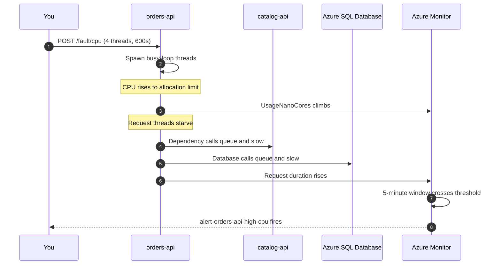

<ul class="sre-meta">
<li class="duration">Estimated time: 20 minutes</li>
<li>Module 06</li>
<li class="incident">Incident 1 of 3</li>
</ul>

## Overview

The first incident is the simplest one that still teaches something: a single service consumes all of its CPU allocation and everything downstream of it slows down. No cascade, no partial failure, one obvious culprit.

Start here because the investigation loop is the same for every incident. Learn it on the easy case, then apply it when the signals conflict.

## Learning objectives

* Trigger a bounded CPU saturation fault.
* Observe the effect on latency, throughput, and success rate in real time.
* Confirm Azure Monitor detects the condition and fires an alert.
* Record the incident timeline for the investigation in the next module.

## Architecture context

The fault runs inside the `orders-api` container. Nothing else in the system is touched, which is what makes the blast radius easy to reason about.



Note that `catalog-api` and the database remain perfectly healthy. Their latency as measured from `orders-api` will rise, but that is queueing on the caller, not slowness on the callee. Distinguishing those two is the core skill in Module 07.

## Tasks

### Task 1: Confirm the baseline is healthy

```bash
source .workshop/workshop.env

curl --silent --header "X-Fault-Token: ${FAULT_TOKEN}" \
  "https://${ORDERS_API_FQDN}/fault/status" | jq '{cpuLoadActive, errorInjectionActive, storagePhase}'
```

All three should show no active fault. Confirm your load generator from Module 04 is still running; if not, restart it.

### Task 2: Record the incident start time

Time is the primary key of an investigation. Write it down before you break anything.

```bash
export INCIDENT_1_START="$(date -u +%Y-%m-%dT%H:%M:%SZ)"
echo "Incident 1 start (UTC): ${INCIDENT_1_START}"

mkdir -p .workshop/notes
cat > .workshop/notes/incident-01-high-cpu.md <<EOF
# Incident 1: CPU saturation on orders-api

* Injected at (UTC): ${INCIDENT_1_START}
* Fault: 4 CPU-bound threads for 600 seconds
* Expected primary signal: saturation
* Expected secondary signal: latency

## Timeline

| Time (UTC) | Observation |
|------------|-------------|
|            |             |

## Agent findings

## Verification against raw telemetry
EOF
```

### Task 3: Inject the CPU fault

```bash
./scripts/inject-fault.sh cpu 600 4
```

Four busy-loop threads against a 0.5 vCPU allocation guarantees saturation. The fault stops automatically after 600 seconds, so there is no way to forget about it and burn credits overnight.

### Task 4: Watch the impact in real time

In a new terminal, poll the service and watch response times degrade.

```bash
source .workshop/workshop.env

for i in $(seq 1 40); do
  RESULT=$(curl --silent --output /dev/null --max-time 20 \
    --write-out '%{http_code} %{time_total}' \
    "https://${ORDERS_API_FQDN}/orders")
  printf '%s  attempt=%-3d status_and_seconds=%s\n' "$(date -u +%H:%M:%S)" "${i}" "${RESULT}"
  sleep 10
done
```

Watch your load generator terminal at the same time. The periodic summary line shows the success and error counts moving.

### Task 5: Confirm the metric is climbing

```bash
az monitor metrics list \
  --resource "/subscriptions/${SUBSCRIPTION_ID}/resourceGroups/${RESOURCE_GROUP}/providers/Microsoft.App/containerApps/orders-api" \
  --metric UsageNanoCores \
  --interval PT1M \
  --aggregation Average Maximum \
  --start-time "${INCIDENT_1_START}" \
  --output table
```

Platform metrics lag by one to three minutes. If the first run returns nothing, wait 90 seconds and repeat.

### Task 6: Wait for the alert to fire

The rule uses a 5-minute window evaluated every minute, so expect the alert five to eight minutes after injection.

```bash
watch -n 30 "az monitor activity-log alert list --resource-group ${RESOURCE_GROUP} --output table 2>/dev/null; \
  az graph query -q \"alertsmanagementresources | where resourceGroup =~ '${RESOURCE_GROUP}' | project name, properties.essentials.severity, properties.essentials.monitorCondition, properties.essentials.startDateTime\" --output table 2>/dev/null"
```

If the `az graph` extension is not installed, use the portal instead: **Monitor** > **Alerts**, filtered to your resource group.

<!-- SCREENSHOT: Azure Monitor alerts blade showing alert-orders-api-high-cpu in Fired state -->

### Task 7: Capture the incident evidence

```bash
az monitor log-analytics query \
  --workspace "${LOG_ANALYTICS_CUSTOMER_ID}" \
  --analytics-query "
AppRequests
| where TimeGenerated > ago(20m)
| where AppRoleName == 'orders-api'
| summarize
    Requests = count(),
    SuccessRate = round(100.0 * countif(Success == true) / count(), 2),
    P50Ms = round(percentile(DurationMs, 50), 1),
    P95Ms = round(percentile(DurationMs, 95), 1),
    P99Ms = round(percentile(DurationMs, 99), 1)
  by bin(TimeGenerated, 2m)
| order by TimeGenerated asc
" \
  --output table
```

Paste the result into `.workshop/notes/incident-01-high-cpu.md` under the timeline heading.

## Validation

* [x] `GET /fault/status` reports `cpuLoadActive: true` while the fault is running.
* [x] `UsageNanoCores` for `orders-api` exceeds 400,000,000.
* [x] P95 latency has risen substantially above your Module 04 baseline.
* [x] `alert-orders-api-high-cpu` reaches the `Fired` state.
* [x] You received the alert email from `ag-sre-workshop`.

```bash
source .workshop/workshop.env
curl --silent --header "X-Fault-Token: ${FAULT_TOKEN}" \
  "https://${ORDERS_API_FQDN}/fault/status" | jq '{cpuLoadActive, cpuLoadThreads, cpuLoadUntilUtc}'
```

## Expected results

Within two to three minutes of injection, `UsageNanoCores` approaches the 500,000,000 allocation ceiling and stays there. P95 latency for `orders-api` rises from roughly 200 milliseconds to several seconds. Success rate degrades but does not collapse, because requests are queued rather than rejected.

Within five to eight minutes, `alert-orders-api-high-cpu` fires at severity 2 and an email arrives.

Meanwhile, `catalog-api` CPU stays near baseline and no `catalog-api` alerts fire. That contrast is the single most useful piece of evidence in the next module.

!!! note "Requests may time out rather than fail"
    Depending on how heavily the load generator is pushing, you may see 5xx responses from ingress timeouts as well as slow 2xx responses. Both are consistent with saturation. What you should not see is a jump in `AppExceptions`, because nothing is throwing; the code is merely starved of CPU.

## Knowledge check

??? question "During the incident, dependency duration for the `catalog-api` call rises sharply. Does that mean `catalog-api` is slow?"
    No. The duration is measured by `orders-api` and includes the time the calling thread spent waiting to be scheduled. With four busy loops on half a vCPU, a call that takes 20 milliseconds on the wire can be recorded as several seconds. Confirm by checking `catalog-api` server-side request duration, which stays at baseline. Mistaking caller-side queueing for callee-side slowness sends teams to investigate the wrong service, which is exactly the trap Module 07 sets.

??? question "Why does the workshop cap the fault at 600 seconds instead of running until you stop it?"
    Bounded faults fail safe. If you close your laptop, lose network access, or simply forget, the system recovers on its own instead of burning CPU and generating alerts overnight. Any fault-injection mechanism that requires a human to turn it off will eventually be left on by a human.

??? question "The success rate degraded but never reached zero. What does that tell you about the failure mode?"
    It is a saturation failure, not a hard failure. The service is still functioning, just too slowly for some requests to complete within their timeout. Hard failures produce a sharp cliff in success rate; saturation produces a gradual slope that tracks the queue depth. The shape of the curve is diagnostic before you look at a single log line.

## Next steps

The incident is live. Now investigate it properly.

[Next: Module 07 - Investigate the High CPU Incident :material-arrow-right:](../07-investigate-high-cpu/index.md){ .md-button .md-button--primary }

<div class="sre-nav" markdown>
[:material-arrow-left: Module 05 - Configure Azure SRE Agent](../05-configure-sre-agent/index.md)
[Module 07 - Investigate the High CPU Incident :material-arrow-right:](../07-investigate-high-cpu/index.md)
</div>
