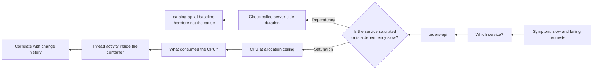

<ul class="sre-meta">
<li class="duration">Estimated time: 30 minutes</li>
<li>Module 07</li>
<li>Investigation 1 of 3</li>
</ul>

## Overview

You have a live incident and a fired alert. This module runs the investigation twice: once with Azure SRE Agent, once manually with KQL. Doing both is the point. You cannot judge whether an agent is trustworthy until you have independently reached the same conclusion at least a few times.

The manual path also gives you the queries. Keep them; they work on any Container Apps workload, not just this one.

## Learning objectives

* Structure an effective investigation prompt instead of typing "what is wrong".
* Verify each agent claim against a specific telemetry query.
* Distinguish caller-side queueing from callee-side slowness.
* Choose an appropriate mitigation and articulate why it is not a fix.
* Document a defensible incident timeline.

## Architecture context

The investigation walks the signal chain backwards, from customer symptom to originating resource.



## Tasks

### Task 1: Ask the agent to triage

Open the Azure SRE Agent chat and start with scope, not cause. A good first prompt establishes blast radius.

```text
An alert named alert-orders-api-high-cpu has fired in this resource group.
Triage it for me:
1. Which resources are affected and which are healthy?
2. When did the degradation actually start, as distinct from when the alert fired?
3. What is the customer-visible impact right now, expressed as success rate and P95 latency?
4. What severity would you assign and why?
Cite the specific metric or log query behind each answer.
```

Record the answer in your notes before you look at anything else. Anchoring on the agent's independent conclusion first makes it much easier to spot where it went wrong.

<!-- SCREENSHOT: SRE Agent chat response summarizing affected resources and impact -->

### Task 2: Ask the agent to investigate the cause

```text
Now determine the cause. Specifically:
1. Is orders-api slow because it is saturated, or because a downstream dependency is slow?
2. Distinguish between time spent waiting on the dependency and time spent waiting for CPU.
3. Compare orders-api and catalog-api resource utilization over the same window.
4. Did any deployment, revision change, or configuration change precede the degradation?
5. What is your leading hypothesis, and what evidence would disprove it?
```

The last question matters more than it looks. An answer that cannot describe its own disproof is a guess wearing a lab coat.

### Task 3: Verify the impact claim

Do not take the agent's numbers on faith. Run the query yourself.

```bash
source .workshop/workshop.env

az monitor log-analytics query \
  --workspace "${LOG_ANALYTICS_CUSTOMER_ID}" \
  --analytics-query "
AppRequests
| where TimeGenerated > ago(45m)
| where AppRoleName == 'orders-api'
| summarize
    Requests = count(),
    SuccessRate = round(100.0 * countif(Success == true) / count(), 2),
    P50Ms = round(percentile(DurationMs, 50), 1),
    P95Ms = round(percentile(DurationMs, 95), 1)
  by bin(TimeGenerated, 2m)
| order by TimeGenerated asc
" \
  --output table
```

Find the first bin where P95 deviates meaningfully from your Module 04 baseline. That is the real degradation start time. Compare it to the alert fire time; the gap is your detection latency.

### Task 4: Verify the saturation claim

```bash
az monitor metrics list \
  --resource "/subscriptions/${SUBSCRIPTION_ID}/resourceGroups/${RESOURCE_GROUP}/providers/Microsoft.App/containerApps/orders-api" \
  --metric UsageNanoCores WorkingSetBytes \
  --interval PT1M \
  --aggregation Average Maximum \
  --start-time "${INCIDENT_1_START}" \
  --output table
```

Compare against `catalog-api`.

```bash
az monitor metrics list \
  --resource "/subscriptions/${SUBSCRIPTION_ID}/resourceGroups/${RESOURCE_GROUP}/providers/Microsoft.App/containerApps/catalog-api" \
  --metric UsageNanoCores \
  --interval PT1M \
  --aggregation Average \
  --start-time "${INCIDENT_1_START}" \
  --output table
```

### Task 5: Prove the dependency is not the cause

This is the query that separates a real investigation from a plausible story. Compare the duration `orders-api` observed for its outbound call against the duration `catalog-api` recorded for the same operation.

```bash
az monitor log-analytics query \
  --workspace "${LOG_ANALYTICS_CUSTOMER_ID}" \
  --analytics-query "
let clientView =
    AppDependencies
    | where TimeGenerated > ago(45m)
    | where AppRoleName == 'orders-api' and Type == 'HTTP'
    | summarize ClientP95Ms = round(percentile(DurationMs, 95), 1), Calls = count() by bin(TimeGenerated, 5m);
let serverView =
    AppRequests
    | where TimeGenerated > ago(45m)
    | where AppRoleName == 'catalog-api'
    | summarize ServerP95Ms = round(percentile(DurationMs, 95), 1) by bin(TimeGenerated, 5m);
clientView
| join kind=inner serverView on TimeGenerated
| project TimeGenerated, Calls, ClientP95Ms, ServerP95Ms, QueueingMs = ClientP95Ms - ServerP95Ms
| order by TimeGenerated asc
" \
  --output table
```

The `QueueingMs` column is the time that exists only on the caller. If it grows while `ServerP95Ms` stays flat, the dependency is innocent and the caller is starved.

### Task 6: Check for a correlated change

```bash
az monitor activity-log list \
  --resource-group "${RESOURCE_GROUP}" \
  --start-time "$(date -u -d '2 hours ago' +%Y-%m-%dT%H:%M:%SZ 2>/dev/null || date -u -v-2H +%Y-%m-%dT%H:%M:%SZ)" \
  --query "[?contains(operationName.value, 'write') || contains(operationName.value, 'action')].{Time:eventTimestamp, Operation:operationName.localizedValue, Caller:caller, Status:status.value}" \
  --output table
```

```bash
az containerapp revision list \
  --name orders-api \
  --resource-group "${RESOURCE_GROUP}" \
  --query "[].{Revision:name, Created:properties.createdTime, Active:properties.active, Replicas:properties.replicas}" \
  --output table
```

You should find no deployment correlated with the degradation, because the fault came in over HTTP. Note that as a finding: an incident with no correlated change points at runtime behavior or an external trigger, not a release.

### Task 7: Search the container logs

```bash
az monitor log-analytics query \
  --workspace "${LOG_ANALYTICS_CUSTOMER_ID}" \
  --analytics-query "
ContainerAppConsoleLogs_CL
| where TimeGenerated > ago(45m)
| where ContainerAppName_s == 'orders-api'
| where Log_s contains 'FAULT INJECTED' or Log_s contains 'warn' or Log_s contains 'error'
| project TimeGenerated, Log_s
| order by TimeGenerated asc
| take 50
" \
  --output table
```

The `FAULT INJECTED: CPU load` line is your smoking gun. Note whether the agent found it on its own. If it did not, ask why:

```text
There is a log line in ContainerAppConsoleLogs_CL for orders-api containing the text
"FAULT INJECTED". Did you consider container console logs in your investigation?
If not, explain what would have led you to them.
```

### Task 8: Mitigate

Two reasonable mitigations exist. Discuss both before you act.

=== "Option A: Stop the offending workload"

    ```bash
    ./scripts/inject-fault.sh reset
    ./scripts/inject-fault.sh status
    ```

    This is the equivalent of terminating a runaway job in production. Fast, targeted, and it addresses the actual consumer of CPU.

=== "Option B: Add capacity"

    ```bash
    az containerapp update \
      --name orders-api \
      --resource-group "${RESOURCE_GROUP}" \
      --min-replicas 3 \
      --max-replicas 5 \
      --output none
    ```

    This is the equivalent of scaling out under load. It restores service without understanding the cause, which is sometimes the correct call at 3 a.m. Revert afterwards so later modules behave as documented.

    ```bash
    az containerapp update \
      --name orders-api \
      --resource-group "${RESOURCE_GROUP}" \
      --min-replicas 1 \
      --max-replicas 1 \
      --output none
    ```

Use Option A, then confirm recovery.

```bash
sleep 120
az monitor log-analytics query \
  --workspace "${LOG_ANALYTICS_CUSTOMER_ID}" \
  --analytics-query "
AppRequests
| where TimeGenerated > ago(10m)
| where AppRoleName == 'orders-api'
| summarize SuccessRate = round(100.0 * countif(Success == true) / count(), 2), P95Ms = round(percentile(DurationMs, 95), 1)
" \
  --output table
```

### Task 9: Ask the agent to write the timeline

```text
Write an incident timeline for this event. Include:
- Degradation start, alert fire time, mitigation time, and recovery time, all in UTC
- The customer-visible impact quantified
- The evidence that ruled out catalog-api and the database as causes
- The mitigation applied and whether it addressed the cause or only the symptom
- Two specific follow-up actions with a clear owner role for each
```

Paste the result into `.workshop/notes/incident-01-high-cpu.md` and edit it. Editing is not optional; it is how you find the parts that are subtly wrong.

## Validation

* [x] You identified the degradation start time independently of the alert time.
* [x] You produced a query proving `catalog-api` server-side latency stayed at baseline.
* [x] You found the `FAULT INJECTED` log line.
* [x] You confirmed no deployment correlated with the incident.
* [x] Success rate returned to baseline after mitigation.
* [x] Your timeline distinguishes mitigation from remediation.

## Expected results

Metrics show `UsageNanoCores` pinned near 500,000,000 for the duration of the fault, returning to under 100,000,000 within two minutes of the reset. `catalog-api` CPU never moves. The `QueueingMs` column climbs to seconds during the incident and returns to near zero afterwards.

A good agent response identifies `orders-api` as the affected resource, states that CPU is at its allocation ceiling, and explicitly rules out the dependency. A weaker response reports that "the catalog dependency is slow" because it read the client-side dependency duration without comparing it to the server-side view. Both outcomes are useful; the second is more instructive.

!!! tip "Grade the agent"
    Score its answer out of five: correct resource, correct start time, correct mechanism, correct exclusion of the dependency, correct mitigation. Write the score down. You repeat this exercise in Modules 09 and 11, and in Module 12 you try to raise the score with better instructions.

## Knowledge check

??? question "The agent reported the dependency call to catalog-api as the slowest operation. Is that wrong?"
    The measurement is correct and the conclusion drawn from it would be wrong. The dependency call genuinely took the longest wall-clock time as observed by `orders-api`, because the calling thread could not get scheduled. What makes it a misdiagnosis is attributing that duration to `catalog-api` without checking the server-side view. The corrective query is the client-versus-server comparison in Task 5, and it belongs in every dependency investigation you ever run.

??? question "You scaled `orders-api` to three replicas and service recovered. Has the incident been resolved?"
    Service is mitigated. The runaway CPU consumer is still running on the original replica, and you have merely diluted its effect across more capacity. If the load increases, or if the consumer appears on the new replicas too, the incident returns. Scaling out during an incident is a legitimate and often correct action, but it must be recorded as mitigation with a follow-up item, not as a resolution.

??? question "What would this investigation have looked like if `orders-api` had been configured with autoscaling from the start?"
    The saturation signal would have been much weaker, because the platform would have added replicas as concurrency rose, keeping per-replica CPU below the alert threshold. The symptom would have shifted from latency to cost and to a steadily climbing replica count. Detection would likely have come from a cost anomaly or a scale-limit alert rather than from a CPU alert, and the investigation would have started from "why are we running twelve replicas for normal traffic".

## Next steps

One incident down. The next one is harder, because the symptom appears on the wrong service.

[Next: Module 08 - Generate HTTP 500 Incident :material-arrow-right:](../08-incident-http-500/index.md){ .md-button .md-button--primary }

<div class="sre-nav" markdown>
[:material-arrow-left: Module 06 - Generate High CPU Incident](../06-incident-high-cpu/index.md)
[Module 08 - Generate HTTP 500 Incident :material-arrow-right:](../08-incident-http-500/index.md)
</div>
