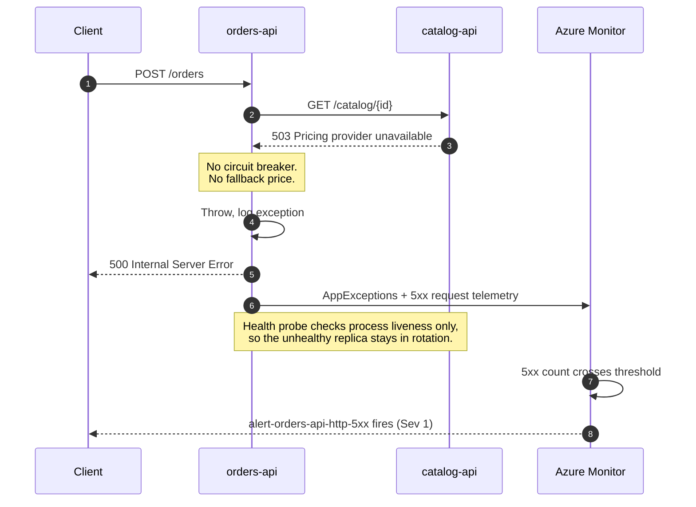

<ul class="sre-meta">
<li class="duration">Estimated time: 20 minutes</li>
<li>Module 08</li>
<li class="incident">Incident 2 of 3</li>
</ul>

## Overview

The second incident is where investigations start going wrong in real life. A dependency fails, the caller has no protection against that failure, and the customer-facing service starts returning HTTP 500 for something it did not do.

Everything you learned in Module 07 still applies. What changes is that the resource emitting the alert is no longer the resource that needs fixing.

## Learning objectives

* Trigger a dependency failure with a bounded time to live.
* Observe how a failure in an internal service becomes a customer-facing outage.
* Identify the architectural gaps that turned degradation into an outage.
* Record evidence that distinguishes the trigger from the contributing factors.

## Architecture context

The failure originates two hops away from the customer, and every hop in between amplifies it.



Three separate design decisions combine to produce this outcome:

* `orders-api` has no circuit breaker, so it keeps calling a failing dependency at full rate.
* There is no fallback behavior, such as serving a cached price or accepting the order for later pricing.
* The readiness probe checks only that the process is alive, so the platform never removes the replica from rotation.

Only the first of these is the trigger. All three are findings.

## Tasks

### Task 1: Confirm the system recovered from Incident 1

```bash
source .workshop/workshop.env

./scripts/inject-fault.sh status

az monitor log-analytics query \
  --workspace "${LOG_ANALYTICS_CUSTOMER_ID}" \
  --analytics-query "
AppRequests
| where TimeGenerated > ago(10m)
| where AppRoleName == 'orders-api'
| summarize SuccessRate = round(100.0 * countif(Success == true) / count(), 2), P95Ms = round(percentile(DurationMs, 95), 1)
" \
  --output table
```

Success rate should be back at or near 100 percent. If it is not, wait a few minutes; the previous fault's queue drains gradually.

Fault status is a snapshot from the private job, delivered through Log Analytics
after ingestion, not a live view at print time. Use the telemetry above to confirm
recovery. See [result timing and retry](../30-appendix/01-variables.md#fault-helper-results-and-retry).

!!! warning "Do not stack incidents"
    Injecting a second fault while the first is still active produces overlapping signals and an investigation nobody can untangle, including the agent. That is realistic, and it is also a terrible way to learn. Confirm recovery first.

### Task 2: Record the incident start time

Record helper invocation time, then refine the actual injection time using the
job execution and `FAULT INJECTED` logs.

```bash
export INCIDENT_2_START="$(date -u +%Y-%m-%dT%H:%M:%SZ)"
echo "Incident 2 start (UTC): ${INCIDENT_2_START}"

cat > .workshop/notes/incident-02-http-500.md <<EOF
# Incident 2: HTTP 500 cascade from catalog dependency

* Helper invoked at (UTC): ${INCIDENT_2_START}
* Fault: 100 percent catalog dependency failure for 900 seconds
* Expected primary signal: errors
* Expected secondary signal: latency from retries and timeouts

## Timeline

| Time (UTC) | Observation |
|------------|-------------|
|            |             |

## Trigger

## Contributing factors

## Agent findings

## Verification against raw telemetry
EOF
```

### Task 3: Inject the dependency failure

```bash
./scripts/inject-fault.sh errors 100 900
```

Once the private job invokes the route, every `catalog-api` lookup returns HTTP
503 for 900 seconds. That timer continues while the helper waits up to five
minutes for result ingestion. Start Task 4 in another terminal during the wait.
If result retrieval times out, use the reported request ID with
`python scripts/workshop.py fault-result <request-id>`; do not repeat the injection
to recover delayed logs.

!!! tip "Try a partial failure afterwards"
    A 100 percent failure rate is easy to detect. Once you have finished the module, re-run with `./scripts/inject-fault.sh errors 15 600` and observe how much harder a 15 percent failure rate is to see on a dashboard that shows averages. Partial failures are the ones that stay undiagnosed for days.

### Task 4: Observe the customer experience

```bash
source .workshop/workshop.env

for i in $(seq 1 20); do
  STATUS=$(curl --silent --output /dev/null --write-out '%{http_code}' --max-time 20 \
    --request POST "https://${ORDERS_API_FQDN}/orders" \
    --header 'Content-Type: application/json' \
    --data '{"customerId":"cust-042","productId":"SKU-1003","quantity":1}')
  printf '%s  attempt=%-3d status=%s\n' "$(date -u +%H:%M:%S)" "${i}" "${STATUS}"
  sleep 5
done
```

You should see a solid run of `500`. Note what you are looking at: a service that is running, healthy by its own health check, with plenty of CPU, returning errors on every request.

### Task 5: Confirm the read path still works

```bash
curl --silent --output /dev/null --write-out 'GET /orders -> HTTP %{http_code}\n' \
  "https://${ORDERS_API_FQDN}/orders"

curl --silent --output /dev/null --write-out 'GET /health/ready -> HTTP %{http_code}\n' \
  "https://${ORDERS_API_FQDN}/health/ready"
```

Both return 200. The read path does not touch `catalog-api`, and the readiness probe does not check dependencies. This is the moment to notice that a green health check means almost nothing here.

### Task 6: Watch the error telemetry accumulate

```bash
az monitor log-analytics query \
  --workspace "${LOG_ANALYTICS_CUSTOMER_ID}" \
  --analytics-query "
AppRequests
| where TimeGenerated > ago(20m)
| summarize
    Total = count(),
    Failed = countif(Success == false),
    FailureRate = round(100.0 * countif(Success == false) / count(), 1)
  by bin(TimeGenerated, 2m), AppRoleName
| order by TimeGenerated asc
" \
  --output table
```

```bash
az monitor log-analytics query \
  --workspace "${LOG_ANALYTICS_CUSTOMER_ID}" \
  --analytics-query "
AppExceptions
| where TimeGenerated > ago(20m)
| summarize Occurrences = count() by AppRoleName, ProblemId, OuterMessage
| order by Occurrences desc
| take 10
" \
  --output table
```

### Task 7: Wait for the alerts to fire

Two rules should fire for this incident: `alert-orders-api-http-5xx` at severity 1 and `alert-dependency-failure-rate` at severity 1. The exception spike rule may also fire.

Check in the portal under **Monitor** > **Alerts**, or:

```bash
az graph query -q "
alertsmanagementresources
| where resourceGroup =~ '${RESOURCE_GROUP}'
| project name = properties.essentials.alertRule,
          severity = properties.essentials.severity,
          state = properties.essentials.monitorCondition,
          started = properties.essentials.startDateTime
| order by started desc
" --output table 2>/dev/null || echo "Install the resource-graph extension or use the portal."
```

<!-- SCREENSHOT: Azure Monitor alerts showing both the 5xx metric alert and the dependency failure log alert -->

### Task 8: Record what the platform did not do

Check whether any replica was restarted or removed from rotation.

```bash
az monitor log-analytics query \
  --workspace "${LOG_ANALYTICS_CUSTOMER_ID}" \
  --analytics-query "
ContainerAppSystemLogs_CL
| where TimeGenerated > ago(30m)
| where ContainerAppName_s in ('orders-api', 'catalog-api')
| project TimeGenerated, ContainerAppName_s, Reason_s, Type_s, Log_s
| order by TimeGenerated desc
| take 30
" \
  --output table
```

Expect very little. The platform sees a healthy process passing a liveness check and takes no action while 100 percent of business requests fail. Write that down; it is a finding, not a footnote.

## Validation

* [x] `POST /orders` returns HTTP 500 consistently.
* [x] `GET /orders` and `GET /health/ready` still return HTTP 200.
* [x] `AppDependencies` shows a high failure ratio for `orders-api` calling `catalog-api`.
* [x] `AppExceptions` shows a repeating exception signature on `orders-api`.
* [x] `alert-orders-api-http-5xx` has fired at severity 1.
* [x] No replica restarts occurred.

```bash
source .workshop/workshop.env
az monitor log-analytics query \
  --workspace "${LOG_ANALYTICS_CUSTOMER_ID}" \
  --analytics-query "
AppDependencies
| where TimeGenerated > ago(15m)
| where AppRoleName == 'orders-api'
| summarize Calls = count(), Failures = countif(Success == false), FailureRate = round(100.0 * countif(Success == false) / count(), 1) by Target, Type
" \
  --output table
```

## Expected results

The write path fails completely while the read path is unaffected. Dependency failure rate for the `catalog-api` target sits at or near 100 percent. Exception telemetry on `orders-api` shows a repeated signature originating from the catalog lookup.

CPU on both services stays near baseline. That is important: this incident looks nothing like Incident 1 in the metric store, even though the customer sees a similar symptom of "orders are not working".

Severity here is higher than Incident 1. Order submission is completely unavailable, which is a Sev 1 by the classification in [Incident Response Concepts](../00-workshop-intro/2-incident-response-concepts.md), whereas the CPU incident was degraded but functional.

## Knowledge check

??? question "`orders-api` is healthy by every infrastructure measure yet returns 500 on every order. Which golden signal caught this, and which one would have missed it?"
    Errors caught it. Saturation would have missed it entirely, because CPU, memory, and replica count all stayed at baseline. Teams that monitor only infrastructure saturation discover this class of incident from customer complaints, which is the worst possible detection channel.

??? question "The readiness probe returns 200 throughout the incident. Should it?"
    Not for a service whose primary function depends on that dependency. A readiness probe that checks only process liveness will keep a replica serving traffic it cannot fulfill. The counter-argument is real: a readiness probe that fails on dependency errors can take down an entire fleet when the dependency has a transient blip, converting a partial failure into a total one. The defensible middle ground is a probe that reflects dependency health with hysteresis, combined with a circuit breaker and a degraded-mode response, so the service reports what it can still do rather than all or nothing.

??? question "If you only had the `orders-api` metric alert and no Application Insights dependency telemetry, how would this investigation change?"
    You would know that `orders-api` is returning 5xx but not why. You would move to container logs and read exception stack traces to find the failing call, which works but is slower and depends on the exception message being useful. Dependency telemetry turns "something in this service throws" into "the HTTP call to this specific target fails 100 percent of the time", which is the difference between minutes and an hour.

## Next steps

The customer-facing service is failing. Investigate it without accusing the wrong component.

[Next: Module 09 - Investigate the HTTP 500 Incident :material-arrow-right:](../09-investigate-http-500/index.md){ .md-button .md-button--primary }

<div class="sre-nav" markdown>
[:material-arrow-left: Module 07 - Investigate the High CPU Incident](../07-investigate-high-cpu/index.md)
[Module 09 - Investigate the HTTP 500 Incident :material-arrow-right:](../09-investigate-http-500/index.md)
</div>
