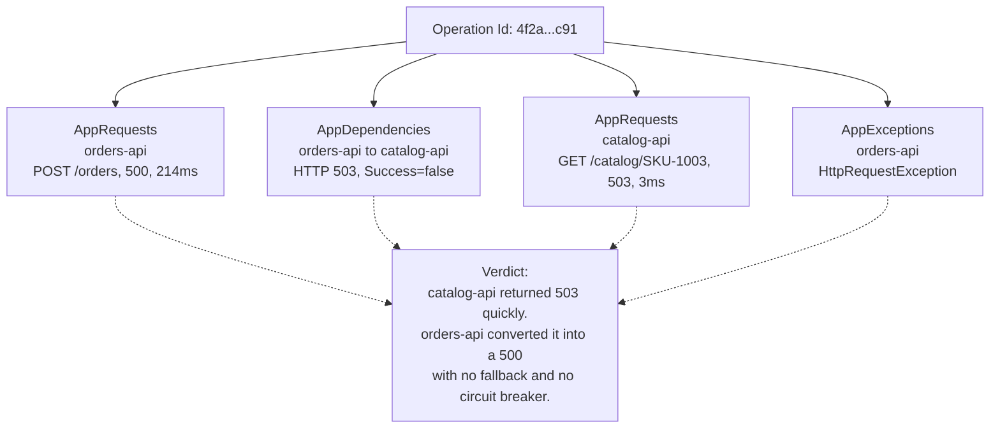

<ul class="sre-meta">
<li class="duration">Estimated time: 35 minutes</li>
<li>Module 09</li>
<li>Investigation 2 of 3</li>
</ul>

## Overview

The alert points at `orders-api`. The customer complains about `orders-api`. The fix is not in `orders-api`, and neither is it entirely in `catalog-api`.

This module walks the dependency chain with distributed traces, then separates the trigger from the architectural conditions that turned a dependency blip into a total write outage. That separation is the difference between an incident review that changes something and one that produces a Jira ticket nobody reads.

## Learning objectives

* Use distributed tracing to follow a single failed request across service boundaries.
* Query end-to-end operation telemetry rather than per-service aggregates.
* Distinguish the trigger from contributing factors with evidence for each.
* Evaluate an agent's causal reasoning rather than only its data retrieval.
* Apply a mitigation and articulate the remediation that should follow.

## Architecture context

A single failed operation produces correlated telemetry in four places. Following the correlation ID is faster than reading four dashboards.



Compare this to Module 07, where the dependency duration was high but the callee was fast. Here the callee is fast *and* failing. Same telemetry tables, opposite conclusion.

## Tasks

### Task 1: Ask the agent to trace the failure

```text
Alert alert-orders-api-http-5xx has fired at severity 1 in this resource group.
Investigate and answer precisely:
1. Which requests are failing, and which are succeeding? Segment by operation name.
2. Follow a single failed operation end to end across services. Show the correlation.
3. Where in the call chain does the failure originate?
4. Is the originating service unhealthy, or is it returning a deliberate error quickly?
5. What in the calling service's behavior converted this into a customer-facing outage?
Give me the query behind each answer.
```

Question 4 is the one that separates a shallow answer from a useful one. A slow dependency and a fast-failing dependency call for completely different responses.

<!-- SCREENSHOT: SRE Agent response showing the end-to-end trace across orders-api and catalog-api -->

### Task 2: Segment the failures yourself

```bash
source .workshop/workshop.env

az monitor log-analytics query \
  --workspace "${LOG_ANALYTICS_CUSTOMER_ID}" \
  --analytics-query "
AppRequests
| where TimeGenerated > ago(30m)
| where AppRoleName == 'orders-api'
| summarize
    Total = count(),
    Failed = countif(Success == false),
    FailureRate = round(100.0 * countif(Success == false) / count(), 1),
    P95Ms = round(percentile(DurationMs, 95), 1)
  by Name
| order by Failed desc
" \
  --output table
```

The write operation fails and the read operation does not. Averaging across both would have shown a misleading partial failure rate, which is why segmentation comes before aggregation.

### Task 3: Follow one operation end to end

Pick a failed operation and follow its correlation ID across every table.

```bash
export FAILED_OP_ID=$(az monitor log-analytics query \
  --workspace "${LOG_ANALYTICS_CUSTOMER_ID}" \
  --analytics-query "
AppRequests
| where TimeGenerated > ago(30m)
| where AppRoleName == 'orders-api' and Success == false
| top 1 by TimeGenerated desc
| project OperationId
" --output tsv | head -1)

echo "Tracing operation: ${FAILED_OP_ID}"

az monitor log-analytics query \
  --workspace "${LOG_ANALYTICS_CUSTOMER_ID}" \
  --analytics-query "
union
  (AppRequests     | extend Kind = 'Request',    Detail = strcat(Name, ' -> ', ResultCode)),
  (AppDependencies | extend Kind = 'Dependency', Detail = strcat(Type, ' ', Target, ' ', Name, ' -> ', ResultCode)),
  (AppExceptions   | extend Kind = 'Exception',  Detail = strcat(ProblemId, ': ', OuterMessage), DurationMs = 0.0)
| where OperationId == '${FAILED_OP_ID}'
| project TimeGenerated, Kind, AppRoleName, Detail, DurationMs, Success
| order by TimeGenerated asc
" \
  --output table
```

Read the output as a story. The request arrives, the dependency call fails in a handful of milliseconds, an exception is thrown, the request completes with 500. Total elapsed time is small, which tells you nothing is slow. Something is refusing.

### Task 4: Check whether the dependency is unhealthy or fast-failing

```bash
az monitor log-analytics query \
  --workspace "${LOG_ANALYTICS_CUSTOMER_ID}" \
  --analytics-query "
AppRequests
| where TimeGenerated > ago(30m)
| where AppRoleName == 'catalog-api'
| summarize
    Total = count(),
    Failed = countif(Success == false),
    P50Ms = round(percentile(DurationMs, 50), 1),
    P95Ms = round(percentile(DurationMs, 95), 1)
  by bin(TimeGenerated, 2m), ResultCode
| order by TimeGenerated asc
" \
  --output table
```

`catalog-api` responds in single-digit milliseconds with 503. It is not overloaded, not starved, and not slow. It is deliberately refusing, which in a real system means an upstream provider outage, a dependency of its own, a feature flag, or a deployment.

Confirm `catalog-api` is not saturated:

```bash
az monitor metrics list \
  --resource "/subscriptions/${SUBSCRIPTION_ID}/resourceGroups/${RESOURCE_GROUP}/providers/Microsoft.App/containerApps/catalog-api" \
  --metric UsageNanoCores WorkingSetBytes \
  --interval PT1M \
  --aggregation Average \
  --start-time "${INCIDENT_2_START}" \
  --output table
```

### Task 5: Find the originating log message

```bash
az monitor log-analytics query \
  --workspace "${LOG_ANALYTICS_CUSTOMER_ID}" \
  --analytics-query "
ContainerAppConsoleLogs_CL
| where TimeGenerated > ago(30m)
| where ContainerAppName_s == 'catalog-api'
| where Log_s contains 'failed' or Log_s contains 'unavailable' or Log_s contains 'error'
| project TimeGenerated, Log_s
| order by TimeGenerated asc
| take 20
" \
  --output table
```

The message names the pricing provider. In this workshop that message is synthetic, but the lesson is not: a well-written error log turns a five-minute investigation into a thirty-second one, and a message like `Error: operation failed` turns it into an hour.

### Task 6: Separate trigger from contributing factors

Fill in this table in your notes with the evidence you gathered.

| Classification       | Finding                                                    | Evidence                                                  |
|----------------------|------------------------------------------------------------|-----------------------------------------------------------|
| Trigger              | `catalog-api` returns 503 for every pricing lookup          | `AppRequests` for `catalog-api` shows 100 percent 503      |
| Contributing factor  | No circuit breaker in `orders-api`                          | Dependency call volume never drops during the failure      |
| Contributing factor  | No fallback or degraded-mode response                       | Every failed dependency call becomes a 500 response        |
| Contributing factor  | Readiness probe ignores dependency health                   | No replica removed from rotation, no restarts logged       |
| Not a factor         | `orders-api` resource saturation                            | CPU and memory at baseline throughout                      |
| Not a factor         | Database availability                                       | SQL dependency calls succeed throughout                    |

Now ask the agent to do the same and compare.

```text
Separate this incident into the trigger and the contributing factors.
For each item state whether it is a trigger, a contributing factor, or explicitly ruled out,
and give the evidence. Then rank the contributing factors by how much risk each one removes
if fixed, relative to the effort involved.
```

!!! note "Where agents typically stop short"
    Most agent responses correctly identify the trigger and stop there, because the trigger is what the telemetry directly shows. Contributing factors are inferred from what is *absent* in the data: no drop in call volume implies no circuit breaker; no restarts imply the probe never failed. Reasoning from absence is harder, and it is where a human currently adds the most value. It is also what you teach the agent in [Module 12](../12-agent-instructions/index.md).

### Task 7: Mitigate

```bash
./scripts/inject-fault.sh reset
./scripts/inject-fault.sh status
```

Verify recovery.

```bash
sleep 90
source .workshop/workshop.env

for i in $(seq 1 5); do
  curl --silent --output /dev/null --write-out "POST /orders -> HTTP %{http_code}\n" \
    --request POST "https://${ORDERS_API_FQDN}/orders" \
    --header 'Content-Type: application/json' \
    --data '{"customerId":"cust-042","productId":"SKU-1003","quantity":1}'
  sleep 3
done
```

```bash
az monitor log-analytics query \
  --workspace "${LOG_ANALYTICS_CUSTOMER_ID}" \
  --analytics-query "
AppRequests
| where TimeGenerated > ago(10m)
| summarize SuccessRate = round(100.0 * countif(Success == true) / count(), 2) by AppRoleName
" \
  --output table
```

### Task 8: Define the remediation

The mitigation removed the trigger. The remediation addresses why the trigger mattered. Write these as concrete engineering work, not as aspirations.

```text
Based on this incident, propose specific code and configuration changes to orders-api that
would have reduced customer impact even with catalog-api failing 100 percent of requests.
For each proposal give the behavior change, the trade-off it introduces, and how I would
verify it works. Do not propose fixing catalog-api; assume its failure is unavoidable.
```

A strong answer includes a circuit breaker with defined open and half-open thresholds, a fallback that serves a cached or last-known price, an explicit degraded-mode response such as accepting the order for asynchronous pricing, retry with exponential backoff and jitter, and a readiness signal that reflects dependency health without flapping. Each of those has a real cost, and an answer that lists benefits without trade-offs is incomplete.

## Validation

* [x] You traced one failed operation across `orders-api` and `catalog-api` using a single correlation ID.
* [x] You demonstrated that `catalog-api` was fast-failing rather than slow or saturated.
* [x] You produced evidence for at least three contributing factors.
* [x] You explicitly ruled out saturation and database availability with data.
* [x] Success rate returned to baseline after the reset.
* [x] You wrote at least three remediation items with trade-offs.

## Expected results

The end-to-end trace shows a request lasting a few hundred milliseconds at most, containing a dependency call that failed in single-digit milliseconds. `catalog-api` shows 100 percent 503 responses with normal latency and normal resource usage. Dependency call volume from `orders-api` stays constant throughout, which is the observable fingerprint of a missing circuit breaker.

After the reset, success rate returns to roughly 100 percent within one to two minutes and the alerts auto-resolve.

!!! tip "Grade the agent again"
    Use the same five-point scale from Module 07: correct resource, correct start time, correct mechanism, correct exclusions, correct mitigation. Then add a sixth point for whether it identified contributing factors unprompted. Most agents score well on the first five and poorly on the sixth without custom instructions.

## Knowledge check

??? question "The dependency call failed in 4 milliseconds. Why does that number matter so much?"
    Duration separates two very different failure classes. A dependency that times out after 30 seconds saturates the caller's thread pool and connection pool, so the correct mitigation is shedding load and reducing timeouts. A dependency that refuses in 4 milliseconds costs the caller almost nothing in resources, so the mitigation is a fallback or degraded mode rather than capacity work. Same error rate, different fix, and the only way to tell them apart is the duration.

??? question "Fixing `catalog-api` restores service. Why is that not sufficient as an incident outcome?"
    Because the next dependency failure produces an identical outage. The incident revealed that `orders-api` has no tolerance for any downstream failure, which is a property of `orders-api` and not of `catalog-api`. If the only action item is "fix the pricing provider", you have repaired one instance of a general defect and left the general defect in place.

??? question "Your team proposes making the readiness probe call `catalog-api`. What could go wrong?"
    When `catalog-api` fails, every `orders-api` replica fails readiness simultaneously and is removed from rotation, converting a write-path outage into a total outage including the healthy read path. It also creates a correlated failure mode where a probe storm adds load to an already struggling dependency. Dependency-aware readiness needs hysteresis, a distinction between critical and non-critical dependencies, and a guarantee that some minimum capacity stays in rotation regardless.

## Next steps

Two incidents in the application tier. The third one is in the data tier and behaves differently.

[Next: Module 10 - Generate Disk Full Incident :material-arrow-right:](../10-incident-disk-full/index.md){ .md-button .md-button--primary }

<div class="sre-nav" markdown>
[:material-arrow-left: Module 08 - Generate HTTP 500 Incident](../08-incident-http-500/index.md)
[Module 10 - Generate Disk Full Incident :material-arrow-right:](../10-incident-disk-full/index.md)
</div>
