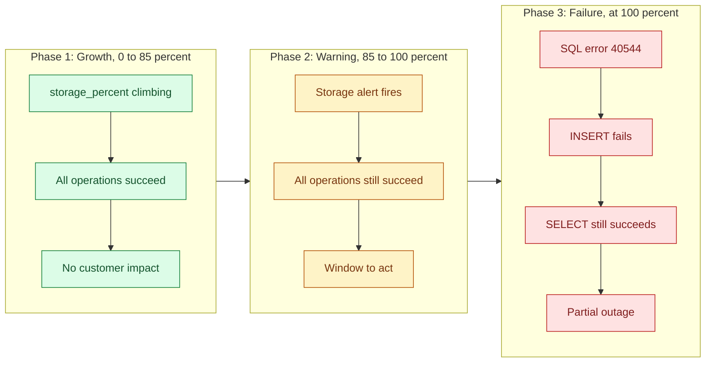

<ul class="sre-meta">
<li class="duration">Estimated time: 25 minutes</li>
<li>Module 10</li>
<li class="incident">Incident 3 of 3</li>
</ul>

## Overview

The first two incidents were binary: something was fine, then it broke. Capacity incidents are not like that. They approach gradually, cross a cliff, and then produce a failure that looks nothing like the gradual approach that preceded it.

This module fills the orders database to its size ceiling. Reads keep working, writes stop, and the aggregate dashboards look almost normal the entire time.

## Learning objectives

* Trigger a storage exhaustion incident on Azure SQL Database.
* Observe the difference between a leading indicator and a failure symptom.
* Recognize how a partial outage hides in averaged metrics.
* Correlate a platform-level error code with an application-level symptom.
* Record the evidence needed for the root cause analysis in Module 11.

## Architecture context

Storage exhaustion is the only incident in this workshop with a usable leading indicator. `storage_percent` climbs steadily for minutes before anything fails.



The gap between phase 2 and phase 3 is the most valuable property of this incident class. Detection during phase 2 makes it a maintenance task. Detection during phase 3 makes it an outage.

## Tasks

### Task 1: Confirm the system recovered from Incident 2

```bash
source .workshop/workshop.env

curl --silent --header "X-Fault-Token: ${FAULT_TOKEN}" \
  "https://${ORDERS_API_FQDN}/fault/status" | jq '{cpuLoadActive, errorInjectionActive, storagePhase}'

curl --silent "https://${ORDERS_API_FQDN}/storage" | jq .
```

Record the starting `usedPercent`. It should be small, typically under 10 percent.

### Task 2: Record the incident start time

```bash
export INCIDENT_3_START="$(date -u +%Y-%m-%dT%H:%M:%SZ)"
echo "Incident 3 start (UTC): ${INCIDENT_3_START}"

cat > .workshop/notes/incident-03-storage.md <<EOF
# Incident 3: Storage exhaustion on the orders database

* Injected at (UTC): ${INCIDENT_3_START}
* Fault: fill the database to 95 percent of its 1 GB maximum size
* Expected primary signal: saturation on the data tier
* Expected secondary signal: errors on the write path only

## Timeline

| Time (UTC) | storage_percent | Write path | Read path | Notes |
|------------|-----------------|------------|-----------|-------|
|            |                 |            |           |       |

## Leading indicator versus symptom

## Agent findings

## Verification against raw telemetry
EOF
```

### Task 3: Start the storage fill

```bash
./scripts/inject-fault.sh storage 95
```

The fill runs as a background task inside `orders-api`, writing padded rows in batches until the database reaches 95 percent of its 1 GB ceiling. Expect five to twelve minutes depending on the database service objective and current load.

!!! warning "This one is not self-limiting in the same way"
    CPU load and error injection expire on a timer. Written rows do not disappear on their own. Task 9 removes them, and [Module 14](../14-cleanup/index.md) deletes the entire resource group. Do not leave a 1 GB ballast table sitting in a database you intend to keep.

### Task 4: Watch the leading indicator climb

```bash
source .workshop/workshop.env

for i in $(seq 1 40); do
  USAGE=$(curl --silent "https://${ORDERS_API_FQDN}/storage" | jq -r '"\(.usedPercent)% (\(.usedBytes) of \(.maxBytes) bytes)"')
  WRITE=$(curl --silent --output /dev/null --write-out '%{http_code}' --max-time 20 \
    --request POST "https://${ORDERS_API_FQDN}/orders" \
    --header 'Content-Type: application/json' \
    --data '{"customerId":"cust-777","productId":"SKU-1001","quantity":1}')
  READ=$(curl --silent --output /dev/null --write-out '%{http_code}' --max-time 20 \
    "https://${ORDERS_API_FQDN}/orders")
  printf '%s  storage=%-32s write=%s read=%s\n' "$(date -u +%H:%M:%S)" "${USAGE}" "${WRITE}" "${READ}"
  sleep 20
done
```

Keep this running and fill in your timeline table as the numbers move. This is the single most instructive output in the workshop: you can watch a leading indicator cross a threshold while the service continues working perfectly, and then watch the cliff.

### Task 5: Observe the platform metric

```bash
az monitor metrics list \
  --resource "/subscriptions/${SUBSCRIPTION_ID}/resourceGroups/${RESOURCE_GROUP}/providers/Microsoft.Sql/servers/${SQL_SERVER_NAME}/databases/${SQL_DATABASE_NAME}" \
  --metric storage_percent storage \
  --interval PT1M \
  --aggregation Maximum \
  --start-time "${INCIDENT_3_START}" \
  --output table
```

### Task 6: Wait for the storage alert

`alert-sqldb-storage-critical` fires at severity 1 when `storage_percent` exceeds 85. Note the time it fires and, critically, note that the write path is still working at that moment.

<!-- SCREENSHOT: Azure Monitor metric chart showing storage_percent crossing the 85 percent threshold -->

Record in your notes:

* Time the alert fired.
* Write path status at that moment.
* Time the write path actually started failing.

The interval between the second and third bullet is your window to act. In a real system that window is the entire difference between a scheduled maintenance and a Sev 1.

### Task 7: Capture the failure

Once writes begin failing, capture the error.

```bash
curl --silent --request POST "https://${ORDERS_API_FQDN}/orders" \
  --header 'Content-Type: application/json' \
  --data '{"customerId":"cust-777","productId":"SKU-1001","quantity":1}' | jq .
```

The response includes the SQL error number. Error 40544 means the database reached its size quota.

```bash
az monitor log-analytics query \
  --workspace "${LOG_ANALYTICS_CUSTOMER_ID}" \
  --analytics-query "
AppExceptions
| where TimeGenerated > ago(30m)
| where AppRoleName == 'orders-api'
| summarize Occurrences = count(), FirstSeen = min(TimeGenerated), LastSeen = max(TimeGenerated) by ProblemId, OuterMessage
| order by Occurrences desc
| take 10
" \
  --output table
```

```bash
az monitor log-analytics query \
  --workspace "${LOG_ANALYTICS_CUSTOMER_ID}" \
  --analytics-query "
AzureDiagnostics
| where TimeGenerated > ago(30m)
| where ResourceProvider == 'MICROSOFT.SQL'
| where Category in ('Errors', 'SQLInsights')
| project TimeGenerated, Category, error_number_d, Message
| order by TimeGenerated desc
| take 20
" \
  --output table
```

### Task 8: Prove the outage is partial

This is the query that demonstrates why averaged dashboards fail you.

```bash
az monitor log-analytics query \
  --workspace "${LOG_ANALYTICS_CUSTOMER_ID}" \
  --analytics-query "
AppRequests
| where TimeGenerated > ago(30m)
| where AppRoleName == 'orders-api'
| summarize
    Total = count(),
    Failed = countif(Success == false),
    FailureRate = round(100.0 * countif(Success == false) / count(), 1)
  by bin(TimeGenerated, 5m), Name
| order by TimeGenerated asc, Name asc
" \
  --output table
```

Then run the same query without the `Name` dimension and compare the failure rate.

```bash
az monitor log-analytics query \
  --workspace "${LOG_ANALYTICS_CUSTOMER_ID}" \
  --analytics-query "
AppRequests
| where TimeGenerated > ago(30m)
| where AppRoleName == 'orders-api'
| summarize FailureRate = round(100.0 * countif(Success == false) / count(), 1) by bin(TimeGenerated, 5m)
| order by TimeGenerated asc
" \
  --output table
```

The segmented view shows one operation at 100 percent failure. The aggregate view shows a much lower number, because read traffic dilutes it. A dashboard built on the second query would look survivable during a complete loss of order intake.

### Task 9: Recover the database

```bash
./scripts/inject-fault.sh release
```

This truncates the ballast table and shrinks the database. The `storage_percent` metric takes a few minutes to reflect the change.

```bash
sleep 180
source .workshop/workshop.env
curl --silent "https://${ORDERS_API_FQDN}/storage" | jq .

curl --silent --output /dev/null --write-out 'POST /orders -> HTTP %{http_code}\n' \
  --request POST "https://${ORDERS_API_FQDN}/orders" \
  --header 'Content-Type: application/json' \
  --data '{"customerId":"cust-777","productId":"SKU-1001","quantity":1}'
```

!!! tip "The other mitigation"
    In production you would more likely raise the database maximum size than delete data, because deleting production data during an incident is how incidents become disasters. Try it if you want to see the alternative: `az sql db update --name "${SQL_DATABASE_NAME}" --server "${SQL_SERVER_NAME}" --resource-group "${RESOURCE_GROUP}" --max-size 2GB`. Change it back afterwards or your cost estimate shifts.

## Validation

* [x] `storage_percent` climbed steadily and crossed 85 percent.
* [x] `alert-sqldb-storage-critical` fired while the service was still fully functional.
* [x] `POST /orders` began returning HTTP 500 with SQL error 40544.
* [x] `GET /orders` continued returning HTTP 200 throughout.
* [x] You recorded the interval between the alert firing and the first write failure.
* [x] After release, writes succeed again.

## Expected results

Storage climbs from single-digit percent to 95 percent over five to twelve minutes. The alert fires at 85 percent, typically two to four minutes before the first write failure. Once the ceiling is reached, every `POST /orders` fails with SQL error 40544 while every `GET /orders` succeeds.

Segmented failure rate shows `POST /orders` at 100 percent. Unsegmented failure rate shows something far lower, often between 15 and 40 percent depending on your read-to-write ratio.

After release, `usedPercent` drops and writes recover within one to three minutes. The alert auto-resolves once the metric falls below the threshold.

## Knowledge check

??? question "This incident had a leading indicator and the other two did not. What does that change about how you should respond?"
    Leading indicators let you respond before customers are affected, which converts an outage into a maintenance task. It also changes the alerting strategy: for capacity signals, a lower threshold with a longer window is correct because you are buying reaction time, whereas for error signals a lower threshold just produces noise. The practical rule is to alert on capacity trends early and on error rates precisely.

??? question "The aggregate failure rate stayed around 25 percent while order submission was completely unavailable. What is the general lesson?"
    Aggregate metrics hide dimensional failures. Any signal that mixes operations, tenants, regions, or endpoints will understate a failure that is total within one dimension. The general lesson is to segment before you aggregate, and to build alert rules on the dimension that maps to a customer journey rather than on service-wide totals.

??? question "The agent recommends increasing the database maximum size. Is that a good recommendation?"
    As a mitigation, yes, and it is safer than deleting data during an incident. As a resolution, no. Nothing has explained why storage grew, whether the growth is legitimate, or whether it will recur next week at the new ceiling. A complete response pairs the size increase with an investigation of what consumed the space, a retention or archival policy, and a capacity forecast. Raising a limit without understanding consumption is how you end up doing it again every month.

## Next steps

Three incidents, three failure classes. Now turn the evidence into an analysis someone else could act on.

[Next: Module 11 - Perform Root Cause Analysis :material-arrow-right:](../11-root-cause-analysis/index.md){ .md-button .md-button--primary }

<div class="sre-nav" markdown>
[:material-arrow-left: Module 09 - Investigate the HTTP 500 Incident](../09-investigate-http-500/index.md)
[Module 11 - Perform Root Cause Analysis :material-arrow-right:](../11-root-cause-analysis/index.md)
</div>
