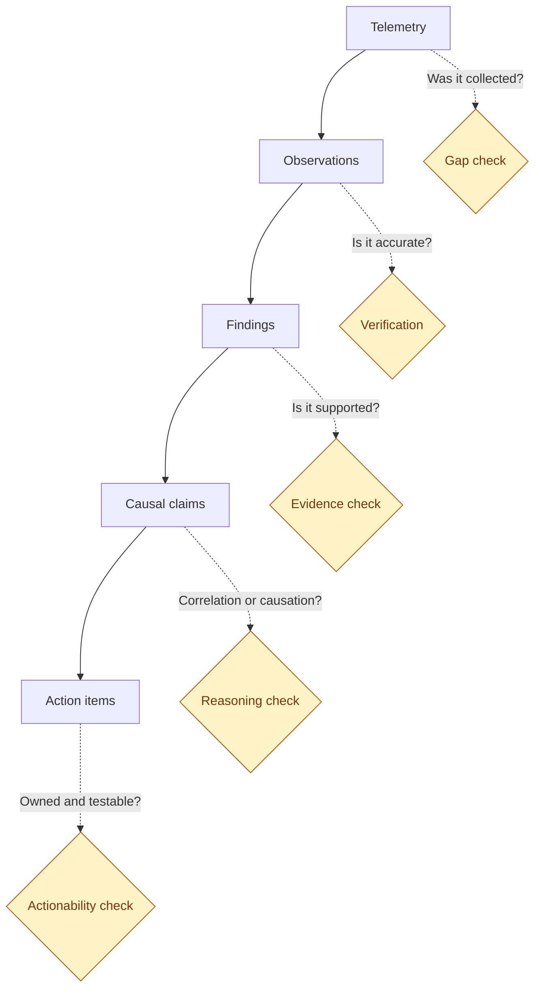

<ul class="sre-meta">
<li class="duration">Estimated time: 35 minutes</li>
<li>Module 11</li>
<li>Investigation 3 of 3</li>
</ul>

## Overview

You have three incidents, three sets of telemetry, and three sets of notes. This module turns them into something an engineering manager can prioritize and an auditor can read.

The interesting work here is not generating the document. An agent will produce a well-formatted RCA in seconds. The interesting work is finding the places where that document is confidently wrong, which is a skill you only develop by looking for it deliberately.

## Learning objectives

* Generate a complete root cause analysis with Azure SRE Agent.
* Apply a structured critique to identify unsupported claims.
* Distinguish correlation from causation in agent output.
* Convert findings into prioritized, owned engineering work.
* Identify the detection and observability gaps the incidents revealed.

## Architecture context

An RCA is an evidence pipeline. Each stage constrains the next, and a weak stage silently corrupts everything downstream.



## Tasks

### Task 1: Generate the multi-incident analysis

```text
Produce a root cause analysis covering the three incidents in this resource group over the
last few hours. For each incident include:
- Detection: what fired, when, and how long after degradation actually started
- Impact: quantified customer effect, segmented by operation
- Trigger: the single change or condition that started it, with supporting evidence
- Contributing factors: conditions that made the trigger consequential, each with evidence
- Mitigation: what restored service and whether it addressed the cause
- Remediation: what still needs to change

Then analyze across all three:
- Common contributing factors that appear in more than one incident
- Observability gaps that slowed any of the investigations
- The three highest-value engineering changes, ranked by risk reduced per unit of effort
```

Save the response verbatim to `.workshop/notes/rca-agent-draft.md`. Do not edit it yet.

<!-- SCREENSHOT: SRE Agent generated root cause analysis with incident timeline -->

### Task 2: Critique the analysis

Work through each claim in the draft against this checklist. Mark every claim as supported, partially supported, or unsupported.

| Check                | Question to ask                                                                 |
|----------------------|----------------------------------------------------------------------------------|
| Evidence             | Is there a specific query or metric behind this claim, or is it plausible prose? |
| Causation            | Does the evidence show causation, or only that two things moved together?        |
| Timing               | Does the stated start time match the first telemetry deviation, or the alert?    |
| Exclusion            | Were alternative explanations named and ruled out with data?                     |
| Completeness         | Which contributing factors from your own notes are missing?                      |
| Actionability        | Could an engineer start work from this item tomorrow without asking questions?   |

Common weaknesses to look for specifically:

* Degradation start time reported as the alert time. Those differed by several minutes in every one of your incidents.
* Incident 1 attributed to the `catalog-api` dependency because client-side duration was high.
* Incident 2 stopping at "`catalog-api` returned 503" without naming the missing circuit breaker.
* Incident 3 described as a total outage rather than a write-path outage.
* Action items phrased as "improve monitoring" or "add resilience", which are wishes rather than work.

### Task 3: Challenge the agent on the gaps

For each unsupported claim, push back specifically. Vague pushback produces vague corrections.

```text
In your analysis of the CPU incident you state that the catalog-api dependency was slow.
Compare the client-side dependency duration recorded by orders-api with the server-side
request duration recorded by catalog-api over the same window. If catalog-api server-side
latency did not change, revise your conclusion and explain what the client-side duration
was actually measuring.
```

```text
Your analysis of the HTTP 500 incident identifies catalog-api returning 503 as the root cause.
Explain why a dependency returning 503 resulted in a complete loss of order submission rather
than a degraded experience. What is missing from orders-api that would have contained it?
```

```text
You describe the storage incident as an outage. Segment AppRequests by operation name for
that window and tell me which operations failed and which succeeded. Then restate the impact.
```

Record how the agent responds. An agent that revises its conclusion when shown contradicting evidence is behaving correctly. One that restates the original claim with more confidence is telling you something important about how much supervision it needs.

### Task 4: Verify the cross-incident analysis yourself

Run the queries that support a cross-incident view.

```bash
source .workshop/workshop.env

az monitor log-analytics query \
  --workspace "${LOG_ANALYTICS_CUSTOMER_ID}" \
  --analytics-query "
AppRequests
| where TimeGenerated > ago(6h)
| summarize
    Total = count(),
    Failed = countif(Success == false),
    FailureRate = round(100.0 * countif(Success == false) / count(), 1),
    P95Ms = round(percentile(DurationMs, 95), 1)
  by bin(TimeGenerated, 10m), AppRoleName
| order by TimeGenerated asc
" \
  --output table
```

```bash
az monitor log-analytics query \
  --workspace "${LOG_ANALYTICS_CUSTOMER_ID}" \
  --analytics-query "
AppExceptions
| where TimeGenerated > ago(6h)
| summarize Occurrences = count(), FirstSeen = min(TimeGenerated), LastSeen = max(TimeGenerated)
  by AppRoleName, ProblemId
| order by FirstSeen asc
" \
  --output table
```

The three incident windows should be clearly visible as distinct shapes: a latency hump with no exceptions, an error plateau with a single exception signature, and a partial error plateau with a SQL exception signature.

### Task 5: Write the final analysis

Create the document you would actually circulate.

```bash
cat > .workshop/notes/rca-final.md <<'EOF'
# Root cause analysis: Contoso Order Services

## Summary

One paragraph an executive can read. What broke, how long, what customers experienced,
what has changed as a result.

## Incident 1: CPU saturation on orders-api

* Detection:
* Degradation start (from telemetry):
* Alert fired:
* Detection latency:
* Impact (segmented):
* Trigger:
* Contributing factors:
* Mitigation:
* Remediation:

## Incident 2: Dependency failure cascade

* Detection:
* Degradation start (from telemetry):
* Alert fired:
* Detection latency:
* Impact (segmented):
* Trigger:
* Contributing factors:
* Mitigation:
* Remediation:

## Incident 3: Database storage exhaustion

* Detection:
* Leading indicator crossed threshold:
* First write failure:
* Warning window available:
* Impact (segmented):
* Trigger:
* Contributing factors:
* Mitigation:
* Remediation:

## Cross-incident findings

### Common contributing factors

### Observability gaps

### What worked well

## Action items

| Priority | Action | Owner role | Risk reduced | Effort | Verification |
|----------|--------|------------|--------------|--------|--------------|
| P1       |        |            |              |        |              |
| P1       |        |            |              |        |              |
| P2       |        |            |              |        |              |
| P2       |        |            |              |        |              |
| P3       |        |            |              |        |              |

## Agent assessment

* What the agent got right:
* What the agent got wrong:
* What the agent missed entirely:
* Instructions that would have prevented each miss:
EOF

echo "Complete .workshop/notes/rca-final.md using your notes and the agent draft."
```

Fill it in. The last section feeds directly into the next module.

### Task 6: Identify the observability gaps

For each investigation, note where you had to guess because the data did not exist.

| Gap                                                | Consequence                                          | Fix                                                     |
|----------------------------------------------------|------------------------------------------------------|---------------------------------------------------------|
| No per-thread or per-operation CPU attribution     | Could not identify what consumed CPU from metrics alone | Continuous profiler or code-level CPU sampling         |
| No circuit breaker state telemetry                 | Absence of a breaker inferred rather than observed    | Emit breaker state transitions as custom metrics         |
| No storage growth rate metric                      | Could not forecast time to exhaustion                 | Derived metric on `storage_percent` slope                |
| No business-level SLI                              | Impact expressed in requests, not orders lost         | Track order submission success as a first-class metric   |
| No deployment markers in telemetry                 | Change correlation required a separate Activity log query | Annotate releases into Application Insights          |

Add any gaps you found that are not listed. This table is more valuable than the RCA itself, because it is the thing that makes the next incident cheaper.

## Validation

* [x] You generated an agent RCA covering all three incidents.
* [x] You classified every causal claim as supported, partially supported, or unsupported.
* [x] You challenged at least three specific claims and recorded the responses.
* [x] You verified the cross-incident telemetry independently.
* [x] Your final RCA has at least five action items with owners and verification steps.
* [x] You documented at least three observability gaps.

## Expected results

The agent draft is well structured, accurately reports what happened, and is strongest on detection and impact. It is weakest on contributing factors, because those require reasoning about what is absent from the system rather than what is present in the telemetry.

Your final RCA should differ from the draft in three predictable ways: earlier degradation start times, more contributing factors, and impact statements segmented by operation rather than aggregated.

!!! important "The document is not the deliverable"
    An RCA that does not change what gets built is theatre. The action item table is the only part that has any effect on future reliability. If you cannot name who does each item and how you would verify it, the item is not real.

## Knowledge check

??? question "The agent stated that the CPU incident was caused by a dependency slowdown. That is factually wrong. Does that make the tool untrustworthy?"
    It makes it a tool with a known failure mode, which is different from untrustworthy. The error came from a genuine ambiguity in the data: client-side dependency duration really was high. A human reading the same telemetry without the client-versus-server comparison would reach the same conclusion. The correct response is to encode that comparison as a standing instruction, which is what Module 12 does, and to keep a human reviewing causal claims. Tools with understood failure modes are usable; tools with unknown failure modes are not.

??? question "Why does the RCA template ask for the degradation start time separately from the alert time?"
    Because the difference is your detection latency, and it is a directly actionable number. If degradation began at 14:02 and the alert fired at 14:09, you have seven minutes of undetected customer impact that no amount of faster investigation will recover. Teams that record only the alert time optimize investigation speed while ignoring a larger and cheaper win in detection.

??? question "Two of the three incidents share a contributing factor. Which one, and why does that matter more than any individual finding?"
    Insufficient dimensional segmentation in both alerting and dashboards. Incident 2 and Incident 3 were both invisible in aggregate views and obvious once segmented by operation. A contributing factor that appears in multiple independent incidents is a systemic property of how you monitor, not a property of any one failure, and fixing it improves the response to failures you have not seen yet.

## Next steps

You know exactly where the agent fell short. Now fix it.

[Next: Module 12 - Improve Agent Instructions :material-arrow-right:](../12-agent-instructions/index.md){ .md-button .md-button--primary }

<div class="sre-nav" markdown>
[:material-arrow-left: Module 10 - Generate Disk Full Incident](../10-incident-disk-full/index.md)
[Module 12 - Improve Agent Instructions :material-arrow-right:](../12-agent-instructions/index.md)
</div>
