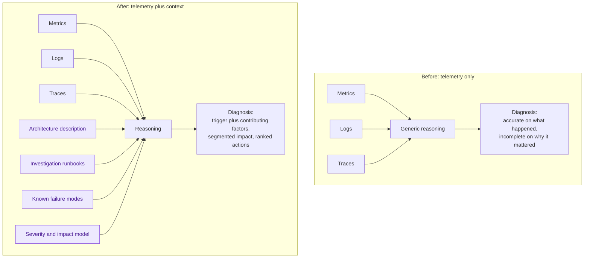

<ul class="sre-meta">
<li class="duration">Estimated time: 35 minutes</li>
<li>Module 12</li>
<li>Advanced</li>
</ul>

## Overview

In Module 11 you documented exactly where the agent's reasoning fell short. Most of those gaps were not model limitations. They were missing context: architectural constraints the agent could not see, comparisons it did not know to make, and organizational conventions nobody told it about.

This module supplies that context and then measures whether it helped. The measurement is the part people skip, and it is the only part that distinguishes engineering from vibes.

## Learning objectives

* Write architectural context that materially improves diagnosis quality.
* Author investigation runbooks for the failure classes you encountered.
* Encode the specific corrections identified in Module 11.
* Re-run the incidents and compare results against the recorded baseline.
* Recognize when adding instructions stops helping.

## Architecture context

Instructions sit between the telemetry and the reasoning. They do not give the agent new data; they change what it does with the data it already has.



## Tasks

### Task 1: Review the prepared instruction set

This repository ships a starting point derived from the workshop architecture.

```bash
ls -1 agent/instructions agent/runbooks
```

| File                                                     | Purpose                                                    |
|----------------------------------------------------------|------------------------------------------------------------|
| `agent/instructions/architecture.md`                     | What the system is, how it fails, what the constraints are |
| `agent/instructions/investigation-principles.md`          | How to reason, including the corrections from Module 11    |
| `agent/runbooks/saturation.md`                            | Investigating CPU, memory, and connection saturation       |
| `agent/runbooks/dependency-failure.md`                    | Investigating downstream failures and cascades             |
| `agent/runbooks/capacity-exhaustion.md`                   | Investigating storage and quota limits                     |

Read `agent/instructions/investigation-principles.md` first. Every rule in it exists because the agent got something wrong in Modules 07, 09, or 11.

### Task 2: Add your own corrections

Open `agent/instructions/investigation-principles.md` and add a rule for every gap you recorded in your own RCA that is not already covered. Write rules that are testable.

A rule that works looks like this:

```markdown
When client-side dependency duration increases, always compare it against the callee's
server-side request duration over the same window before attributing latency to the
dependency. If server-side duration is flat, the latency is caller-side queueing and the
dependency is not the cause.
```

A rule that does nothing looks like this:

```markdown
Be thorough and consider all possibilities.
```

The difference is that the first one can be checked against the output and the second cannot.

!!! tip "Write rules as corrections, not as encouragement"
    Every effective instruction encodes a specific mistake you have already seen. If you cannot name the incident that motivated a rule, you are probably adding noise.

### Task 3: Apply the instructions to the agent

The initial `azd up` already loaded the checked-in instructions and runbooks.
After editing the Markdown, review the local references in `agent/knowledge.yaml`
and synchronize from the repository root:

```bash
python scripts/workshop.py configure-agent
```

Alternatively, run `azd up` to redeploy and synchronize both
`agent/incident-filters.yaml` and `agent/knowledge.yaml`. No portal configuration
or copy-and-paste is needed. The uploader removes owned `workshop-*.md` knowledge
documents, including retired entries, before uploading the desired files and
triggering indexing; it preserves files outside that reserved namespace. Common
prompts are updated under stable names and their fields are read back. The hook
waits up to ten minutes for knowledge indexing, not a remote source-byte comparison.
Keep the edits in version control.

To retire an incident filter, retain its YAML entry with `spec.isEnabled: false`.
Removing it instead causes a fail-closed error because v2 filter deletion is not
part of the documented contract.

### Task 4: Re-run the environment description prompt

Use the exact prompt from Module 05 so the comparison is fair.

```text
Describe the workload deployed in this resource group. List every service, how they
depend on each other, which one is publicly reachable, and what data store is in use.
Identify any single points of failure you can infer from the configuration.
```

Compare against `.workshop/notes/agent-baseline.md`. The improved answer should now name the single replica configuration, the absent circuit breaker, and the liveness-only health probe without being asked.

### Task 5: Re-run an incident and score the difference

Re-run the dependency failure, which is the incident where the original diagnosis was weakest.

```bash
source .workshop/workshop.env

export INCIDENT_4_START="$(date -u +%Y-%m-%dT%H:%M:%SZ)"
echo "Re-test start (UTC): ${INCIDENT_4_START}"

./scripts/inject-fault.sh errors 100 600
```

Wait for the alert, then ask the same investigation prompt you used in Module 09.

```text
Alert alert-orders-api-http-5xx has fired at severity 1 in this resource group.
Investigate and answer precisely:
1. Which requests are failing, and which are succeeding? Segment by operation name.
2. Follow a single failed operation end to end across services. Show the correlation.
3. Where in the call chain does the failure originate?
4. Is the originating service unhealthy, or is it returning a deliberate error quickly?
5. What in the calling service's behavior converted this into a customer-facing outage?
Give me the query behind each answer.
```

Score both responses against the same rubric.

| Criterion                                             | Module 09 score | Module 12 score |
|-------------------------------------------------------|-----------------|-----------------|
| Correct affected resource                              |                 |                 |
| Degradation start from telemetry, not alert time       |                 |                 |
| Correct failure mechanism                              |                 |                 |
| Alternative causes explicitly ruled out with evidence  |                 |                 |
| Impact segmented by operation                          |                 |                 |
| Contributing factors named without prompting           |                 |                 |
| Mitigation distinguished from remediation              |                 |                 |
| Actions specific enough to start work                  |                 |                 |

Then clean up.

```bash
./scripts/inject-fault.sh reset
```

### Task 6: Record what did not improve

Not every instruction helps. Note any criterion that did not move, and form a hypothesis about why.

Three common explanations:

* The instruction was written as encouragement rather than as a testable rule.
* The required data does not exist, so no amount of instruction can produce the conclusion. Circuit breaker state is the obvious example; if you do not emit it, the agent can only infer its absence.
* The instruction conflicted with another instruction, and the model resolved the conflict differently than you expected.

The second explanation is the most common and the most important, because the fix is instrumentation rather than prompt editing.

!!! warning "Instruction bloat is real"
    Every rule you add competes for attention with every other rule. A focused set of fifteen specific corrections consistently outperforms sixty pages of general guidance. When a rule stops earning its place, delete it. Treat the instruction set like code, with review and pruning, not like a wiki that only grows.

### Task 7: Commit the instruction set

Instructions are operational configuration. Version them.

```bash
git status --short agent/
git add agent/
git commit -m "docs(agent): add architecture context and investigation runbooks"
```

Reviewing an instruction change should feel like reviewing a code change, because a bad instruction degrades every future investigation in exactly the way a bad utility function degrades every caller.

## Validation

* [x] Every gap from your Module 11 RCA has a corresponding rule or a documented reason why it cannot be fixed with instructions.
* [x] The re-run environment description names at least two single points of failure unprompted.
* [x] The re-run investigation scores higher on at least three rubric criteria.
* [x] You identified at least one criterion that did not improve and explained why.
* [x] The instruction set is committed to version control.

## Expected results

The largest gains appear in contributing factor identification and in impact segmentation, because both are reasoning behaviors that instructions can change directly. Detection and impact reporting were already strong and should stay roughly the same.

Gains that instructions cannot deliver are equally informative. If the agent still cannot tell you whether a circuit breaker opened, that is a instrumentation gap, and it belongs in the observability backlog rather than in the instruction file.

## Knowledge check

??? question "Why does architectural context improve diagnosis when the agent can already read the resource configuration?"
    Configuration tells the agent what exists. It does not convey intent, constraints, or history. The agent can see `minReplicas: 1` but cannot know whether that is a deliberate cost decision, an oversight, or a hard constraint from a licensing agreement. It cannot know that order submission is the revenue path and catalog browsing is not. Context supplies the interpretation layer, and interpretation is what turns an observation into a prioritized recommendation.

??? question "Is there a point where more instructions make results worse?"
    Yes, and it arrives sooner than people expect. Long instruction sets dilute attention across rules, increase the chance of internal contradictions, and encourage the model to pattern-match to the nearest documented scenario rather than reason about the actual evidence. The practical signal is when adding a rule improves one scenario and degrades another. At that point, split into scenario-specific runbooks rather than growing a single global instruction file.

??? question "You wrote a rule and the behavior did not change at all. What are the first two things to check?"
    First, confirm the instruction was actually applied and is in scope for the prompt you ran; configuration changes sometimes need a new session. Second, confirm the data the rule depends on exists. A rule that says "compare client-side and server-side dependency duration" is inert if the callee is not instrumented with Application Insights. Rules can only redirect reasoning over available evidence; they cannot conjure evidence.

## Next steps

One agent, one resource group. Real systems have neither.

[Next: Module 13 - Multi-Agent Investigation Patterns :material-arrow-right:](../13-multi-agent-patterns/index.md){ .md-button .md-button--primary }

<div class="sre-nav" markdown>
[:material-arrow-left: Module 11 - Perform Root Cause Analysis](../11-root-cause-analysis/index.md)
[Module 13 - Multi-Agent Investigation Patterns :material-arrow-right:](../13-multi-agent-patterns/index.md)
</div>
