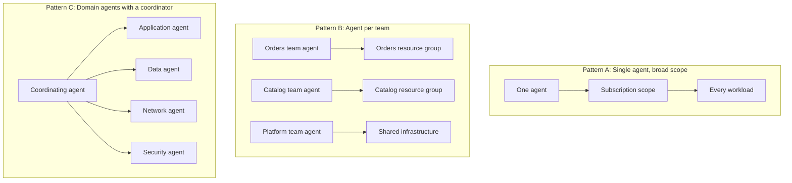
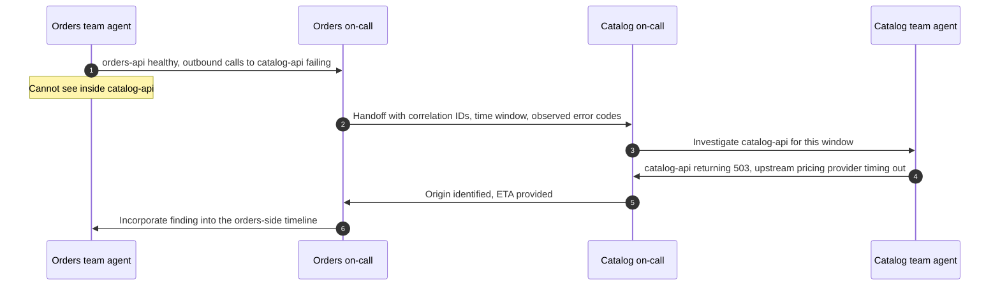

<ul class="sre-meta">
<li class="duration">Estimated time: 30 minutes</li>
<li>Module 13</li>
<li>Advanced</li>
</ul>

## Overview

Everything so far assumed one agent, one resource group, one owner. Production looks nothing like that. A payment failure spans four teams, three subscriptions, and a partner API, and the on-call engineer for each part sees only their slice.

This module is design work rather than deployment. You extend the workshop architecture into a realistic multi-team topology, choose an agent pattern, and reason about the failure modes that only appear when multiple agents investigate the same incident.

## Learning objectives

* Compare single-agent and multi-agent topologies with their trade-offs.
* Scope agents along ownership boundaries rather than technology boundaries.
* Design handoff between agents that cannot see each other's telemetry.
* Anticipate conflicting conclusions and decide how to resolve them.
* Apply governance controls that scale beyond one agent.

## Architecture context

Three topologies cover most real situations.



| Pattern | Strength                                        | Weakness                                                          | Fits                                    |
|---------|--------------------------------------------------|-------------------------------------------------------------------|-----------------------------------------|
| A       | Complete cross-service view, no handoff needed   | Broad permissions, one team's prompt reaches another team's data   | Small orgs, single-team ownership       |
| B       | Permissions match ownership, blast radius small  | Nobody sees the whole picture, cross-boundary incidents are slow   | Clear service ownership, strict isolation |
| C       | Specialization plus coordination                 | Coordinator complexity, ambiguous conclusion authority              | Large estates with distinct domains     |

Most organizations should start with Pattern B and add coordination only when cross-boundary incidents demonstrably cost more than the coordination overhead.

## Tasks

### Task 1: Map ownership onto the workshop architecture

Extend Contoso Order Services into a plausible multi-team estate.

| Component                | Owning team       | Resource group         | Subscription |
|--------------------------|-------------------|------------------------|--------------|
| `orders-api`             | Orders            | `rg-orders-prod`       | `sub-apps`   |
| `catalog-api`            | Catalog           | `rg-catalog-prod`      | `sub-apps`   |
| Orders database          | Data platform     | `rg-data-prod`         | `sub-data`   |
| Container Apps environment | Platform        | `rg-platform-prod`     | `sub-platform` |
| Log Analytics workspace  | Observability     | `rg-observability-prod`| `sub-platform` |
| Pricing provider         | External partner  | Not in Azure           | Not applicable |

Now re-run the Module 08 incident mentally against this topology. The Orders team agent sees a service returning 500 with healthy resources and a failing outbound call to something it cannot inspect. The Catalog team agent sees a service returning 503 with healthy resources, caused by a partner API it also cannot inspect. Neither agent can produce a complete diagnosis alone.

Write down which piece of evidence each agent is missing. That list is the specification for your handoff design.

### Task 2: Choose the scoping boundary

Two boundaries are defensible and one is not.

=== "Scope by ownership (recommended)"

    Each agent covers the resources a single team is accountable for. Permissions match the on-call rotation, escalation paths are obvious, and an agent misconfiguration is contained to one team.

    The cost is that cross-boundary incidents require explicit handoff, which you must design rather than hope for.

=== "Scope by domain"

    Agents cover application, data, network, and security across teams. Specialization improves depth, and a data agent that understands query plans is genuinely better at data incidents.

    The cost is that a single incident is investigated by several agents simultaneously, and conclusion authority becomes ambiguous. This needs a coordinator.

=== "Scope by convenience (avoid)"

    One agent with subscription or management group Contributor because it was faster to set up. Everything works immediately. Then someone's prompt about a test environment reads production data, and the audit review takes a week.

### Task 3: Design the handoff

Agents that cannot see each other's telemetry need a structured exchange. Design what crosses the boundary.



A useful handoff payload contains:

* Time window in UTC with explicit start and end.
* Correlation or operation IDs that exist on both sides of the boundary.
* Observed symptom from the caller's perspective, including error codes and durations.
* What the calling agent already ruled out, with evidence.
* The specific question being asked, not a general request to look into it.

!!! important "Correlation IDs are the contract"
    Everything above depends on a trace context that survives the network hop between teams. If `orders-api` and `catalog-api` do not propagate W3C trace context, no agent topology will save you and no amount of coordination will substitute. Distributed tracing is a prerequisite for multi-agent investigation, not an enhancement.

### Task 4: Decide how conflicts are resolved

Two agents will eventually reach incompatible conclusions. Decide the rule before it happens, not during a Sev 1.

| Conflict                                                | Resolution rule                                                        |
|---------------------------------------------------------|------------------------------------------------------------------------|
| Both agents blame the other's service                   | The agent with direct telemetry for a component owns claims about it   |
| Agents disagree on incident start time                  | Earliest telemetry-derived deviation wins, regardless of which agent found it |
| Agents disagree on severity                             | Highest severity holds until the incident commander downgrades it      |
| Agents propose conflicting mitigations                  | A human incident commander decides; agents do not negotiate            |

The first rule does most of the work. An agent that cannot see inside a component should describe observed behavior at the boundary and stop, rather than inferring internal state.

### Task 5: Apply governance controls

Multi-agent estates fail on governance long before they fail on technology.

* Maintain an inventory of every agent, its scope, its permissions, and its owning team. An agent nobody owns is an agent nobody reviews.
* Grant identical role sets across agents so that reviewing one agent's permissions tells you something about all of them. Divergence is where surprises hide.
* Review agent-initiated actions in the Activity log on the same cadence as human privileged access reviews.
* Version instruction sets in source control with mandatory review. A bad instruction degrades every future investigation.
* Set a shared standard for evidence citation so that conclusions from different agents can be compared.
* Define which agents may take actions and which are read-only, and make read-only the default.

### Task 6: Write your design

```bash
cat > .workshop/notes/multi-agent-design.md <<'EOF'
# Multi-agent design for Contoso Order Services

## Chosen topology and why

## Agent inventory

| Agent | Scope | Roles | Owning team | Operating mode |
|-------|-------|-------|-------------|----------------|
|       |       |       |             |                |

## Handoff protocol

* Trigger conditions:
* Payload contents:
* Channel:
* Expected response time:

## Conflict resolution rules

## Governance controls

## What I would need to build before this works

EOF

echo "Complete .workshop/notes/multi-agent-design.md"
```

The last heading is the honest one. Most organizations discover that trace context propagation, a shared correlation standard, and a resource ownership inventory are missing, and that those are the real prerequisites.

## Validation

* [x] You mapped every workshop component to an owning team and a resource group.
* [x] You identified which evidence each agent would be missing during the Module 08 incident.
* [x] You chose a topology and can defend the choice against the alternatives.
* [x] Your handoff payload includes correlation IDs and explicit exclusions.
* [x] Your conflict resolution rules cover the case of two agents blaming each other.
* [x] Your design names at least one prerequisite you do not currently have.

## Expected results

A design document you could take to an architecture review. Most participants choose Pattern B, discover that trace context propagation is the binding constraint, and conclude that the first investment is instrumentation rather than more agents.

That conclusion is correct and it is the point of the module. Agent topology is downstream of observability quality. An organization with excellent tracing and one agent will out-investigate an organization with poor tracing and six.

## Knowledge check

??? question "Why is scoping agents by ownership usually better than scoping by technology domain?"
    Ownership boundaries already carry accountability, escalation paths, and access control. Aligning agents to them means permissions match the on-call rotation, misconfiguration is contained, and there is always a person responsible for a given agent's conclusions. Technology boundaries cut across ownership, so a data agent's finding may have no clear owner, and its permissions must span teams that do not otherwise trust each other.

??? question "Two agents blame each other's service. What is the fastest way to break the tie?"
    Apply the rule that an agent owns claims only about components it has direct telemetry for. Ask each agent to state what it observed at the boundary and what it explicitly ruled out inside its own scope. Almost always one agent has telemetry that positively excludes its component, and the tie breaks on evidence rather than on assertion. If neither can exclude itself, the real answer is that observability at the boundary is insufficient, which is a finding in its own right.

??? question "An organization has strong ownership boundaries but does not propagate trace context between services. What should they build first?"
    Trace context propagation, before any additional agents. Without it, every cross-boundary handoff degrades to correlating by timestamp, which is unreliable under load and impossible when clocks drift or when a request is queued. Adding agents to a system without distributed tracing multiplies the number of partial views without adding any means to join them.

## Next steps

The last module costs nothing and saves you money.

[Next: Module 14 - Cleanup :material-arrow-right:](../14-cleanup/index.md){ .md-button .md-button--primary }

<div class="sre-nav" markdown>
[:material-arrow-left: Module 12 - Improve Agent Instructions](../12-agent-instructions/index.md)
[Module 14 - Cleanup :material-arrow-right:](../14-cleanup/index.md)
</div>
