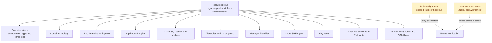

<ul class="sre-meta">
<li class="duration">Estimated time: 10 minutes</li>
<li>Module 14</li>
<li>Hands-on</li>
</ul>

## Overview

The workshop deployed always-on Container Apps replicas, a Standard tier SQL
database, a container registry, a Log Analytics workspace, two billable Private
Endpoints, and private DNS. None of that stops costing money because you closed
your laptop. Scaling the apps to zero does not stop endpoint-hour charges.

This module removes everything and verifies the removal, which is the part people skip.

## Learning objectives

* Stop all active fault injection and load generation.
* Preserve the artifacts that are worth keeping.
* Delete every Azure resource created by the workshop.
* Verify that nothing survived outside the resource group.

## Architecture context

Almost everything lives in the workshop resource group, which makes deletion a single operation. The exceptions matter.



## Tasks

### Task 1: Stop the load generator and clear all faults

```bash
source .workshop/workshop.env

./scripts/inject-fault.sh reset
./scripts/inject-fault.sh status
```

Press ++ctrl+c++ in the terminal running `generate-load.sh`.

The fault helpers start the private job and retrieve only its non-secret JSON
result from Log Analytics. Results may arrive up to five minutes after job success;
status is a snapshot from that job. If a result times out, use
`python scripts/workshop.py fault-result <request-id>` with the reported ID instead
of repeating an action to recover its logs.

### Task 2: Keep what is worth keeping

Your notes are the only durable output of the workshop. Move them somewhere that survives the cleanup.

```bash
mkdir -p ~/sre-workshop-artifacts
cp -r .workshop/notes/* ~/sre-workshop-artifacts/ 2>/dev/null || true
ls -1 ~/sre-workshop-artifacts
```

Worth keeping:

* Your baseline measurements and the three incident timelines.
* Your final root cause analysis and the agent draft you critiqued.
* Your agent scoring tables from Modules 07, 09, and 12.
* Your multi-agent design from Module 13.
* The instruction set in `agent/`, which is already in the repository.

### Task 3: Record what the workshop cost

Useful for justifying the next one.

```bash
az consumption usage list \
  --start-date "$(date -u -d '2 days ago' +%Y-%m-%d 2>/dev/null || date -u -v-2d +%Y-%m-%d)" \
  --end-date "$(date -u +%Y-%m-%d)" \
  --query "[?contains(instanceName, '${WORKSHOP_SUFFIX}')].{Resource:instanceName, Cost:pretaxCost, Currency:currency}" \
  --output table 2>/dev/null || echo "Consumption data may not be available on this subscription type. Use Cost Management in the portal."
```

Billing data lags by up to 24 hours, so run this the day after if the output is empty.

### Task 4: Remove role assignments scoped outside the resource group

Deleting a resource group removes role assignments scoped inside it. Anything scoped elsewhere survives as an orphaned assignment.

```bash
source .workshop/workshop.env

if [[ -n "${SRE_AGENT_PRINCIPAL_ID:-}" ]]; then
  az role assignment list \
    --assignee "${SRE_AGENT_PRINCIPAL_ID}" \
    --all \
    --query "[].{Role:roleDefinitionName, Scope:scope}" \
    --output table
fi
```

If any workshop-created scope is outside `rg-sre-agent-workshop-<environment>`,
review and delete that assignment explicitly.

```bash
# Only run for assignments whose scope is outside the workshop resource group.
az role assignment delete \
  --assignee "${SRE_AGENT_PRINCIPAL_ID}" \
  --scope "<the-scope-you-identified>"
```

### Task 5: Delete the azd environment

```bash
source .workshop/workshop.env

echo "About to delete: ${RESOURCE_GROUP}"
az resource list --resource-group "${RESOURCE_GROUP}" --query "[].{Name:name, Type:type}" --output table
```

Read that list. Confirm it contains only workshop resources and that the resource
group name matches the selected environment. In addition to apps and monitoring,
the current inventory includes:

* `cae-private-<suffix>` and the `orders-db-bootstrap`, `workshop-token-init`, and `workshop-fault-client` jobs
* Key Vault and managed identities, including `id-token-<suffix>` and `id-fault-<suffix>`
* `vnet-<suffix>`, its delegated Container Apps and private-endpoint subnets, and both SQL/vault Private Endpoints
* `privatelink.database.windows.net` and `privatelink.vaultcore.azure.net`, their VNet links, and endpoint DNS zone groups

The current design creates no ARM token deployment script, script-supporting
storage account, or Azure Container Instance. If you retried an older failed
deployment, an empty `cae-*` environment and old failed deployment-script metadata
may still appear. They are not removed automatically during redeployment;
deliberate deletion of their workshop resource group removes those leftovers
alongside the current resources. This cleanup deletes data, not an in-place
migration path for existing apps.

```bash
azd down
```

!!! danger "Verify the resource group name before you press enter"
  Deleting the workshop removes its applications and SQL data. Confirm the selected environment with `azd env get-value AZURE_ENV_NAME`, verify the resource listing, and review the interactive deletion prompt. If asked to purge the protected vault, choose **No**.

Allow several minutes for Azure resource deletion to finish. Before removing
local environment state, confirm this returns `false`:

```bash
az group exists --name "${RESOURCE_GROUP}"
```

!!! warning "Key Vault names remain reserved after cleanup"
    The workshop vault has purge protection and seven-day soft-delete retention. `azd down --purge` cannot override that protection: the deleted vault and its name remain reserved during retention. An immediate redeployment with the same environment-derived vault name may require recovery of the deleted vault. For a separate fresh workshop, choose a new azd environment name; otherwise wait for retention to expire or follow your organization's approved recovery process. Do not disable purge protection or attempt a portal workaround.

### Task 6: Handle local deployment state

The generated `.workshop/workshop.env` and `.workshop/workshop.ps1` contain only
allowlisted non-secret identifiers and endpoints. SQL uses managed identity and
fault credentials remain in Key Vault, not local exports. Remove stale deployment
state if you do not intend to reuse the environment; keep investigation notes
only as appropriate for your organization's data handling policy.

=== "Delete it"

    ```bash
    azd env remove "$(azd env get-value AZURE_ENV_NAME)"
    rm -f .workshop/workshop.env .workshop/workshop.ps1
    ```

=== "Keep it for a repeat run"

    Keep it only if you intend to redeploy. Confirm it is still excluded from source control.

    ```bash
    git check-ignore -v .workshop/workshop.env
    ```

    An empty result means the file is not ignored. Stop and fix `.gitignore` before committing anything.

## Validation

```bash
source .workshop/workshop.env 2>/dev/null || true

if az group show --name "${RESOURCE_GROUP}" >/dev/null 2>&1; then
  STATE=$(az group show --name "${RESOURCE_GROUP}" --query properties.provisioningState --output tsv)
  echo "IN PROGRESS: resource group state is ${STATE}"
else
  echo "PASS: resource group ${RESOURCE_GROUP} no longer exists"
fi

if [[ -n "${SRE_AGENT_PRINCIPAL_ID:-}" ]]; then
  ORPHANS=$(az role assignment list --assignee "${SRE_AGENT_PRINCIPAL_ID}" --all --query "length(@)" --output tsv 2>/dev/null || echo 0)
  [[ "${ORPHANS}" == "0" ]] && echo "PASS: no orphaned role assignments" || echo "REVIEW: ${ORPHANS} role assignments remain"
fi
```

Confirm no workshop resources remain anywhere in the subscription.

```bash
az resource list \
  --query "[?contains(name, '${WORKSHOP_SUFFIX}')].{Name:name, Type:type, Group:resourceGroup}" \
  --output table
```

## Expected results

The resource group is gone or reports `Deleting`. No resources match your workshop suffix. No role assignments remain for the agent identity.

If the resource group deletion stalls, a resource lock or an Azure Policy deny assignment is the usual cause. Check with `az lock list --resource-group "${RESOURCE_GROUP}"`.

## Knowledge check

??? question "Why check role assignments separately instead of relying on resource group deletion?"
    Role assignments are stored at the scope they apply to, not with the identity. An assignment scoped to a workspace in a different resource group, or to the subscription, survives the deletion of the identity's home group and becomes an orphaned entry referencing a principal that no longer exists. These accumulate silently and clutter every future access review.

??? question "You deleted the resource group but Cost Management still shows charges the next day. Why?"
    Billing data lags by up to 24 hours, so charges incurred before deletion continue to appear afterwards. Confirm the dates on the charges rather than assuming something survived. If charges appear with dates after the deletion completed, then something genuinely survived, most likely a resource created outside the workshop resource group.

??? question "What is the single highest-value artifact to keep from this workshop?"
    The instruction set in `agent/`, adapted to your own architecture. The incident notes document a simulation; the instruction set is reusable operational configuration that improves every future investigation against a real system. The observability gap table from Module 11 is a close second, because it converts what you learned into a concrete engineering backlog.

## Next steps

You have run a full incident lifecycle three times, produced a defensible root cause analysis, tuned an agent against measured results, and designed a topology for a multi-team estate.

What to do with that:

* Apply the [investigation principles](https://github.com/charliekw411/sre-agent-workshop/blob/main/agent/instructions/investigation-principles.md) to your own workload and see how many of them your telemetry can actually support.
* Work through your Module 11 observability gap table and close the cheapest gap first.
* Pilot Azure SRE Agent read-only against a real non-production workload for a month before widening anything.
* Read the [Azure SRE Agent documentation](https://learn.microsoft.com/azure/sre-agent/) for current capabilities and regional availability.
* Build the platform side of the story with the [Azure Container Apps .NET Workshop](https://azure.github.io/aca-dotnet-workshop/).

[About The Authors :material-arrow-right:](../29-about-the-authors/index.md){ .md-button .md-button--primary }
[Troubleshooting](../30-appendix/02-troubleshooting.md){ .md-button }

<div class="sre-nav" markdown>
[:material-arrow-left: Module 13 - Multi-Agent Investigation Patterns](../13-multi-agent-patterns/index.md)
[About The Authors :material-arrow-right:](../29-about-the-authors/index.md)
</div>
